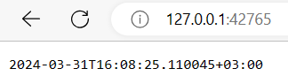

# Kubernetes

## Task 1

```
$ kubectl get pods,svc
NAME                              READY   STATUS    RESTARTS   AGE
pod/app-python-674f6b6b87-pdhkf   1/1     Running   0          4m3s

NAME                 TYPE           CLUSTER-IP       EXTERNAL-IP   PORT(S)          AGE
service/app-python   LoadBalancer   10.100.211.233   <pending>     8080:30789/TCP   83s
service/kubernetes   ClusterIP      10.96.0.1        <none>        443/TCP          25m
```

## Task 2

```
$ kubectl get pods,svc
NAME                                         READY   STATUS    RESTARTS   AGE
pod/app-python-deployment-5974f57697-jjnkn   1/1     Running   0          54m

NAME                         TYPE           CLUSTER-IP     EXTERNAL-IP   PORT(S)          AGE
service/app-python-service   LoadBalancer   10.99.54.226   <pending>     8080:31611/TCP   7m59s
service/kubernetes           ClusterIP      10.96.0.1      <none>        443/TCP          71m
```

```
$ minikube service --all
|-----------|--------------------|-------------|---------------------------|
| NAMESPACE |        NAME        | TARGET PORT |            URL            |
|-----------|--------------------|-------------|---------------------------|
| default   | app-python-service |        8080 | http://192.168.49.2:31611 |
|-----------|--------------------|-------------|---------------------------|
|-----------|------------|-------------|--------------|
| NAMESPACE |    NAME    | TARGET PORT |     URL      |
|-----------|------------|-------------|--------------|
| default   | kubernetes |             | No node port |
|-----------|------------|-------------|--------------|
😿  service default/kubernetes has no node port
🏃  Starting tunnel for service app-python-service.
🏃  Starting tunnel for service kubernetes.
|-----------|--------------------|-------------|------------------------|
| NAMESPACE |        NAME        | TARGET PORT |          URL           |
|-----------|--------------------|-------------|------------------------|
| default   | app-python-service |             | http://127.0.0.1:42765 |
| default   | kubernetes         |             | http://127.0.0.1:45379 |
|-----------|--------------------|-------------|------------------------|
...
```



## Bonus task

```
$ curl --resolve "python.app:80:$(minikube ip)" python.app
2024-03-31T16:40:44.662410+03:00
```

```
$ curl --resolve "haskell.app:80:$(minikube ip)" haskell.app
2024-03-31T16:41:17.570003742+03:00
```
