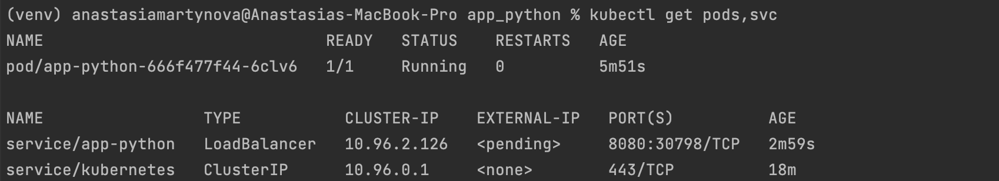
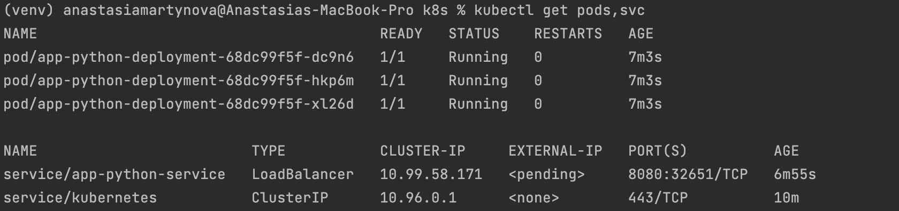
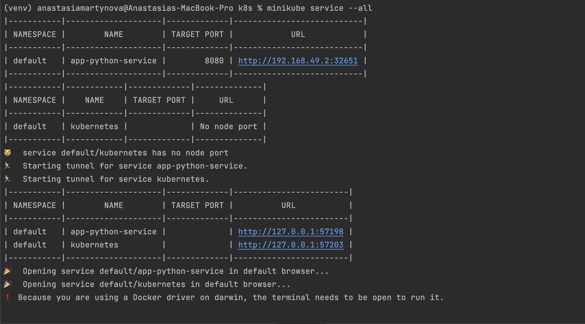

## Basic Deployment using Kubernetes

```bash
kubectl get pods,svc
```


## Declarative Kubernetes Manifests

### Deployment using .yml files
```bash
kubectl get pods,svc
```


```bash
minikube service --all
```



