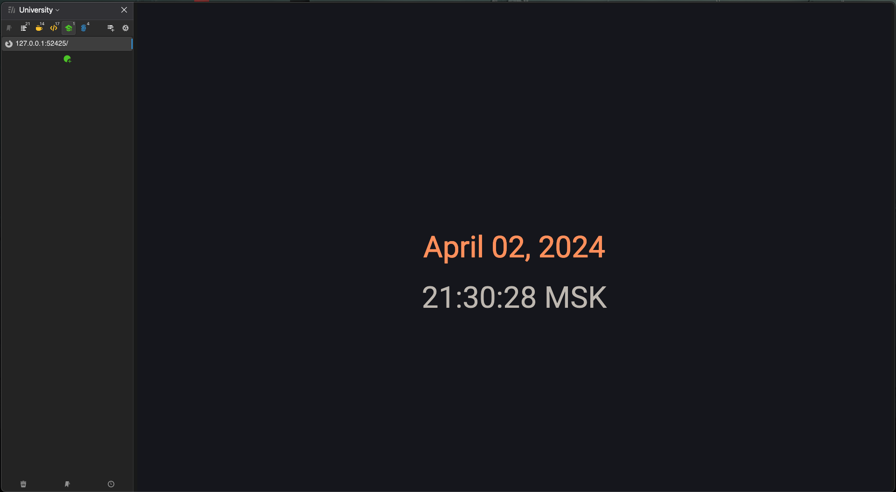

# Kubernetes

## Pods

```bash
❯ kubectl get pods,svc
NAME                                  READY   STATUS    RESTARTS   AGE
pod/python-app-node-8986fff78-nnsqn   1/1     Running   0          81s

NAME                 TYPE        CLUSTER-IP   EXTERNAL-IP   PORT(S)   AGE
service/kubernetes   ClusterIP   10.96.0.1    <none>        443/TCP   29m
```

## Clean up

```bash
❯ kubectl delete deployment python-app-node
deployment.apps "python-app-node" deleted
```

## Deployment and Manifest

```bash
❯ kubectl get pods,svc
NAME                                        READY   STATUS    RESTARTS   AGE
pod/python-app-deployment-dd7f869bb-7sr92   1/1     Running   0          113s
pod/python-app-deployment-dd7f869bb-gzqgc   1/1     Running   0          113s
pod/python-app-deployment-dd7f869bb-k6t8d   1/1     Running   0          113s

NAME                         TYPE           CLUSTER-IP       EXTERNAL-IP   PORT(S)          AGE
service/kubernetes           ClusterIP      10.96.0.1        <none>        443/TCP          103m
service/python-app-service   LoadBalancer   10.109.145.235   <pending>     8080:30895/TCP   32s
```

## Minikube

```bash
❯ minikube service --all
|-----------|------------|-------------|--------------|
| NAMESPACE |    NAME    | TARGET PORT |     URL      |
|-----------|------------|-------------|--------------|
| default   | kubernetes |             | No node port |
|-----------|------------|-------------|--------------|
😿  service default/kubernetes has no node port
|-----------|--------------------|-------------|---------------------------|
| NAMESPACE |        NAME        | TARGET PORT |            URL            |
|-----------|--------------------|-------------|---------------------------|
| default   | python-app-service |        8080 | http://192.168.49.2:30895 |
|-----------|--------------------|-------------|---------------------------|
🏃  Starting tunnel for service kubernetes.
🏃  Starting tunnel for service python-app-service.
|-----------|--------------------|-------------|------------------------|
| NAMESPACE |        NAME        | TARGET PORT |          URL           |
|-----------|--------------------|-------------|------------------------|
| default   | kubernetes         |             | http://127.0.0.1:52423 |
| default   | python-app-service |             | http://127.0.0.1:52425 |
|-----------|--------------------|-------------|------------------------|
🎉  Opening service default/kubernetes in default browser...
🎉  Opening service default/python-app-service in default browser...
❗  Because you are using a Docker driver on darwin, the terminal needs to be open to run it.
```


