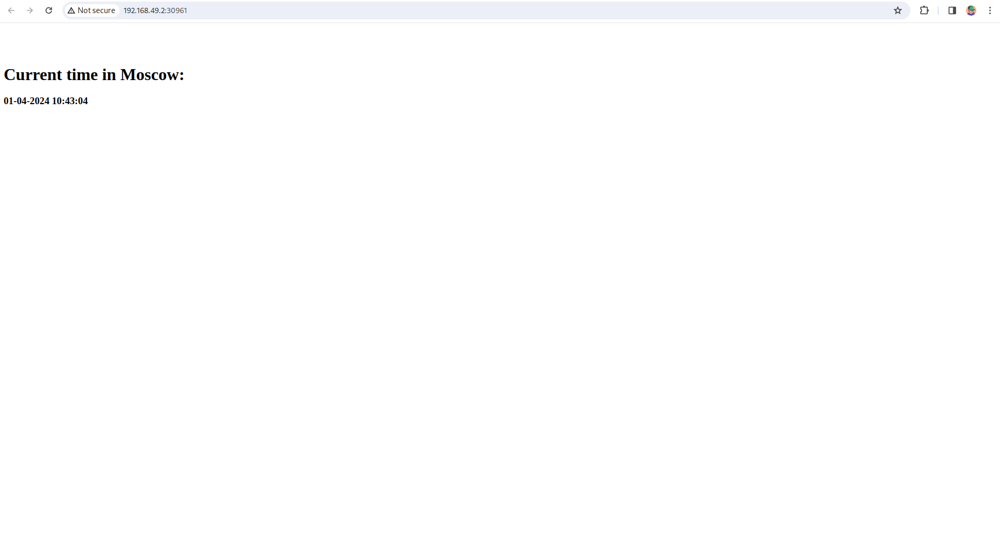

## Kubernetes setup and basic Deployment

`adari_ka@MacBookPro ~ % minikube start`

1. Create deployment
```
adari_ka@MacBookPro k8s % kubectl create deployment app-python --image=adarika/devops-lab-02-python                                     

deployment.apps/app-python created
```

2. Access (expose) application
```
adari_ka@MacBookPro k8s % kubectl expose deployment app-python --type=LoadBalancer --port=8000

service/app-python exposed
```

3. `kubectl get pods,svc`
```
adari_ka@MacBookPro k8s % kubectl get pods,svc                                        
NAME                              READY   STATUS    RESTARTS   AGE
pod/app-python-57545bcb67-dtkt2   1/1     Running   0          43s

NAME                 TYPE           CLUSTER-IP       EXTERNAL-IP   PORT(S)          AGE
service/app-python   LoadBalancer   10.110.191.114   <pending>     8000:32736/TCP   11s
service/kubernetes   ClusterIP      10.96.0.1        <none>        443/TCP          77m
```

   - try to access python app 

    adari_ka@MacBookPro k8s % curl 127.0.0.1:8000
    22:43:00 31.03.2024%                                                                                                                                               
    adari_ka@MacBookPro k8s % curl 127.0.0.1:8000
    22:43:02 31.03.2024%  

4. Cleanup
```
adari_ka@MacBookPro k8s % kubectl delete deployment app-python
deployment.apps "app-python" deleted

adari_ka@MacBookPro k8s % kubectl delete service app-python                                                                   
service "app-python" deleted
```

## Declarative Kubernetes Manifests

- `kubectl apply -f app_python`
```
adari_ka@MacBookPro k8s % kubectl apply -f app_python         
deployment.apps/app-python created
service/app-python created
```

- `kubectl get pods,svc`
```
adari_ka@MacBookPro k8s % kubectl get pods,svc
NAME                              READY   STATUS    RESTARTS   AGE
pod/app-python-5cb6675984-8hf6w   1/1     Running   0          3m30s
pod/app-python-5cb6675984-dcs9w   1/1     Running   0          3m30s

NAME                 TYPE           CLUSTER-IP       EXTERNAL-IP   PORT(S)          AGE
service/app-python   LoadBalancer   10.102.104.140   <pending>     8000:32347/TCP   13m
service/kubernetes   ClusterIP      10.96.0.1        <none>        443/TCP          84m
```

- `minikube service --all`

```
adari_ka@MacBookPro k8s % minikube service --all                                                                                        
|-----------|------------|-------------|---------------------------|
| NAMESPACE |    NAME    | TARGET PORT |            URL            |
|-----------|------------|-------------|---------------------------|
| default   | app-python |        8000 | http://192.168.49.2:31882 |
|-----------|------------|-------------|---------------------------|
|-----------|------------|-------------|--------------|
| NAMESPACE |    NAME    | TARGET PORT |     URL      |
|-----------|------------|-------------|--------------|
| default   | kubernetes |             | No node port |
|-----------|------------|-------------|--------------|
😿  service default/kubernetes has no node port
🏃  Starting tunnel for service app-python.
🏃  Starting tunnel for service kubernetes.
|-----------|------------|-------------|------------------------|
| NAMESPACE |    NAME    | TARGET PORT |          URL           |
|-----------|------------|-------------|------------------------|
| default   | app-python |             | http://127.0.0.1:58676 |
| default   | kubernetes |             | http://127.0.0.1:58678 |
|-----------|------------|-------------|------------------------|
🎉  Opening service default/app-python in default browser...
🎉  Opening service default/kubernetes in default browser...
```


### Ingress

- `minikube addons enable ingress`

```
adari_ka@MacBookPro S24-core-course-labs % minikube addons enable ingress
💡  ingress is an addon maintained by Kubernetes. For any concerns contact minikube on GitHub.
You can view the list of minikube maintainers at: https://github.com/kubernetes/minikube/blob/master/OWNERS
💡  After the addon is enabled, please run "minikube tunnel" and your ingress resources would be available at "127.0.0.1"
    ▪ Using image registry.k8s.io/ingress-nginx/controller:v1.9.4
    ▪ Using image registry.k8s.io/ingress-nginx/kube-webhook-certgen:v20231011-8b53cabe0
    ▪ Using image registry.k8s.io/ingress-nginx/kube-webhook-certgen:v20231011-8b53cabe0
🔎  Verifying ingress addon...
🌟  The 'ingress' addon is enabled
```

- setup
```
adari_ka@MacBookPro k8s % kubectl apply -f app_python 
deployment.apps/app-python created
service/app-python created
adari_ka@MacBookPro k8s % kubectl apply -f app_rust  
deployment.apps/app-rust created
service/app-rust created
adari_ka@MacBookPro k8s % kubectl apply -f ingress.yml         
ingress.networking.k8s.io/app-ingress created
```

```
adari_ka@MacBookPro ~ % kubectl get pods,svc
NAME                              READY   STATUS    RESTARTS   AGE
pod/app-python-5cb6675984-4jjk6   1/1     Running   0          2m55s
pod/app-python-5cb6675984-v496w   1/1     Running   0          2m55s
pod/app-rust-6cfc45b775-2cq2j     1/1     Running   0          2m50s
pod/app-rust-6cfc45b775-44zsz     1/1     Running   0          2m50s
pod/app-rust-6cfc45b775-xss9f     1/1     Running   0          2m50s

NAME                 TYPE           CLUSTER-IP      EXTERNAL-IP   PORT(S)          AGE
service/app-python   LoadBalancer   10.100.214.22   <pending>     8000:32632/TCP   2m55s
service/app-rust     LoadBalancer   10.96.51.177    <pending>     8001:32659/TCP   2m50s
service/kubernetes   ClusterIP      10.96.0.1       <none>        443/TCP          4m32s

```

also I have create a tunnel via `minikube tunnel`

```
adari_ka@MacBookPro ~ % minikube service --all 
|-----------|------------|-------------|---------------------------|
| NAMESPACE |    NAME    | TARGET PORT |            URL            |
|-----------|------------|-------------|---------------------------|
| default   | app-python |        8000 | http://192.168.49.2:31962 |
|-----------|------------|-------------|---------------------------|
|-----------|----------|-------------|---------------------------|
| NAMESPACE |   NAME   | TARGET PORT |            URL            |
|-----------|----------|-------------|---------------------------|
| default   | app-rust |        8000 | http://192.168.49.2:31831 |
|-----------|----------|-------------|---------------------------|
|-----------|------------|-------------|--------------|
| NAMESPACE |    NAME    | TARGET PORT |     URL      |
|-----------|------------|-------------|--------------|
| default   | kubernetes |             | No node port |
|-----------|------------|-------------|--------------|
<...>
|-----------|------------|-------------|------------------------|
| NAMESPACE |    NAME    | TARGET PORT |          URL           |
|-----------|------------|-------------|------------------------|
| default   | app-python |             | http://127.0.0.1:59978 |
| default   | app-rust   |             | http://127.0.0.1:59980 |
| default   | kubernetes |             | http://127.0.0.1:59982 |
|-----------|------------|-------------|------------------------|
<...>
```

- checks

```
adari_ka@MacBookPro k8s % curl -H "Host: python.app" http://192.168.49.2   
00:53:06 01.04.2024% 
adari_ka@MacBookPro k8s % curl -H "Host: rust.app" http://192.168.49.2
Request number: 1%
```

