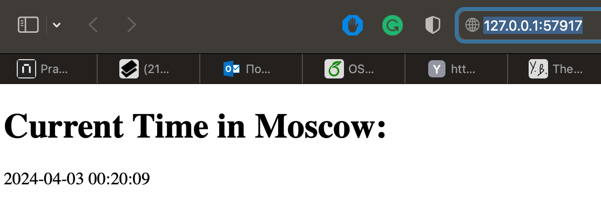

# Kubernetes Resources

This folder contains Kubernetes manifests for deploying our application.

## Pods

```bash
kubectl get pods
```

```bash
NAME                             READY   STATUS             RESTARTS   AGE
my-app-devops-6f759f666f-7wf6s   1/1     Running            0          37m
```


## Services

```bash
kubectl get svc
```

```bash
NAME            TYPE        CLUSTER-IP     EXTERNAL-IP   PORT(S)          AGE
kubernetes      ClusterIP   10.96.0.1      <none>        443/TCP          50m
my-app-devops   NodePort    10.98.62.223   <none>        5000:31230/TCP   7m33s
```


##Declarative Kubernetes Manifests
### Pods and services
I applied .yml files, see in bash script
```bash
(venv) (base) dilaraf@MacBook-Air k8s % kubectl apply -f deployment.yml
deployment.apps/my-app unchanged
(venv) (base) dilaraf@MacBook-Air k8s % kubectl apply -f service.yml   
service/my-app created
(venv) (base) dilaraf@MacBook-Air k8s % kubectl get pod,svc
NAME                         READY   STATUS    RESTARTS   AGE
pod/my-app-59cc786cc-5wtxv   1/1     Running   0          21s
pod/my-app-59cc786cc-958cz   1/1     Running   0          21s
pod/my-app-59cc786cc-jddk8   1/1     Running   0          21s

NAME                 TYPE        CLUSTER-IP       EXTERNAL-IP   PORT(S)          AGE
service/kubernetes   ClusterIP   10.96.0.1        <none>        443/TCP          67s
service/my-app       NodePort    10.102.224.183   <none>        5000:31726/TCP   9s
(venv) (base) dilaraf@MacBook-Air k8s % minikube service --all
|-----------|------------|-------------|--------------|
| NAMESPACE |    NAME    | TARGET PORT |     URL      |
|-----------|------------|-------------|--------------|
| default   | kubernetes |             | No node port |
|-----------|------------|-------------|--------------|
😿  service default/kubernetes has no node port
|-----------|--------|-------------|---------------------------|
| NAMESPACE |  NAME  | TARGET PORT |            URL            |
|-----------|--------|-------------|---------------------------|
| default   | my-app |        5000 | http://192.168.49.2:31726 |
|-----------|--------|-------------|---------------------------|
🏃  Starting tunnel for service kubernetes.
🏃  Starting tunnel for service my-app.
|-----------|------------|-------------|------------------------|
| NAMESPACE |    NAME    | TARGET PORT |          URL           |
|-----------|------------|-------------|------------------------|
| default   | kubernetes |             | http://127.0.0.1:57915 |
| default   | my-app     |             | http://127.0.0.1:57917 |
|-----------|------------|-------------|------------------------|
🎉  Opening service default/kubernetes in default browser...
🎉  Opening service default/my-app in default browser...
❗  Because you are using a Docker driver on darwin, the terminal needs to be open to run it.


```
