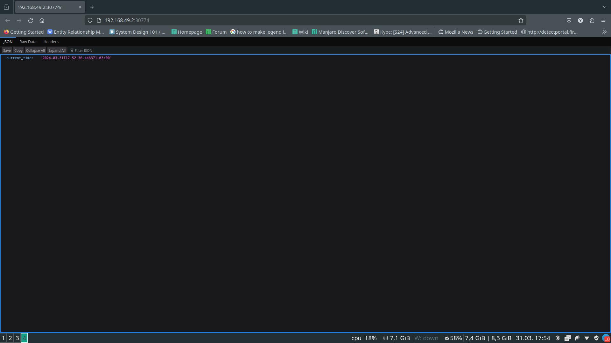
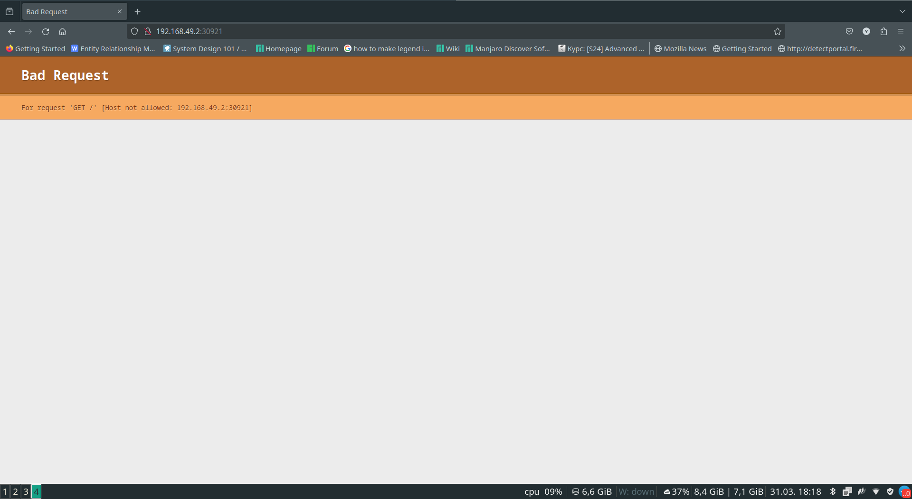

# K8s

## Output of `kubectl get pods,svc` command

```
yaroslav@xiaomao ~/S/D/d/k8s (lab8)> kubectl get pods,svc
NAME                              READY   STATUS    RESTARTS   AGE
pod/app-python-5569cc84d7-8gxfs   1/1     Running   0          5m58s
pod/hello-node-ccf4b9788-wrq56    1/1     Running   0          8m41s

NAME                 TYPE           CLUSTER-IP    EXTERNAL-IP   PORT(S)        AGE
service/app-python   LoadBalancer   10.99.90.38   <pending>     80:31871/TCP   2m54s
service/kubernetes   ClusterIP      10.96.0.1     <none>        443/TCP        43m
```

## Output of `kubectl get pods,svc` command for declarative kubernetes manifest

```
yaroslav@xiaomao ~/S/D/d/k8s (lab8)> kubectl get pods,svc
NAME                                         READY   STATUS    RESTARTS   AGE
pod/app-python-deployment-5978865569-dvqq2   1/1     Running   0          17m
pod/app-python-deployment-5978865569-k88q7   1/1     Running   0          17m
pod/app-python-deployment-5978865569-thlfr   1/1     Running   0          17m

NAME                 TYPE           CLUSTER-IP      EXTERNAL-IP   PORT(S)        AGE
service/app-python   LoadBalancer   10.98.206.119   <pending>     80:30774/TCP   4m45s
service/kubernetes   ClusterIP      10.96.0.1       <none>        443/TCP        75m
```

```
yaroslav@xiaomao ~/S/D/d/k8s (lab8)> minikube service --all
|-----------|------------|-------------|---------------------------|
| NAMESPACE |    NAME    | TARGET PORT |            URL            |
|-----------|------------|-------------|---------------------------|
| default   | app-python | http/80     | http://192.168.49.2:30774 |
|-----------|------------|-------------|---------------------------|
|-----------|------------|-------------|--------------|
| NAMESPACE |    NAME    | TARGET PORT |     URL      |
|-----------|------------|-------------|--------------|
| default   | kubernetes |             | No node port |
|-----------|------------|-------------|--------------|
😿  service default/kubernetes has no node port
🎉  Opening service default/app-python in default browser...
```



## Bonus task

Disclaimer: We have got Bad Request just because of CORS politics. The Request were indeed delivered to scala application.

```
yaroslav@xiaomao ~/S/D/d/k8s (lab8)> minikube service --all
|-----------|------------|-------------|---------------------------|
| NAMESPACE |    NAME    | TARGET PORT |            URL            |
|-----------|------------|-------------|---------------------------|
| default   | app-python | http/80     | http://192.168.49.2:30774 |
|-----------|------------|-------------|---------------------------|
|-----------|-----------|-------------|---------------------------|
| NAMESPACE |   NAME    | TARGET PORT |            URL            |
|-----------|-----------|-------------|---------------------------|
| default   | app-scala | http/9000   | http://192.168.49.2:30921 |
|-----------|-----------|-------------|---------------------------|
|-----------|------------|-------------|--------------|
| NAMESPACE |    NAME    | TARGET PORT |     URL      |
|-----------|------------|-------------|--------------|
| default   | kubernetes |             | No node port |
|-----------|------------|-------------|--------------|
😿  service default/kubernetes has no node port
🎉  Opening service default/app-python in default browser...
🎉  Opening service default/app-scala in default browser...
```



