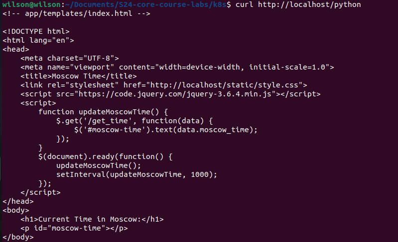
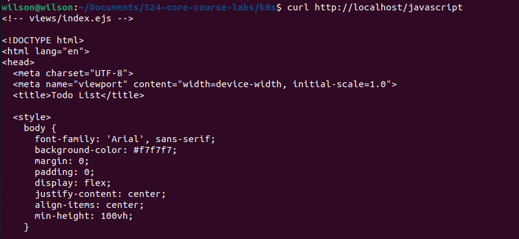

# Kubernetes

## Kubernetes Setup and Basic Deployment
To deploy the python application I ran:
```shell
minikube start --driver=docker 
kubectl create deployment app-python --image cogbonna/app_python_image
kubectl expose deployment app-python --type=LoadBalancer --port=5000
```
Running `kubectl get pods,svc`:
```shell
wilson@wilson ~/D/S/k8s (lab09)> kubectl get pods,svc
NAME                             READY   STATUS    RESTARTS   AGE
pod/app-python-ddb46dc45-68htw   1/1     Running   0          33s

NAME                 TYPE           CLUSTER-IP       EXTERNAL-IP   PORT(S)          AGE
service/app-python   LoadBalancer   10.106.109.190   <pending>     5000:32160/TCP   38s
service/kubernetes   ClusterIP      10.96.0.1        <none>        443/TCP          49s
```

## Declarative Kubernetes Manifests
After adding `deployment.yml` and `service.yml`. I ran the following: 
```shell
kubectl apply -f deployment.yml
kubectl apply -f service.yml
```
Running `kubectl get pods,svc` gave:
```shell
wilson@wilson ~/D/S/k8s (lab09)> kubectl get pods,svc
NAME                                         READY   STATUS    RESTARTS   AGE
pod/app-python-deployment-6558769565-2n4h8   1/1     Running   0          2m28s
pod/app-python-deployment-6558769565-rx96h   1/1     Running   0          2m28s
pod/app-python-deployment-6558769565-wx888   1/1     Running   0          2m28s

NAME                         TYPE           CLUSTER-IP      EXTERNAL-IP   PORT(S)          AGE
service/app-python-service   LoadBalancer   10.109.236.40   <pending>     5000:31668/TCP   2m
service/kubernetes           ClusterIP      10.96.0.1       <none>        443/TCP          2m50s
```

Running `minikube service --all`:
```shell
wilson@wilson ~/D/S/k8s (lab09)> minikube service --all
|-----------|--------------------|-------------|---------------------------|
| NAMESPACE |        NAME        | TARGET PORT |            URL            |
|-----------|--------------------|-------------|---------------------------|
| default   | app-python-service |        5000 | http://192.168.49.2:31668 |
|-----------|--------------------|-------------|---------------------------|
|-----------|------------|-------------|--------------|
| NAMESPACE |    NAME    | TARGET PORT |     URL      |
|-----------|------------|-------------|--------------|
| default   | kubernetes |             | No node port |
|-----------|------------|-------------|--------------|
😿  service default/kubernetes has no node port
🏃  Starting tunnel for service app-python-service.
🏃  Starting tunnel for service kubernetes.
|-----------|--------------------|-------------|------------------------|
| NAMESPACE |        NAME        | TARGET PORT |          URL           |
|-----------|--------------------|-------------|------------------------|
| default   | app-python-service |             | http://127.0.0.1:41065 |
| default   | kubernetes         |             | http://127.0.0.1:33827 |
|-----------|--------------------|-------------|------------------------|
```
Visiting `http://127.0.0.1:41065` from my browser:


## Additional Configuration and Ingress
To deploy the bonus application I ran:
```shell
kubectl apply -f deployment-javascript.yml
kubectl apply -f service-javascript.yml
```

To apply the ingress manifests I ran: 
```shell
kubectl apply -f ingress.yml 
kubectl apply -f ingress-javascript.yml 
```
then 
```shell
minikube tunnel
``` 
followed by the `curl` commands to verify the availability of the applications.
### app_python


### app_javascript

