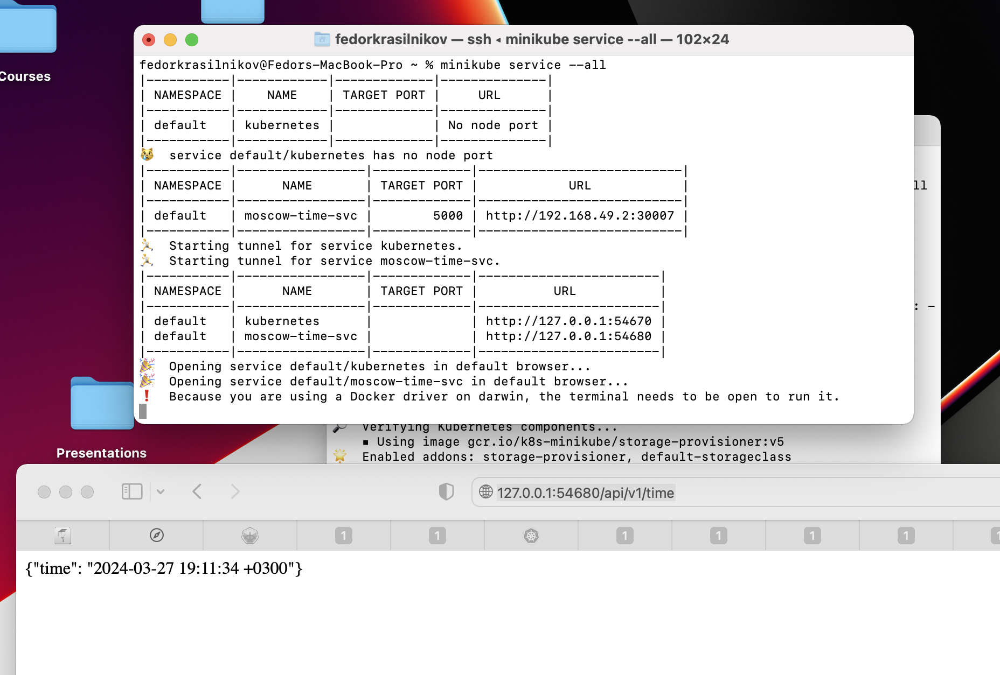
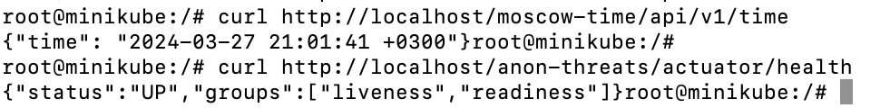

# K8S 
## Manual 
I ran the following commands: 
```
kubectl create deployment moscow-time --port=5000 --image fk12344321/moscow-time:mac

kubectl expose deployment/moscow-time --type="NodePort" --port 5000 

minikube service moscow-time  --url 
```

And here is the output of `kubectl get pods,svc`

```
(venv) fedorkrasilnikov@Fedors-MBP app_python % kubectl get pods,svc                
NAME                               READY   STATUS    RESTARTS   AGE
pod/moscow-time-596d575b66-p4cpk   1/1     Running   0          16m

NAME                  TYPE        CLUSTER-IP     EXTERNAL-IP   PORT(S)          AGE
service/kubernetes    ClusterIP   10.96.0.1      <none>        443/TCP          248d
service/moscow-time   NodePort    10.99.143.71   <none>        5000:32706/TCP   13m
```

## Manifest 

After applying manifest the result of `k get deploy,svc` is following 

```
(venv) fedorkrasilnikov@Fedors-MBP k8s % k get deploy,svc
NAME                          READY   UP-TO-DATE   AVAILABLE   AGE
deployment.apps/moscow-time   3/3     3            3           13m

NAME                      TYPE        CLUSTER-IP      EXTERNAL-IP   PORT(S)          AGE
service/kubernetes        ClusterIP   10.96.0.1       <none>        443/TCP          248d
service/moscow-time-svc   NodePort    10.108.73.231   <none>        5000:30007/TCP   13m
```

And here is the screenshot confirming that the setup works 



## Bonus 

Here is the result of the requests sent to the ingress controller 

