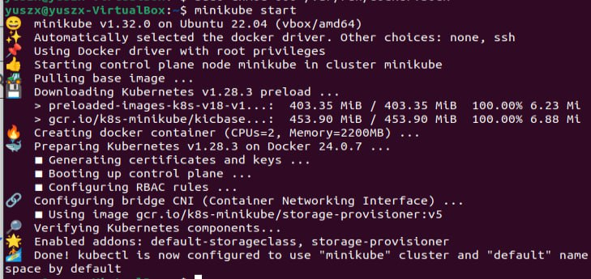
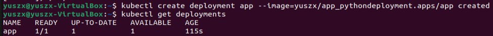
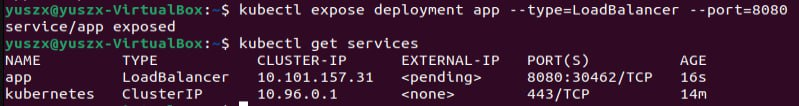
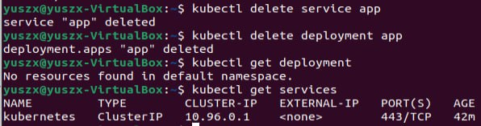
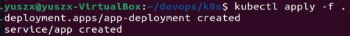
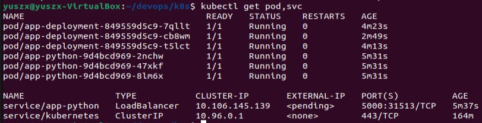
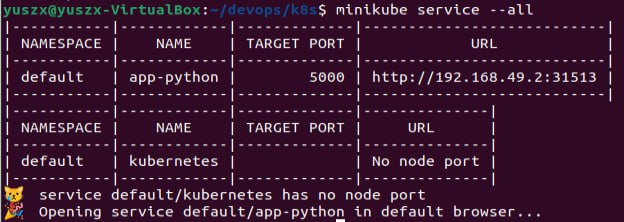

# Kubernets

## Task 1: Kubernets Setup and Basic Deployment

### Application Deployment

I used the following commands to create `Deployment` resource for my app:

### Application Access

I used the following commands to create `Service` resource for my app:

### Output of `kubectl get pods,svc`

### Cleanup

## Task 2: Declarative Kubernets Manifests

### Output of `kubectl get pods,svc`

### Output of `minikube service --all`

