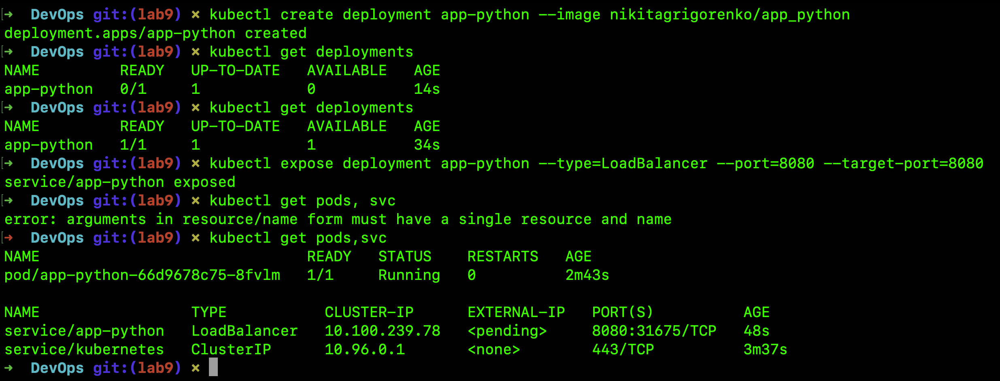
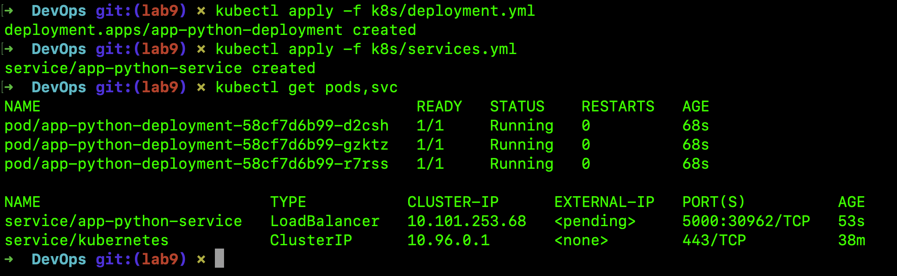
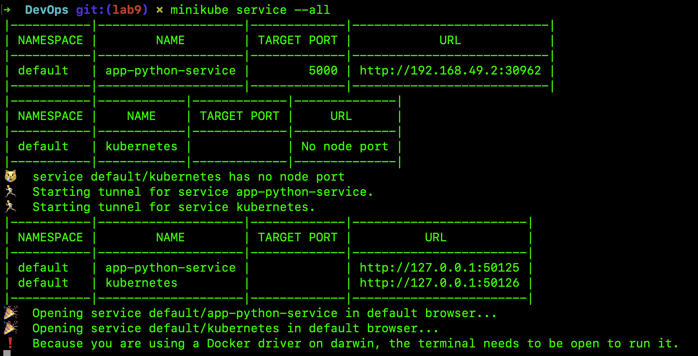
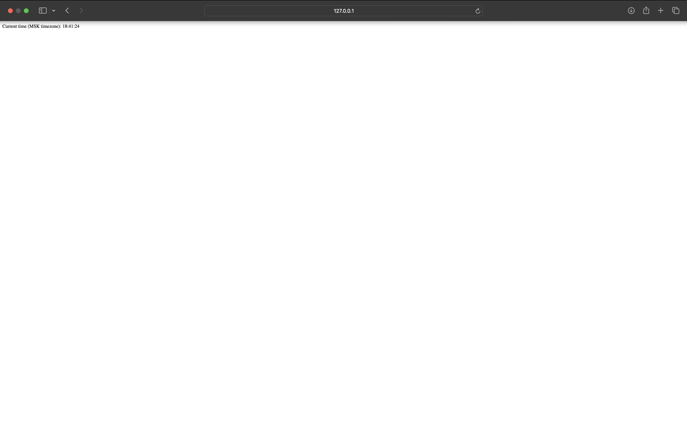

# k8s

## The deployment process using commands

The following command was used to create a deployment:
`kubectl create deployment app-python --image nikitagrigorenko/app_python`

To view the state of deployments we can run the command below:
`kubectl get deployments`

## The making of the app accessible from outside

To make the app-python Container accessible from outside the Kubernetes virtual network, we have to expose the Pod as a Kubernetes Service:
`kubectl expose deployment app-python --type=LoadBalancer --port=8080 --target-port=8080`

Now we can see the output:
`kubectl get pods,svc`

At the end of the proccess we can clean up all recources which we created by using:
- `kubectl delete service app-python`
- `kubectl delete deployment app-python`

## The process of deployment using .yml files.

The following command was used to create a deployment via deployment.yml:
`kubectl apply -f k8s/deployment.yml`

The following command was used to create a service via services.yml
`kubectl apply -f k8s/services.yml`

Now we can see the output:
`kubectl get pods,svc`

The output of the `minikube service --all` command

Verify what IP matches in the browser for local one

Verify what IP matches in the browser for remote one

