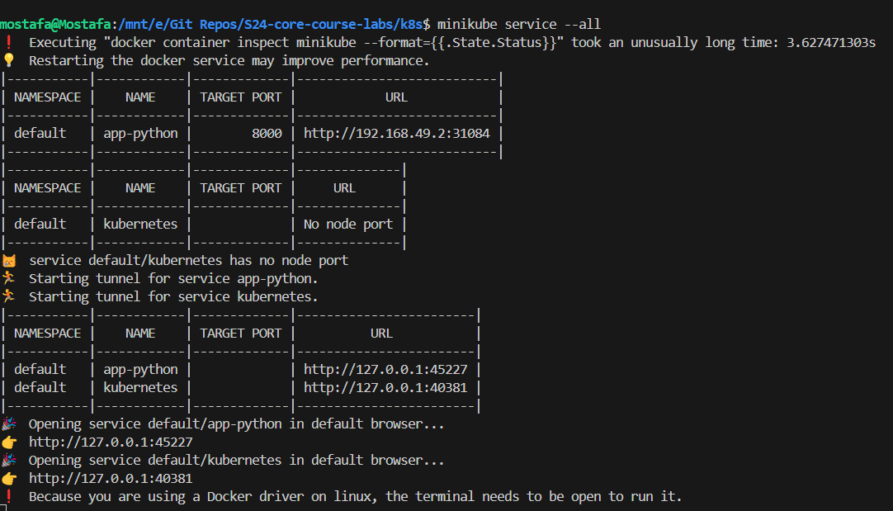
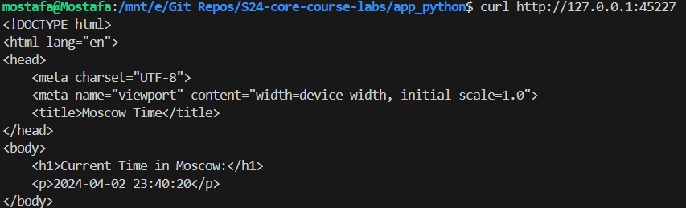

# Kubernets

## Installing tools
To use Kubernetes, I have installed the following tools:
- **kubectl**: The Kubernetes command-line tool that allows us to run commands against Kubernetes clusters.
- **minikube**: A tool that enables us to run a single-node Kubernetes cluster locally for development and testing purposes.

## Configuration
I have configured the Kubernetes cluster using the following commands:
```bash
minikube start

kubectl create deployment app-python --image=mostafakira/app_python

kubectl expose deployment app-python --type=LoadBalancer --port=8000
```

## Commands output
```bash
$ kubectl get pods

NAME                            READY   STATUS    RESTARTS   AGE
app-python-7b4b7b8b5b-7z5zv     1/1     Running   0          32s

$ kubectl get services

NAME                 TYPE           CLUSTER-IP      EXTERNAL-IP     PORT(S)          AGE
app-python           LoadBalancer   10.100.185.69   10.100.185.69   8080:30752/TCP   28s
kubernetes           ClusterIP      10.96.0.1       <none>          443/TCP          4m5s
```

## Screenshots
### Output of `minikube service --all`


### Accessing the Python application using the URL


## CleanUp
To clean up the resources created in the Kubernetes cluster, I have used the following commands:
```bash
kubectl delete deployment app-python

kubectl delete service app-python
```

## Bonus Task

### Creating a deployment and service manifests for the additional applications
I have created the following manifests for the additional application:
- **Deployment**: `deployment.yml`
- **Service**: `service.yml`

The manifests are available in the `k8s/app-javascript` directory.

### Ingress Manifests

I have created the ingress manifests for the two applications. The manifests are available in the `k8s/app-python` and `k8s/app-javascript` directories.
