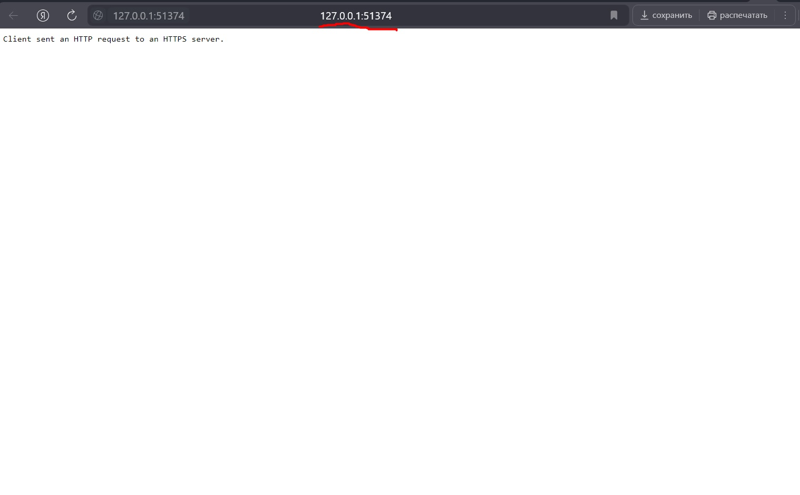
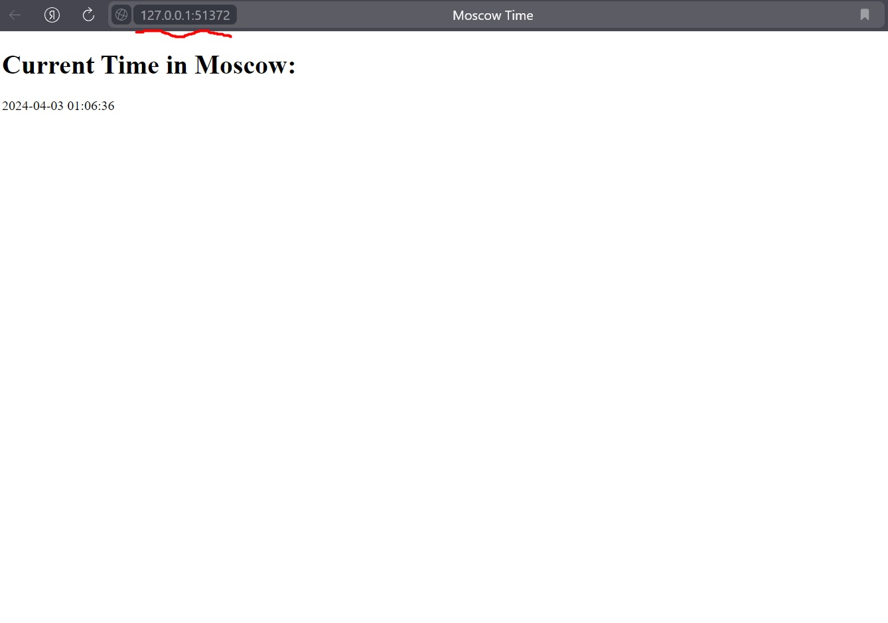
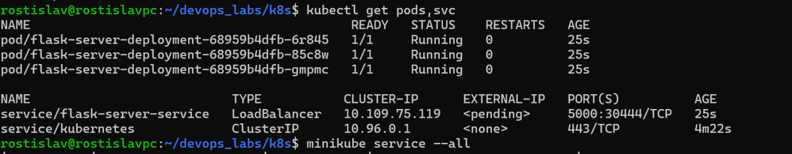

# Task 1.3
## Command:
To create deployment resource
```bash
kubectl create deployment app-node --image=glebuben/dev-ops-labs
```
# Task 1.4
## Commands:
To start service that exposes ports for application.
```bash
kubectl expose deployment app-node --type=LoadBalancer --port=5000
```
To get the app response
```bash
minikube service app-node
```
# Task 1.5
## Command:
```bash
kubectl get pods,svc
```
## Output:
```bash
NAME                            READY   STATUS    RESTARTS   AGE
pod/app-node-7bd755cb98-lrg8s   1/1     Running   0          10m

NAME                 TYPE           CLUSTER-IP       EXTERNAL-IP   PORT(S)          AGE
service/app-node     LoadBalancer   10.108.161.235   <pending>     5000:30148/TCP   5m47s
service/kubernetes   ClusterIP      10.96.0.1        <none>        443/TCP          42m
```
# Task 1.6
## Commands:
To delete deployment resource
```bash
kubectl delete deployment app-node
```
To delete service
```bash
kubectl delete deployment app-node
```

# Task 2.3
Do not forget to run these commands:
```bash
kubectl apply -f path_to_repo/S24-core-course-labs/k8s/deployment.yml
```

```bash
kubectl apply -f path_to_repo/S24-core-course-labs/k8s/service.yml
```
## Required commands and their outputs
### Command
```bash
kubectl get pods,svc
```
### Output
```bash
NAME                            READY   STATUS    RESTARTS   AGE
pod/app-node-5874b865c8-7mp4z   1/1     Running   0          9m40s
pod/app-node-5874b865c8-k98zb   1/1     Running   0          9m40s
pod/app-node-5874b865c8-xzxkg   1/1     Running   0          9m40s

NAME                       TYPE           CLUSTER-IP      EXTERNAL-IP   PORT(S)          AGE
service/app-node-service   LoadBalancer   10.102.155.63   <pending>     8000:32618/TCP   9m36s
service/kubernetes         ClusterIP      10.96.0.1       <none>        443/TCP          69m
```

### Command
```bash
minikube service --all
```
### Output
```bash
|-----------|------------------|-------------|---------------------------|
| NAMESPACE |       NAME       | TARGET PORT |            URL            |
|-----------|------------------|-------------|---------------------------|
| default   | app-node-service |        8000 | http://192.168.49.2:32618 |
|-----------|------------------|-------------|---------------------------|
|-----------|------------|-------------|--------------|
| NAMESPACE |    NAME    | TARGET PORT |     URL      |
|-----------|------------|-------------|--------------|
| default   | kubernetes |             | No node port |
|-----------|------------|-------------|--------------|
* service default/kubernetes has no node port
* Starting tunnel for service app-node-service.
* Starting tunnel for service kubernetes.
|-----------|------------------|-------------|------------------------|
| NAMESPACE |       NAME       | TARGET PORT |          URL           |
|-----------|------------------|-------------|------------------------|
| default   | app-node-service |             | http://127.0.0.1:51372 |
| default   | kubernetes       |             | http://127.0.0.1:51374 |
|-----------|------------------|-------------|------------------------|
* Opening service default/app-node-service in default browser...
* Opening service default/kubernetes in default browser...
! Because you are using a Docker driver on windows, the terminal needs to be open to run it.
```

## Screenshots
### kubernetes service

### app-node service

### command output
