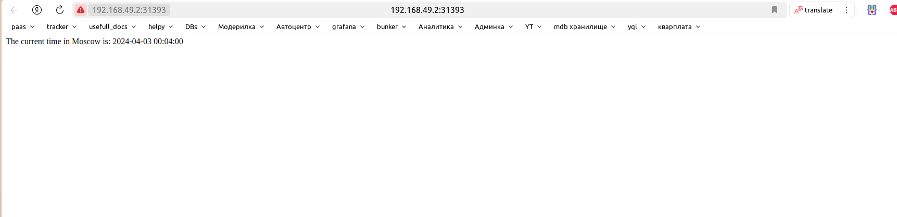

# Task 1:
`kubectl get pods,svc` :

```
NAME                             READY   STATUS    RESTARTS   AGE
pod/hello-node-ccf4b9788-m5nt8   1/1     Running   0          3m43s

NAME                 TYPE           CLUSTER-IP      EXTERNAL-IP   PORT(S)          AGE
service/hello-node   LoadBalancer   10.104.44.210   <pending>     8080:30309/TCP   3m31s
service/kubernetes   ClusterIP      10.96.0.1       <none>        443/TCP          4m10s
```

# Task 2:
`kubectl get pods,svc`:
```
NAME                             READY   STATUS    RESTARTS   AGE
pod/flask-app-6df445cb4d-2d2cm   1/1     Running   0          30s
pod/flask-app-6df445cb4d-6rrfv   1/1     Running   0          30s
pod/flask-app-6df445cb4d-k6x84   1/1     Running   0          30s

NAME                 TYPE           CLUSTER-IP       EXTERNAL-IP   PORT(S)          AGE
service/flask-app    LoadBalancer   10.105.196.104   <pending>     5000:31393/TCP   23s
service/kubernetes   ClusterIP      10.96.0.1        <none>        443/TCP          47s
```

`minikube service --all`:
```
|-----------|-----------|-------------|---------------------------|
| NAMESPACE |   NAME    | TARGET PORT |            URL            |
|-----------|-----------|-------------|---------------------------|
| default   | flask-app |        5000 | http://192.168.49.2:31393 |
|-----------|-----------|-------------|---------------------------|
|-----------|------------|-------------|--------------|
| NAMESPACE |    NAME    | TARGET PORT |     URL      |
|-----------|------------|-------------|--------------|
| default   | kubernetes |             | No node port |
|-----------|------------|-------------|--------------|
```

### SCREENSHOT:

