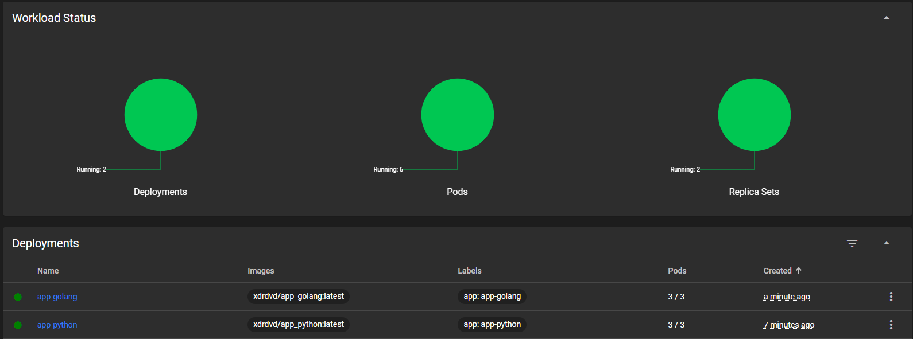
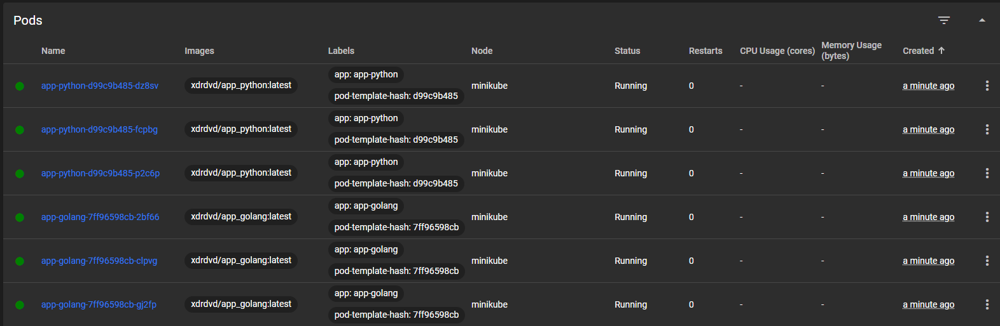
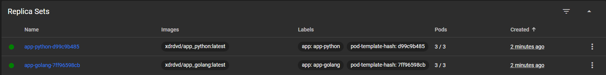
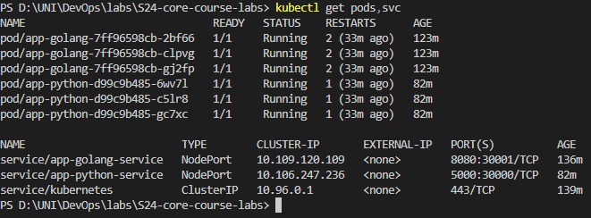
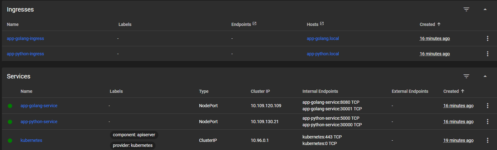
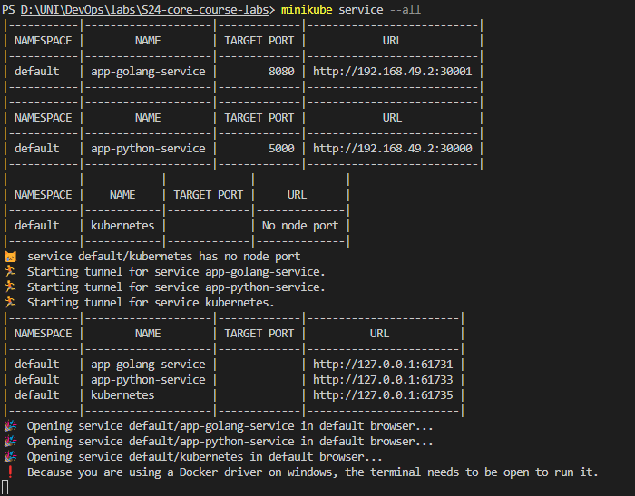
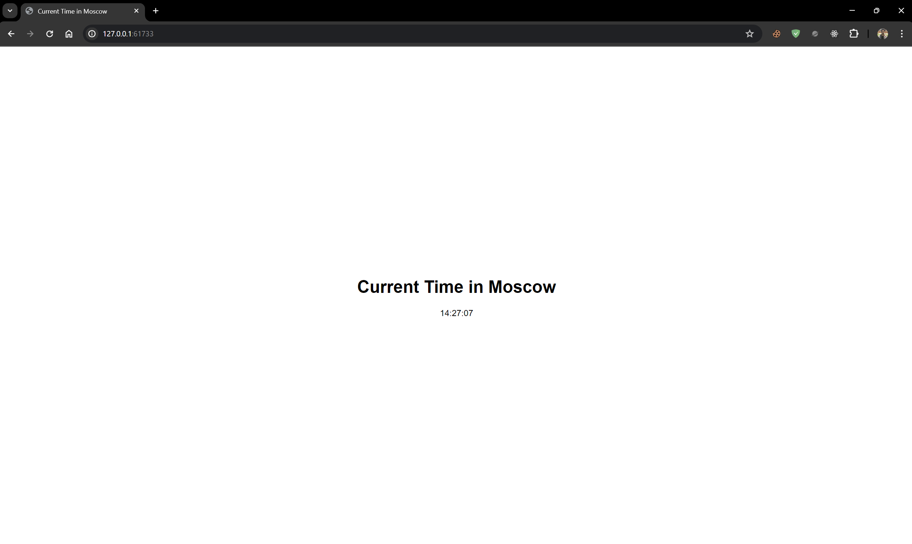
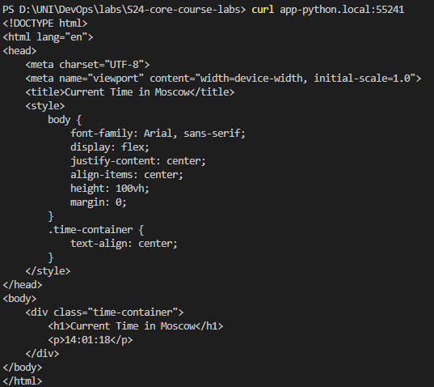

# Kubernetes

## Descriptions:

#### K8s
Kubernetes is an open-source container orchestration platform that automates the deployment, scaling, and management of containerized applications. It was originally designed by Google and is now maintained by the Cloud Native Computing Foundation.

#### Deployment
A Deployment in Kubernetes is responsible for creating and updating instances of your application. It is responsible for creating new ReplicaSets and making sure that the desired number of them are running at all times.

#### Service
A Kubernetes Service is an abstraction that defines a logical set of Pods and a policy by which to access them. Services enable a loose coupling between dependent Pods, allowing them to scale and change independently.

#### Ingress
Ingress exposes HTTP and HTTPS routes from outside the cluster to services within the cluster. Traffic routing is controlled by rules defined on the Ingress resource.

#### Pods
A Pod is the basic execution unit of a Kubernetes application. A Pod represents a single instance of a running process in your cluster.

## Outputs:
#### Deployements:
 

#### Pods

#### Replica Sets: 

#### `kubectl get pods,svc`:

#### Services: 

#### Python:

#### GO:

