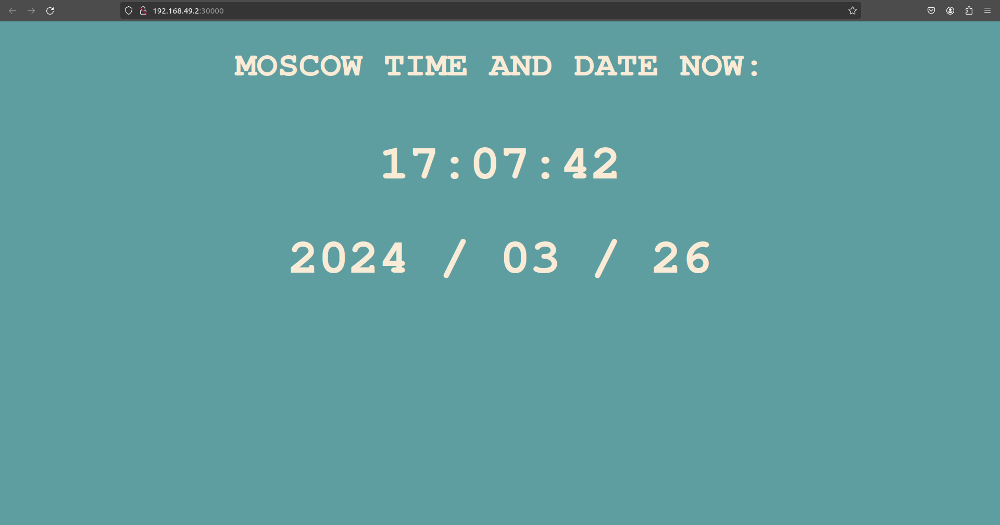

# Introduction to Kubernetes

## Task 1

### Creating Deployment resource
Use command `kubectl create deployment app-python --image=sokolofff/app_python` to create deployment:
```commandline
yegor@yegor:~/devops/S24-Devops-core-course-labs/k8s$ kubectl create deployment app-python --image=sokolofff/app_python
deployment.apps/app-python created
```

Check deployments:
```commandline
yegor@yegor:~/devops/S24-Devops-core-course-labs/k8s$ kubectl get deployments
NAME         READY   UP-TO-DATE   AVAILABLE   AGE
app-python   1/1     1            1           33s
```

### Creating Service resource
Use command `kubectl expose deployment app-python --type=LoadBalancer --port=8080` for creating service:
```commandline
yegor@yegor:~/devops/S24-Devops-core-course-labs/k8s$ kubectl expose deployment app-python --type=LoadBalancer --port=8080
service/app-python exposed
```

Check service:
```commandline
yegor@yegor:~/devops/S24-Devops-core-course-labs/k8s$ kubectl get services
NAME         TYPE           CLUSTER-IP      EXTERNAL-IP   PORT(S)          AGE
app-python   LoadBalancer   10.107.94.239   <pending>     8080:32298/TCP   23s
kubernetes   ClusterIP      10.96.0.1       <none>        443/TCP          49m
```

### Output of `kubectl get pods,svc`
```commandline
yegor@yegor:~/devops/S24-Devops-core-course-labs/k8s$ kubectl get pods,svc
NAME                              READY   STATUS    RESTARTS   AGE
pod/app-python-5d6fff7cdb-pnrnt   1/1     Running   0          4m37s

NAME                 TYPE           CLUSTER-IP      EXTERNAL-IP   PORT(S)          AGE
service/app-python   LoadBalancer   10.107.94.239   <pending>     8080:32298/TCP   91s
service/kubernetes   ClusterIP      10.96.0.1       <none>        443/TCP          50m

```

### Cleanup
Removing deployment:
```commandline
yegor@yegor:~/devops/S24-Devops-core-course-labs/k8s$ kubectl delete deployments app-python
deployment.apps "app-python" deleted
yegor@yegor:~/devops/S24-Devops-core-course-labs/k8s$ kubectl get deployments
No resources found in default namespace.
```

Removing service:
```commandline
yegor@yegor:~/devops/S24-Devops-core-course-labs/k8s$ kubectl delete services app-python
service "app-python" deleted
yegor@yegor:~/devops/S24-Devops-core-course-labs/k8s$ kubectl get services
NAME         TYPE        CLUSTER-IP   EXTERNAL-IP   PORT(S)   AGE
kubernetes   ClusterIP   10.96.0.1    <none>        443/TCP   52m
```

## Task 2

1. Created `deployment.yml` and `service.yml`;
2. Applied new manifest:
```commandline
yegor@yegor:~/devops/S24-Devops-core-course-labs/k8s$ kubectl apply -f .
deployment.apps/app-python-deployment created
service/app-python-service created
```
3. Output of `kubectl get pods,svc`:
```commandline
yegor@yegor:~/devops/S24-Devops-core-course-labs/k8s$ kubectl get pods,svc
NAME                                         READY   STATUS    RESTARTS   AGE
pod/app-python-deployment-647964fbdd-695mb   1/1     Running   0          16s
pod/app-python-deployment-647964fbdd-6mh2h   1/1     Running   0          16s
pod/app-python-deployment-647964fbdd-8sr4l   1/1     Running   0          16s
pod/app-python-deployment-647964fbdd-g7b8q   1/1     Running   0          16s

NAME                         TYPE           CLUSTER-IP      EXTERNAL-IP   PORT(S)          AGE
service/app-python-service   LoadBalancer   10.104.17.218   <pending>     8080:30000/TCP   16s
service/kubernetes           ClusterIP      10.96.0.1       <none>        443/TCP          58m
```
4. Output of `minikube service --all`:
```commandline
yegor@yegor:~/devops/S24-Devops-core-course-labs$ minikube service --all
|-----------|--------------------|-------------|---------------------------|
| NAMESPACE |        NAME        | TARGET PORT |            URL            |
|-----------|--------------------|-------------|---------------------------|
| default   | app-python-service |        8080 | http://192.168.49.2:30000 |
|-----------|--------------------|-------------|---------------------------|
|-----------|------------|-------------|--------------|
| NAMESPACE |    NAME    | TARGET PORT |     URL      |
|-----------|------------|-------------|--------------|
| default   | kubernetes |             | No node port |
|-----------|------------|-------------|--------------|
😿  service default/kubernetes has no node port
🎉  Opening service default/app-python-service in default browser...
yegor@yegor:~/devops/S24-Devops-core-course-labs$ Gtk-Message: 17:15:06.365: Not loading module "atk-bridge": The functionality is provided by GTK natively. Please try to not load it.
```
5. Screenshot of IP matching:

