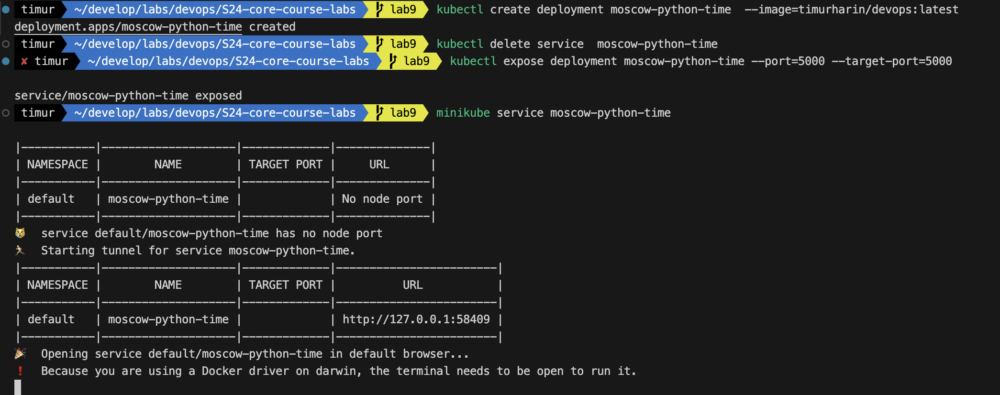
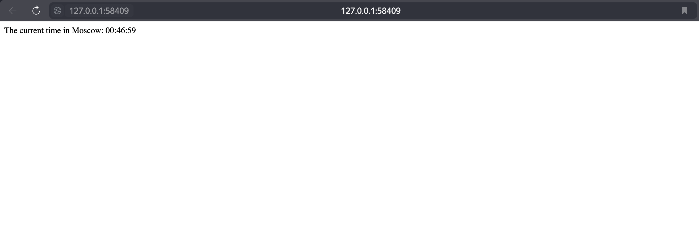
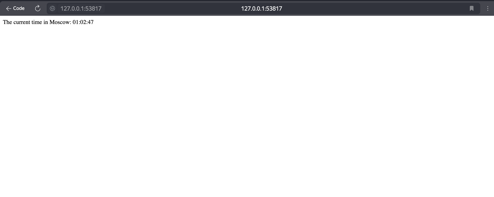

# Deploy



# Access



# Result of command

```text
NAME                                      READY   STATUS    RESTARTS   AGE
pod/moscow-python-time-7d6dc4568c-fkghl   1/1     Running   0          36s

NAME                         TYPE        CLUSTER-IP      EXTERNAL-IP   PORT(S)    AGE
service/kubernetes           ClusterIP   10.96.0.1       <none>        443/TCP    45m
service/moscow-python-time   ClusterIP   10.96.231.123   <none>        5000/TCP   29s
```

# Clean up


# 2nd result of command

```text
NAME                                      READY   STATUS    RESTARTS   AGE
pod/moscow-python-time-6c4478fc97-88jm8   1/1     Running   0          20s
pod/moscow-python-time-6c4478fc97-pzftx   1/1     Running   0          20s
pod/moscow-python-time-6c4478fc97-s998n   1/1     Running   0          20s

NAME                                 TYPE           CLUSTER-IP      EXTERNAL-IP   PORT(S)        AGE
service/kubernetes                   ClusterIP      10.96.0.1       <none>        443/TCP        52m
service/moscow-python-time-service   LoadBalancer   10.105.63.171   <pending>     80:31687/TCP   16s
```

# minikube service --all

```text
|-----------|------------|-------------|--------------|
| NAMESPACE |    NAME    | TARGET PORT |     URL      |
|-----------|------------|-------------|--------------|
| default   | kubernetes |             | No node port |
|-----------|------------|-------------|--------------|
😿  service default/kubernetes has no node port
|-----------|----------------------------|-------------|---------------------------|
| NAMESPACE |            NAME            | TARGET PORT |            URL            |
|-----------|----------------------------|-------------|---------------------------|
| default   | moscow-python-time-service |          80 | http://192.168.49.2:31687 |
|-----------|----------------------------|-------------|---------------------------|
🏃  Starting tunnel for service kubernetes.
🏃  Starting tunnel for service moscow-python-time-service.
|-----------|----------------------------|-------------|------------------------|
| NAMESPACE |            NAME            | TARGET PORT |          URL           |
|-----------|----------------------------|-------------|------------------------|
| default   | kubernetes                 |             | http://127.0.0.1:53814 |
| default   | moscow-python-time-service |             | http://127.0.0.1:53817 |
|-----------|----------------------------|-------------|------------------------|
🎉  Opening service default/kubernetes in default browser...
🎉  Opening service default/moscow-python-time-service in default browser...
❗  Because you are using a Docker driver on darwin, the terminal needs to be open to run it.
```

Same port



# Bonus 

`kubectl get pods,svc`

```text
NAME                                      READY   STATUS             RESTARTS      AGE
pod/moscow-flutter-time-f6cd77c8c-4g9kb   0/1     CrashLoopBackOff   1 (9s ago)    21s
pod/moscow-flutter-time-f6cd77c8c-hjfd8   0/1     CrashLoopBackOff   1 (13s ago)   21s
pod/moscow-flutter-time-f6cd77c8c-x74gp   0/1     CrashLoopBackOff   1 (11s ago)   21s
pod/moscow-python-time-6c4478fc97-dkch8   1/1     Running            0             29s
pod/moscow-python-time-6c4478fc97-dxgb2   1/1     Running            0             29s
pod/moscow-python-time-6c4478fc97-tk7dr   1/1     Running            0             29s

NAME                                  TYPE           CLUSTER-IP      EXTERNAL-IP   PORT(S)          AGE
service/kubernetes                    ClusterIP      10.96.0.1       <none>        443/TCP          132m
service/moscow-flutter-time-service   LoadBalancer   10.109.153.28   <pending>     80:31360/TCP     16s
service/moscow-python-time-service    LoadBalancer   10.96.113.42    <pending>     5000:31764/TCP   30s
```

`minikube service --all`
```text
|-----------|------------|-------------|--------------|
| NAMESPACE |    NAME    | TARGET PORT |     URL      |
|-----------|------------|-------------|--------------|
| default   | kubernetes |             | No node port |
|-----------|------------|-------------|--------------|
😿  service default/kubernetes has no node port
|-----------|-----------------------------|-------------|---------------------------|
| NAMESPACE |            NAME             | TARGET PORT |            URL            |
|-----------|-----------------------------|-------------|---------------------------|
| default   | moscow-flutter-time-service |          80 | http://192.168.49.2:31360 |
|-----------|-----------------------------|-------------|---------------------------|
|-----------|----------------------------|-------------|---------------------------|
| NAMESPACE |            NAME            | TARGET PORT |            URL            |
|-----------|----------------------------|-------------|---------------------------|
| default   | moscow-python-time-service |        5000 | http://192.168.49.2:31764 |
|-----------|----------------------------|-------------|---------------------------|
🏃  Starting tunnel for service kubernetes.
🏃  Starting tunnel for service moscow-flutter-time-service.
🏃  Starting tunnel for service moscow-python-time-service.
|-----------|-----------------------------|-------------|------------------------|
| NAMESPACE |            NAME             | TARGET PORT |          URL           |
|-----------|-----------------------------|-------------|------------------------|
| default   | kubernetes                  |             | http://127.0.0.1:60798 |
| default   | moscow-flutter-time-service |             | http://127.0.0.1:60801 |
| default   | moscow-python-time-service  |             | http://127.0.0.1:60804 |
|-----------|-----------------------------|-------------|------------------------|
🎉  Opening service default/kubernetes in default browser...
🎉  Opening service default/moscow-flutter-time-service in default browser...
🎉  Opening service default/moscow-python-time-service in default browser...
❗  Because you are using a Docker driver on darwin, the terminal needs to be open to run it.
^C✋  Stopping tunnel for service moscow-python-time-service.
✋  Stopped tunnel for service moscow-flutter-time-service.
✋  Stopped tunnel for service kubernetes.
```


### Flutter


### Python


`kubectl get ingress`

```text
NAME                           CLASS    HOSTS                                                            ADDRESS   PORTS   AGE
moscow-time-ingress-manifest   <none>   moscow-flutter-time.example.com,moscow-python-time.example.com             80      77s
```

And these problems because of arm/amd issueses
https://stackoverflow.com/questions/77355846/exec-usr-local-bin-docker-entrypoint-sh-exec-format-error

`kubectl logs moscow-flutter-time-f6cd77c8c-4g9kb`                               
exec /docker-entrypoint.sh: exec format error

So I dont have amd machine to give amd image for minikube

