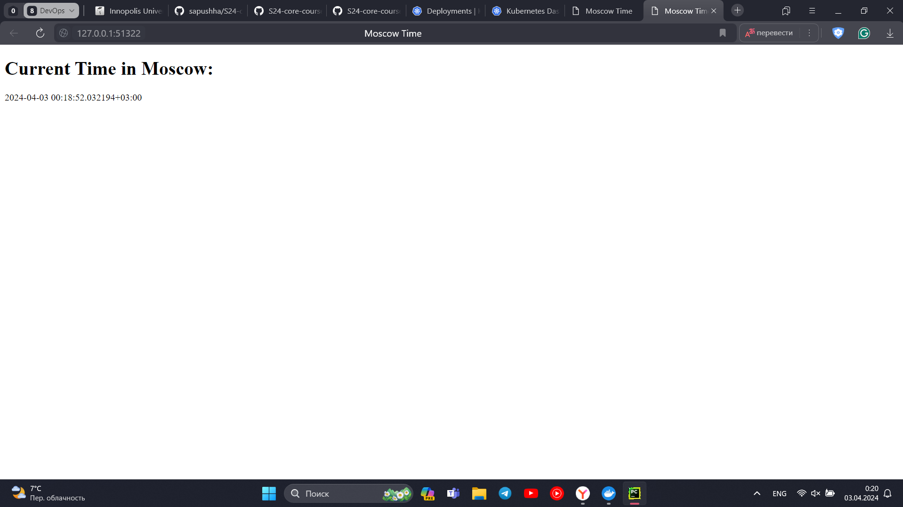

# Kubernetes Deployment

## Basic Deployment

```bash
(venv) PS C:\Users\smash\PyCharmProjects\S24-core-course-labs\k8s> kubectl get pods,svc

NAME                             READY   STATUS    RESTARTS   AGE
pod/app-python-f9d979497-jsg6n   1/1     Running   0          2m14s

NAME                 TYPE           CLUSTER-IP      EXTERNAL-IP   PORT(S)          AGE
service/app-python   LoadBalancer   10.111.71.108   <pending>     8080:32589/TCP   58s
service/kubernetes   ClusterIP      10.96.0.1       <none>        443/TCP          12m
```

## Manifests Deployment

```bash
(venv) PS C:\Users\smash\PyCharmProjects\S24-core-course-labs\k8s> kubectl get pods,svc

NAME                              READY   STATUS    RESTARTS   AGE
pod/app-python-59d8d8c65c-69k6f   1/1     Running   0          100s
pod/app-python-59d8d8c65c-pxt88   1/1     Running   0          100s
pod/app-python-59d8d8c65c-sr7qg   1/1     Running   0          100s

NAME                 TYPE           CLUSTER-IP      EXTERNAL-IP   PORT(S)          AGE
service/app-python   LoadBalancer   10.108.20.128   <pending>     8080:30413/TCP   94s
service/kubernetes   ClusterIP      10.96.0.1       <none>        443/TCP          16m
```

```bash
(venv) PS C:\Users\smash\PyCharmProjects\S24-core-course-labs\k8s> minikube service --all

W0403 00:18:49.568151   10076 main.go:291] Unable to resolve the current Docker CLI context "default": context "default": context not found: open C:\Users\smash\.docker\contexts\meta\37a8eec1ce19687d132fe29051dca629d164e2c4958ba141d5f4133a33f0688f\meta.json: The system cannot find the path specified.
|-----------|------------|-------------|---------------------------|
| NAMESPACE |    NAME    | TARGET PORT |            URL            |
|-----------|------------|-------------|---------------------------|
| default   | app-python |        8080 | http://192.168.49.2:30413 |
|-----------|------------|-------------|---------------------------|
|-----------|------------|-------------|--------------|
| NAMESPACE |    NAME    | TARGET PORT |     URL      |
|-----------|------------|-------------|--------------|
| default   | kubernetes |             | No node port |
|-----------|------------|-------------|--------------|
* service default/kubernetes has no node port
* Starting tunnel for service app-python.
* Starting tunnel for service kubernetes.
|-----------|------------|-------------|------------------------|
| NAMESPACE |    NAME    | TARGET PORT |          URL           |
|-----------|------------|-------------|------------------------|
| default   | app-python |             | http://127.0.0.1:51322 |
| default   | kubernetes |             | http://127.0.0.1:51324 |
|-----------|------------|-------------|------------------------|
* Opening service default/app-python in default browser...
* Opening service default/kubernetes in default browser...
! Because you are using a Docker driver on windows, the terminal needs to be open to run it.
```

