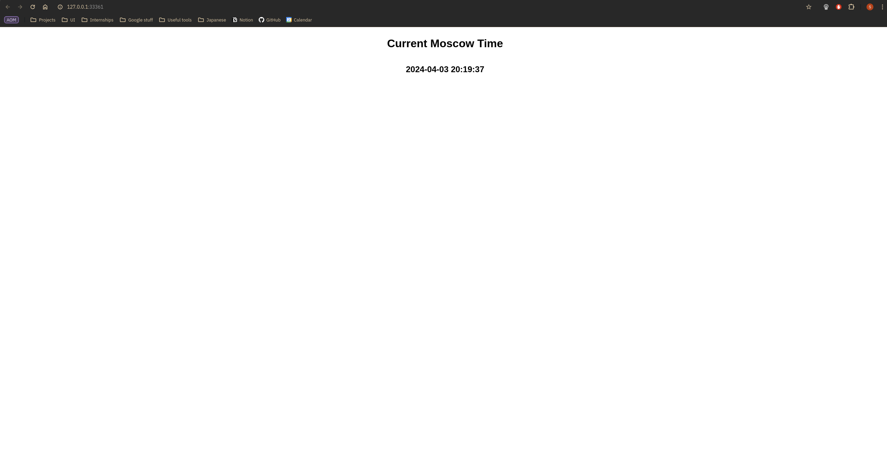

# K8s

## Installation
I installed `cubectl` and `minikube` using binaries from `kubernetes.io`

## Setup
Since I am using Rootless docker, I had to start my `minikube` by following command
```bash
minikube start --driver=docker --container-runtime=containerd
```

## Create deployment source
```bash
kubectl create deploymnet python-app --image=slry/python_moscow_time:latest
```

## Create service
```bash
kubectl expose deployment python-app --type=LoadBalancer --port=8080
```

## Access application from outside the Kubernetes virtual network
To do this, we can use `minikube service <app>` command like this
```bash
minikube service python-app
```

Minikube creates tunnel for service python-app and now we can access it by given port

## Output for Task 1
The output of the `kubectl get pods,svc` command

```bash
NAME                             READY   STATUS    RESTARTS   AGE
pod/python-app-c65b4f95f-5pft9   1/1     Running   0          55m

NAME                 TYPE           CLUSTER-IP       EXTERNAL-IP   PORT(S)          AGE
service/kubernetes   ClusterIP      10.96.0.1        <none>        443/TCP          69m
service/python-app   LoadBalancer   10.107.122.115   <pending>     8080:31980/TCP   50m
```

## Output for Task 2
The output of the `kubectl get pods,svc`

```bash
NAME                                         READY   STATUS    RESTARTS   AGE
pod/python-app-deployment-6cb95844bf-xk4ps   1/1     Running   0          7m11s

NAME                         TYPE           CLUSTER-IP       EXTERNAL-IP   PORT(S)          AGE
service/kubernetes           ClusterIP      10.96.0.1        <none>        443/TCP          33m
service/python-app-service   LoadBalancer   10.107.170.130   <pending>     8080:31621/TCP   7m11s
```

The output of the `minikube service --all` command

```bash
|-----------|------------|-------------|--------------|
| NAMESPACE |    NAME    | TARGET PORT |     URL      |
|-----------|------------|-------------|--------------|
| default   | kubernetes |             | No node port |
|-----------|------------|-------------|--------------|
😿  service default/kubernetes has no node port
|-----------|--------------------|-------------|---------------------------|
| NAMESPACE |        NAME        | TARGET PORT |            URL            |
|-----------|--------------------|-------------|---------------------------|
| default   | python-app-service |        8080 | http://192.168.49.2:31621 |
|-----------|--------------------|-------------|---------------------------|
🏃  Starting tunnel for service kubernetes.
🏃  Starting tunnel for service python-app-service.
|-----------|--------------------|-------------|------------------------|
| NAMESPACE |        NAME        | TARGET PORT |          URL           |
|-----------|--------------------|-------------|------------------------|
| default   | kubernetes         |             | http://127.0.0.1:41641 |
| default   | python-app-service |             | http://127.0.0.1:33361 |
|-----------|--------------------|-------------|------------------------|
🎉  Opening service default/kubernetes in default browser...
🎉  Opening service default/python-app-service in default browser...
❗  Because you are using a Docker driver on linux, the terminal needs to be open to run it.
Opening in existing browser session.
Opening in existing browser session.
```

Screenshot of the application running on my local machine

