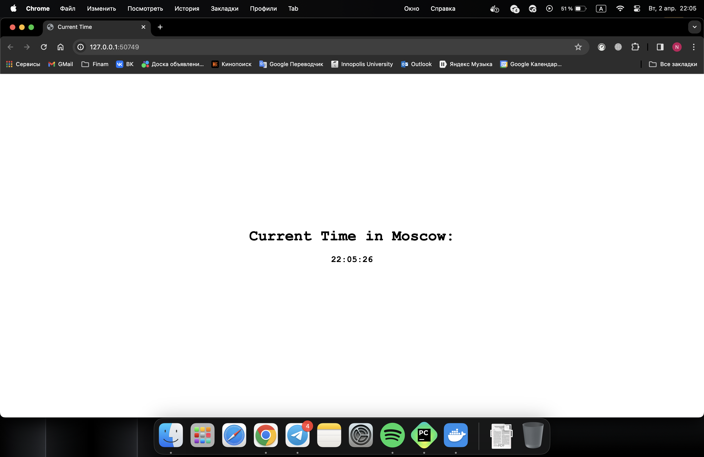
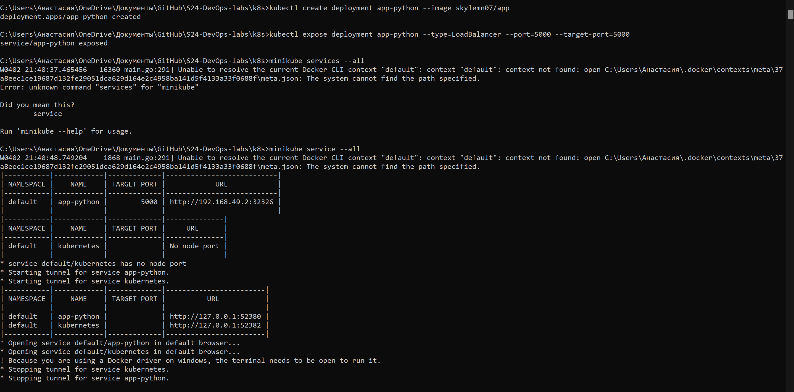

# K8S lab 9

## Output of commands

- `kubectl get pods,svc`

    ```properties
    ahmad@ahmad:~/Desktop/devops/k8s$ kubectl get pods,svc
    NAME                             READY   STATUS    RESTARTS   AGE
    pod/app-python-d9b57b459-2hrm2   1/1     Running   0          94s

    NAME                 TYPE           CLUSTER-IP       EXTERNAL-IP   PORT(S)          AGE
    service/app-python   LoadBalancer   10.106.139.241   <pending>     5000:32443/TCP   84s
    service/kubernetes   ClusterIP      10.96.0.1        <none>        443/TCP          11m
    ```

- `kubectl get pods,svc` after creating yml files

    ```properties
    ahmad@ahmad:~/Desktop/devops/k8s$ kubectl get pods,svc
    NAME                              READY   STATUS    RESTARTS   AGE
    pod/app-python-56b6b6d8f5-8whjb   1/1     Running   0          44s
    pod/app-python-56b6b6d8f5-fhmm5   1/1     Running   0          44s
    pod/app-python-56b6b6d8f5-grb5g   1/1     Running   0          44s

    NAME                 TYPE           CLUSTER-IP       EXTERNAL-IP   PORT(S)          AGE
    service/app-python   LoadBalancer   10.100.181.248   <pending>     5000:30780/TCP   44s
    service/kubernetes   ClusterIP      10.96.0.1        <none>        443/TCP          66m
    ```

- `minikube service --all` command:

    ```properties
    ahmad@ahmad:~/Desktop/devops/k8s$ minikube service --all
    |-----------|------------|-------------|---------------------------|
    | NAMESPACE |    NAME    | TARGET PORT |            URL            |
    |-----------|------------|-------------|---------------------------|
    | default   | app-python |        5000 | http://192.168.49.2:30780 |
    |-----------|------------|-------------|---------------------------|
    |-----------|------------|-------------|--------------|
    | NAMESPACE |    NAME    | TARGET PORT |     URL      |
    |-----------|------------|-------------|--------------|
    | default   | kubernetes |             | No node port |
    |-----------|------------|-------------|--------------|
    😿  service default/kubernetes has no node port
    🎉  Opening service default/app-python in default browser...
    /snap/core20/current/lib/x86_64-linux-gnu/libstdc++.so.6: version `GLIBCXX_3.4.29' not found (required by /lib/x86_64-linux-gnu/libproxy.so.1)
    Failed to load module: /home/ahmad/snap/code/common/.cache/gio-modules/libgiolibproxy.so
    ```

- screenshot for the previous command

    
    
    

- After creating yml for dotnet application

    ```properties
    ahmad@ahmad:~/Desktop/devops$ minikube service --all
    |-----------|------------|-------------|---------------------------|
    | NAMESPACE |    NAME    | TARGET PORT |            URL            |
    |-----------|------------|-------------|---------------------------|
    | default   | app-dotnet |        8080 | http://192.168.49.2:32619 |
    |-----------|------------|-------------|---------------------------|
    |-----------|------------|-------------|---------------------------|
    | NAMESPACE |    NAME    | TARGET PORT |            URL            |
    |-----------|------------|-------------|---------------------------|
    | default   | app-python |        5000 | http://192.168.49.2:30780 |
    |-----------|------------|-------------|---------------------------|
    |-----------|------------|-------------|--------------|
    | NAMESPACE |    NAME    | TARGET PORT |     URL      |
    |-----------|------------|-------------|--------------|
    | default   | kubernetes |             | No node port |
    |-----------|------------|-------------|--------------|
    😿  service default/kubernetes has no node port
    🎉  Opening service default/app-dotnet in default browser...
    /snap/core20/current/lib/x86_64-linux-gnu/libstdc++.so.6: version `GLIBCXX_3.4.29' not found (required by /lib/x86_64-linux-gnu/libproxy.so.1)
    Failed to load module: /home/ahmad/snap/code/common/.cache/gio-modules/libgiolibproxy.so
    🎉  Opening service default/app-python in default browser...
    /snap/core20/current/lib/x86_64-linux-gnu/libstdc++.so.6: version `GLIBCXX_3.4.29' not found (required by /lib/x86_64-linux-gnu/libproxy.so.1)
    Failed to load module: /home/ahmad/snap/code/common/.cache/gio-modules/libgiolibproxy.so
    ```

- result of running `curl`

    