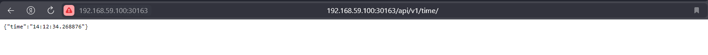

# Kubernetes

---

## Commands' output

### K8S Deployment Using Commands

> Command
>
>```shell
>kubectl get pods
>```
> Output
>```
>NAME                          READY   STATUS    RESTARTS   AGE
>python-app-6fc8b97584-xrscr   1/1     Running   0          9m6s
>```

> Command
>
>```shell
>kubectl get svc
>```
> Output
>```
>NAME         TYPE           CLUSTER-IP      EXTERNAL-IP   PORT(S)          AGE
>kubernetes   ClusterIP      10.96.0.1       <none>        443/TCP          24m
>python-app   LoadBalancer   10.109.82.171   <pending>     5000:32366/TCP   5m22s        9m6s
>```

### K8S Deployment Using Manifests

> Command
>
>```shell
>kubectl get pods
>```
> Output
>```
>NAME                          READY   STATUS    RESTARTS   AGE
>python-app-7d856f674b-7rj5z   1/1     Running   0          27m
>python-app-7d856f674b-kf4nl   1/1     Running   0          27m
>python-app-7d856f674b-vlk4r   1/1     Running   0          27m         9m6s
>```

> Command
>
> ```shell
> kubectl get svc
> ```
> Output
> ```
> NAME                 TYPE           CLUSTER-IP      EXTERNAL-IP   PORT(S)          AGE
> kubernetes           ClusterIP      10.96.0.1       <none>        443/TCP          60m
> python-app-service   LoadBalancer   10.103.68.210   <pending>     5000:30163/TCP   22m
> ```

> Command
> 
> ```shell
> minikube service --all
> ```
> Output
> ```
> |-----------|------------|-------------|--------------|
> | NAMESPACE |    NAME    | TARGET PORT |     URL      |
> |-----------|------------|-------------|--------------|
> | default   | kubernetes |             | No node port |
> |-----------|------------|-------------|--------------|
> * service default/kubernetes has no node port
> |-----------|--------------------|-------------|-----------------------------|
> | NAMESPACE |        NAME        | TARGET PORT |             URL             |
> |-----------|--------------------|-------------|-----------------------------|
> | default   | python-app-service |        5000 | http://192.168.59.100:30163 |
> |-----------|--------------------|-------------|-----------------------------|
> * Opening service default/python-app-service in default browser...
> ```

#### Screenshot

