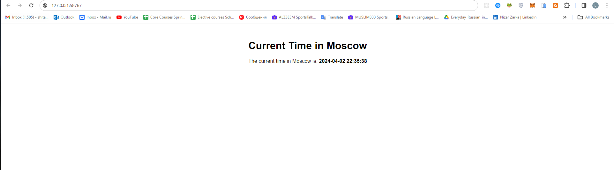

# Kubernetes

## Task 1

The output of the `kubectl get pods,svc` command:

```sh
$ kubectl get pods,svc
NAME                             READY   STATUS    RESTARTS   AGE
pod/app-python-ffc67f4b6-r8vdv   1/1     Running   0          100s

NAME                 TYPE           CLUSTER-IP      EXTERNAL-IP   PORT(S)          AGE
service/app-python   LoadBalancer   10.97.231.221   <pending>     8000:32130/TCP   12s
service/kubernetes   ClusterIP      10.96.0.1       <none>        443/TCP          3m53s
```

## Task 2

The output of the `kubectl get pods,svc` command:

```sh
$ kubectl get pods,svc
NAME                                         READY   STATUS    RESTARTS   AGE
pod/app-python-deployment-75d5864857-2746r   1/1     Running   0          42s
pod/app-python-deployment-75d5864857-cj959   1/1     Running   0          42s
pod/app-python-deployment-75d5864857-sgjwf   1/1     Running   0          42s

NAME                         TYPE           CLUSTER-IP      EXTERNAL-IP   PORT(S)          AGE
service/app-python-service   LoadBalancer   10.102.146.26   <pending>     8000:32754/TCP   10s
service/kubernetes           ClusterIP      10.96.0.1       <none>        443/TCP          17m
```

The output of the `minikube service --all` command:

```sh
$ minikube service --all
|-----------|--------------------|-------------|---------------------------|
| NAMESPACE |        NAME        | TARGET PORT |            URL            |
|-----------|--------------------|-------------|---------------------------|
| default   | app-python-service |        8000 | http://192.168.49.2:32754 |
|-----------|--------------------|-------------|---------------------------|
|-----------|------------|-------------|--------------|
| NAMESPACE |    NAME    | TARGET PORT |     URL      |
|-----------|------------|-------------|--------------|
| default   | kubernetes |             | No node port |
|-----------|------------|-------------|--------------|
😿  service default/kubernetes has no node port
🎉  Opening service default/app-python-service in default browser...
```

Result from the browser, demonstrating that the IP matches the output of `minikube service --all`:



## Bonus Task

Application Availability Check:

```sh
$ curl --resolve "python.app:8000:$( minikube ip )" -i http://python.app
HTTP/1.1 200 OK
Date: Sun, 31 Mar 2024 17:10:27 GMT
Content-Type: application/json
Content-Length: 38
Connection: keep-alive

{"time":"20:10:27", "date":"2024-03-31"}
```