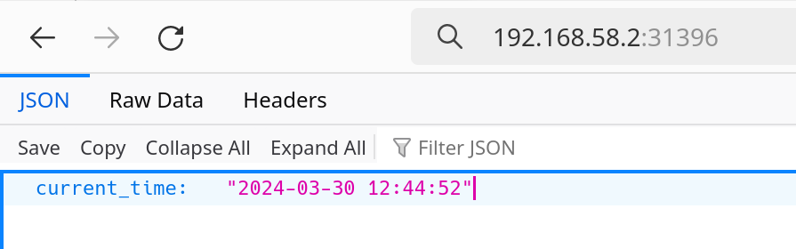
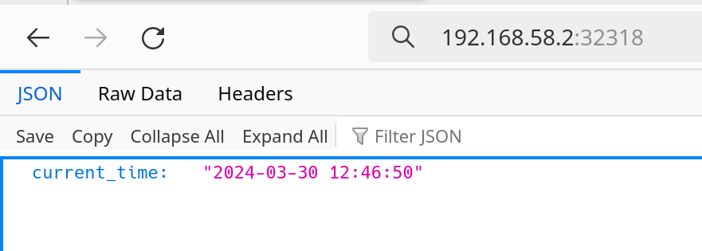

# Kubernetes

## Manual deployment with `kubectl` ad-hoc commands

1. Create a deployment with `kubectl`:

    ```bash
    $ kubectl create deployment app-python --image fedorivn/simple-web-app:python-1.0.0

    deployment.apps/app-python created
    ```

1. Verify that the deployment is running:

    ```bash
    $ kubectl get deployments
    NAME         READY   UP-TO-DATE   AVAILABLE   AGE
    app-python   1/1     1            1           67s
    ```

    ```bash
    $ kubectl logs app-python-687c6d6df-8kb8s 
    INFO:     Started server process [1]
    INFO:     Waiting for application startup.
    INFO:     Application startup complete.
    INFO:     Uvicorn running on http://0.0.0.0:80 (Press CTRL+C to quit)
    ```

1. Expose the deployment:

    ```bash
    $ kubectl expose deployment app-python --type=LoadBalancer --port=8080 --target-port=8080
    service/app-python exposed
    ```

1. Verify that the service is running:

    ```bash
    $ kubectl get pods,svc
    NAME                             READY   STATUS    RESTARTS   AGE
    pod/app-python-687c6d6df-8kb8s   1/1     Running   0          26m

    NAME                 TYPE           CLUSTER-IP       EXTERNAL-IP   PORT(S)          AGE
    service/app-python   LoadBalancer   10.107.200.250   <pending>     8080:31760/TCP   20m
    service/kubernetes   ClusterIP      10.96.0.1        <none>        443/TCP          48m
    ```

## Declarative deployment with manifests

1. Apply manifests:

    ```bash
    $ kubectl apply -f app-python/deployment.yml
    deployment.apps/app-python-deployment created

    $ kubectl apply -f app-python/services.yml
    service/app-python-service created

    $ kubectl apply -f app-rust/deployment.yml
    deployment.apps/app-rust-deployment created

    $ kubectl apply -f app-rust/services.yml
    service/app-rust-service created
    ```

1. Verify that the pods are running and ser

    ```bash
    $ kubectl get pods,svc
    NAME                                         READY   STATUS    RESTARTS   AGE
    pod/app-python-deployment-598cb96897-52gt4   1/1     Running   0          39m
    pod/app-python-deployment-598cb96897-6577m   1/1     Running   0          39m
    pod/app-python-deployment-598cb96897-s8snd   1/1     Running   0          39m
    pod/app-rust-deployment-55676b66df-22k2d     1/1     Running   0          86s
    pod/app-rust-deployment-55676b66df-7d92m     1/1     Running   0          86s
    pod/app-rust-deployment-55676b66df-blpjp     1/1     Running   0          86s

    NAME                         TYPE           CLUSTER-IP      EXTERNAL-IP   PORT(S)        AGE
    service/app-python-service   LoadBalancer   10.102.102.25   <pending>     80:31396/TCP   39m
    service/app-rust-service     LoadBalancer   10.105.173.65   <pending>     80:32318/TCP   79s
    service/kubernetes           ClusterIP      10.96.0.1       <none>        443/TCP        13h
    ```

1. Check if the application is available inside the cluster:

    ```bash
    docker@minikube:~$ curl 10.102.102.25:80 && printf '\n'
    {"current_time":"2024-03-30 11:54:00"}
    ```

1. View the services:

    ```bash
    $ minikube service --all
    |-----------|--------------------|-------------|---------------------------|
    | NAMESPACE |        NAME        | TARGET PORT |            URL            |
    |-----------|--------------------|-------------|---------------------------|
    | default   | app-python-service |          80 | http://192.168.58.2:31396 |
    |-----------|--------------------|-------------|---------------------------|
    |-----------|------------------|-------------|---------------------------|
    | NAMESPACE |       NAME       | TARGET PORT |            URL            |
    |-----------|------------------|-------------|---------------------------|
    | default   | app-rust-service |          80 | http://192.168.58.2:32318 |
    |-----------|------------------|-------------|---------------------------|
    |-----------|------------|-------------|--------------|
    | NAMESPACE |    NAME    | TARGET PORT |     URL      |
    |-----------|------------|-------------|--------------|
    | default   | kubernetes |             | No node port |
    |-----------|------------|-------------|--------------|
    😿  service default/kubernetes has no node port
    🎉  Opening service default/app-python-service in default browser...
    👉  http://192.168.58.2:31396
    🎉  Opening service default/app-rust-service in default browser...
    👉  http://192.168.58.2:32318
    ```

1. Create a tunnel

    ```bash
    $ minikube tunnel
    Status:
        machine: minikube
        pid: 887147
        route: 10.96.0.0/12 -> 192.168.58.2
        minikube: Running
        services: [app-python-service, app-rust-service]
    errors: 
                minikube: no errors
                router: no errors
                loadbalancer emulator: no errors

    ```

1. Verify availability with `curl`:

    ```bash
    $ curl http://192.168.58.2:31396 && printf '\n'
    {"current_time":"2024-03-30 12:38:31"}

    $ curl http://192.168.58.2:32318 && printf '\n'
    {"current_time":"2024-03-30 12:39:31"}
    ```

1. Verify in browser:

    - Python application:
        

    - Rust application:
        

## Ingress

1. Install ingress addon and verify it is running:

    ```bash
    $ minikube addons enable ingress
    ...

    $ kubectl get pods -n ingress-nginx
    NAME                                        READY   STATUS      RESTARTS   AGE
    ingress-nginx-admission-create-bzk86        0/1     Completed   0          19m
    ingress-nginx-admission-patch-wtzqb         0/1     Completed   0          19m
    ingress-nginx-controller-7c6974c4d8-2zd5z   1/1     Running     0          19m
    ```

1. Apply ingress manifest:

    ```bash
    $ kubectl apply -f ingress.yml
    ingress.networking.k8s.io/example-ingress created
    ```

1. Application availability check:

    ```bash
    $ curl --resolve "python.app:80:$( minikube ip )" -i http://python.app
    HTTP/1.1 200 OK
    Date: Sat, 30 Mar 2024 10:26:24 GMT
    Content-Type: application/json
    Content-Length: 38
    Connection: keep-alive

    {"current_time":"2024-03-30 13:26:24"}

    $ curl --resolve "rust.app:80:$( minikube ip )" -i http://rust.app
    HTTP/1.1 200 OK
    Date: Sat, 30 Mar 2024 10:26:58 GMT
    Content-Type: application/json
    Content-Length: 38
    Connection: keep-alive

    {"current_time":"2024-03-30 13:26:58"}
    ```
