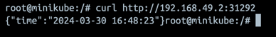
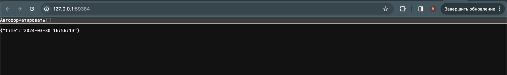
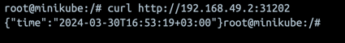
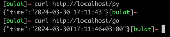

## Task 1

```bash
$ kubectl create deployment app-python --image=bulatok4/app_python:latest --port=8080
```

```bash
$ kubectl expose deployment app-python --type=LoadBalancer --port=8080

service/app-python exposed
```

```bash
$ kubectl get pods,svc
NAME                              READY   STATUS    RESTARTS   AGE
pod/app-python-5dd65f788c-qsgjb   1/1     Running   0          6m41s

NAME                 TYPE           CLUSTER-IP    EXTERNAL-IP   PORT(S)          AGE
service/app-python   LoadBalancer   10.99.108.8   <pending>     8080:31664/TCP   2m4s
service/kubernetes   ClusterIP      10.96.0.1     <none>        443/TCP          15m
```

```bash
$ kubectl delete service app-python
service "app-python" deleted
$ kubectl delete deployment app-python
deployment.apps "app-python" deleted
```

## Task 2 + bonus

```bash
$ kubectl apply -f app-python/deployment.yml
$ kubectl apply -f app-python/service.yml
$ kubectl apply -f app-go/deployment.yml
$ kubectl apply -f app-go/service.yml
```

```bash
$ kubectl get pods,svc
NAME                                         READY   STATUS    RESTARTS   AGE
pod/app-go-deployment-6dcfc7dc5b-c75jb       1/1     Running   0          8m6s
pod/app-go-deployment-6dcfc7dc5b-gwhmn       1/1     Running   0          8m6s
pod/app-go-deployment-6dcfc7dc5b-zjpzr       1/1     Running   0          8m6s
pod/app-python-deployment-789b95c7bd-782pz   1/1     Running   0          8m33s
pod/app-python-deployment-789b95c7bd-fkx69   1/1     Running   0          8m33s
pod/app-python-deployment-789b95c7bd-x6nqs   1/1     Running   0          8m33s

NAME                         TYPE           CLUSTER-IP      EXTERNAL-IP   PORT(S)          AGE
service/app-go-service       LoadBalancer   10.105.122.89   127.0.0.1     8080:31202/TCP   8m9s
service/app-python-service   LoadBalancer   10.106.38.7     127.0.0.1     8080:31292/TCP   8m12s
service/kubernetes           ClusterIP      10.96.0.1       <none>        443/TCP          10m
```


```bash
$ minikube service --all
|-----------|----------------|-------------|---------------------------|
| NAMESPACE |      NAME      | TARGET PORT |            URL            |
|-----------|----------------|-------------|---------------------------|
| default   | app-go-service |        8080 | http://192.168.49.2:31202 |
|-----------|----------------|-------------|---------------------------|
|-----------|--------------------|-------------|---------------------------|
| NAMESPACE |        NAME        | TARGET PORT |            URL            |
|-----------|--------------------|-------------|---------------------------|
| default   | app-python-service |        8080 | http://192.168.49.2:31292 |
|-----------|--------------------|-------------|---------------------------|
|-----------|------------|-------------|--------------|
| NAMESPACE |    NAME    | TARGET PORT |     URL      |
|-----------|------------|-------------|--------------|
| default   | kubernetes |             | No node port |
|-----------|------------|-------------|--------------|
😿  service default/kubernetes has no node port
🏃  Starting tunnel for service app-go-service.
🏃  Starting tunnel for service app-python-service.
🏃  Starting tunnel for service kubernetes.
|-----------|--------------------|-------------|------------------------|
| NAMESPACE |        NAME        | TARGET PORT |          URL           |
|-----------|--------------------|-------------|------------------------|
| default   | app-go-service     |             | http://127.0.0.1:59382 |
| default   | app-python-service |             | http://127.0.0.1:59384 |
| default   | kubernetes         |             | http://127.0.0.1:59386 |
|-----------|--------------------|-------------|------------------------|
🎉  Opening service default/app-go-service in default browser...
🎉  Opening service default/app-python-service in default browser...
🎉  Opening service default/kubernetes in default browser...
❗  Because you are using a Docker driver on darwin, the terminal needs to be open to run it.
```

Python:



Go:




## Ingress

```bash
$ minikube addons enable ingress

$ kubectl apply -f common/ingress.yml

$ kubectl get pods -n ingress-nginx
ingress-nginx-admission-create-gk77f        0/1     Completed   0          3m33s
ingress-nginx-admission-patch-nhxgs         0/1     Completed   0          3m33s
ingress-nginx-controller-7c6974c4d8-57t2s   1/1     Running     0          3m33s
```

