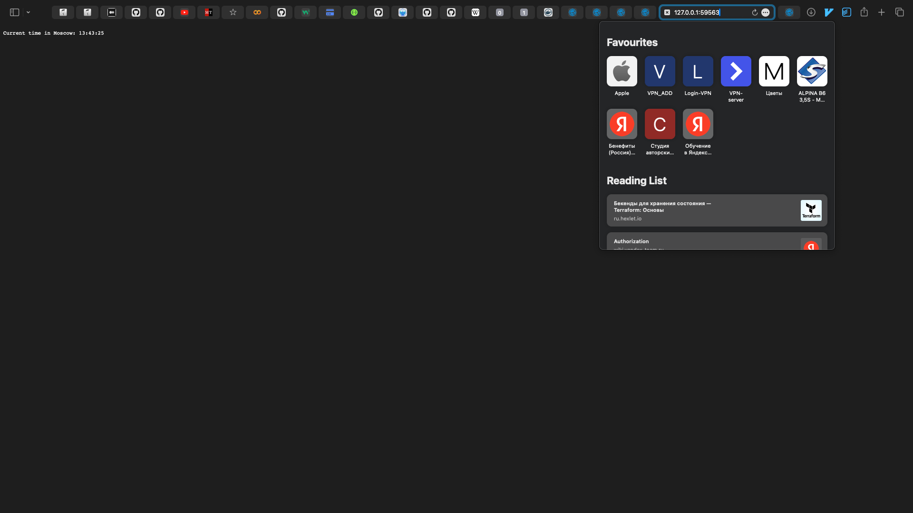
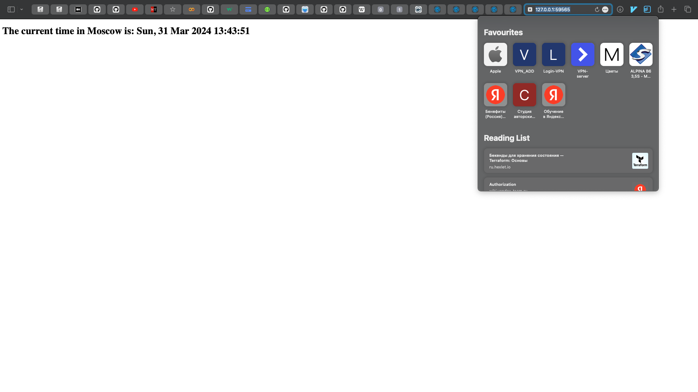

## Task 1
`kubectl get pods,svc`
```text
NAME                                         READY   STATUS    RESTARTS   AGE
pod/moscow-time-web-app-python-f6444c46d-69gkz   1/1     Running   0          8m29s
pod/moscow-time-web-app-python-f6444c46d-jcbcs   1/1     Running   0          8m29s
pod/moscow-time-web-app-python-f6444c46d-rm2f4   1/1     Running   0          8m29s

NAME                                 TYPE           CLUSTER-IP      EXTERNAL-IP   PORT(S)          AGE
service/kubernetes                   ClusterIP      10.96.0.1       <none>        443/TCP          3h9m
service/moscow-time-web-app-python   LoadBalancer   10.98.238.218   <pending>     8080:30801/TCP   8m25s
```

## Task 2

`kubectl get pods,svc`
```text
NAME                                              READY   STATUS    RESTARTS   AGE
pod/moscow-time-web-app-go-64959bfb5-bj5zv        1/1     Running   0          39s
pod/moscow-time-web-app-go-64959bfb5-brhtr        1/1     Running   0          39s
pod/moscow-time-web-app-go-64959bfb5-q77qq        1/1     Running   0          39s
pod/moscow-time-web-app-python-568b54759c-dsw9q   1/1     Running   0          44s
pod/moscow-time-web-app-python-568b54759c-jcbcs   1/1     Running   0          44s
pod/moscow-time-web-app-python-568b54759c-rm2f4   1/1     Running   0          44s

NAME                                 TYPE           CLUSTER-IP       EXTERNAL-IP   PORT(S)          AGE
service/kubernetes                   ClusterIP      10.96.0.1        <none>        443/TCP          7d1h
service/moscow-time-service-go       LoadBalancer   10.111.152.135   <pending>     8081:32194/TCP   39s
service/moscow-time-service-python   LoadBalancer   10.98.251.93     <pending>     8080:31420/TCP   44s
```

`minikube service --all`
```text
|-----------|------------|-------------|--------------|
| NAMESPACE |    NAME    | TARGET PORT |     URL      |
|-----------|------------|-------------|--------------|
| default   | kubernetes |             | No node port |
|-----------|------------|-------------|--------------|
😿  service default/kubernetes has no node port
|-----------|------------------------|-------------|---------------------------|
| NAMESPACE |          NAME          | TARGET PORT |            URL            |
|-----------|------------------------|-------------|---------------------------|
| default   | moscow-time-service-go |        8081 | http://192.168.49.2:30974 |
|-----------|------------------------|-------------|---------------------------|
|-----------|----------------------------|-------------|---------------------------|
| NAMESPACE |            NAME            | TARGET PORT |            URL            |
|-----------|----------------------------|-------------|---------------------------|
| default   | moscow-time-service-python |        8080 | http://192.168.49.2:31731 |
|-----------|----------------------------|-------------|---------------------------|
🏃  Starting tunnel for service kubernetes.
🏃  Starting tunnel for service moscow-time-service-go.
🏃  Starting tunnel for service moscow-time-service-python.
|-----------|----------------------------|-------------|------------------------|
| NAMESPACE |            NAME            | TARGET PORT |          URL           |
|-----------|----------------------------|-------------|------------------------|
| default   | kubernetes                 |             | http://127.0.0.1:59561 |
| default   | moscow-time-service-go     |             | http://127.0.0.1:59563 |
| default   | moscow-time-service-python |             | http://127.0.0.1:59565 |
|-----------|----------------------------|-------------|------------------------|
🎉  Opening service default/kubernetes in default browser...
🎉  Opening service default/moscow-time-service-go in default browser...
🎉  Opening service default/moscow-time-service-python in default browser...
❗  Because you are using a Docker driver on darwin, the terminal needs to be open to run it.
```

### Golang



### Python



## Extra

```text
kubectl get pods -n ingress-nginx

NAME                                        READY   STATUS      RESTARTS   AGE
ingress-nginx-admission-create-bll45        0/1     Completed   0          100s
ingress-nginx-admission-patch-dd755         0/1     Completed   0          100s
ingress-nginx-controller-7c6974c4d8-gxp4g   1/1     Running     0          100s

```