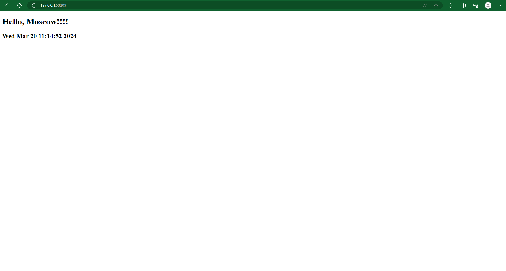

# Kubernetes

## `kubectl get pods,svc` output

```
$ kubectl get pods,svc
NAME                             READY   STATUS    RESTARTS   AGE
pod/app-python-b4d5768c8-w6wn8   1/1     Running   0          5m44s

NAME                 TYPE           CLUSTER-IP       EXTERNAL-IP   PORT(S)          AGE
service/app-python   LoadBalancer   10.105.196.164   <pending>     8080:31439/TCP   2m12s
service/kubernetes   ClusterIP      10.96.0.1        <none>        443/TCP          35m
```

## `kubectl get pods,svc` output with manifest files

```
$ kubectl get pods,svc
NAME                                         READY   STATUS    RESTARTS   AGE
pod/app-python-6b97c9c44d-9vrc5              1/1     Running   0          10s
pod/app-python-6b97c9c44d-jl7q5              1/1     Running   0          10s
pod/app-python-6b97c9c44d-zbq95              1/1     Running   0          10s
pod/app-python-deployment-6b97c9c44d-hd29z   1/1     Running   0          18m
pod/app-python-deployment-6b97c9c44d-j9pn9   1/1     Running   0          18m
pod/app-python-deployment-6b97c9c44d-zf9m4   1/1     Running   0          18m

NAME                 TYPE        CLUSTER-IP       EXTERNAL-IP   PORT(S)   AGE
service/app-python   ClusterIP   10.110.179.122   <none>        80/TCP    11s
service/kubernetes   ClusterIP   10.96.0.1        <none>        443/TCP   86m
```

## `minikube service --all` output with manifest files

```
$ minikube service --all
|-----------|------------|-------------|--------------|
| NAMESPACE |    NAME    | TARGET PORT |     URL      |
|-----------|------------|-------------|--------------|
| default   | app-python |             | No node port |
|-----------|------------|-------------|--------------|
😿  service default/app-python has no node port
|-----------|------------|-------------|--------------|
| NAMESPACE |    NAME    | TARGET PORT |     URL      |
|-----------|------------|-------------|--------------|
| default   | kubernetes |             | No node port |
|-----------|------------|-------------|--------------|
😿  service default/kubernetes has no node port
🏃  Starting tunnel for service app-python.
🏃  Starting tunnel for service kubernetes.
|-----------|------------|-------------|------------------------|
| NAMESPACE |    NAME    | TARGET PORT |          URL           |
|-----------|------------|-------------|------------------------|
| default   | app-python |             | http://127.0.0.1:53209 |
| default   | kubernetes |             | http://127.0.0.1:53211 |
|-----------|------------|-------------|------------------------|
🎉  Opening service default/app-python in default browser...
🎉  Opening service default/kubernetes in default browser...
❗  Because you are using a Docker driver on windows, the terminal needs to be open to run it.
```

### App screenshot



## Ingress

`demo.local` is a host, `/python` redirects to `app-python` and `/kotlin` redirects to `app-kotlin`

```shell
$ curl demo.local/python
StatusCode        : 200
StatusDescription : OK
Content           :
                    <!DOCTYPE html>
                    <html lang="en">
                    <head>
                        <title>Moscow Time</title>
                    </head>
                    <body>
                        <h1>Hello, Moscow!!!!</h1>
                        <h2>Wed Mar 20 13:26:49 2024</h2>
                    </body>
                    </html>
RawContent        : HTTP/1.1 200 OK
                    Connection: keep-alive
                    Content-Length: 171
                    Content-Type: text/html; charset=utf-8
                    Date: Wed, 20 Mar 2024 10:26:49 GMT


                    <!DOCTYPE html>
                    <html lang="en">
                    <head>
                        <title>Moscow ...
Forms             : {}
Headers           : {[Connection, keep-alive], [Content-Length, 171], [Content-Type, text/html; charset=utf-8], [Date,
                    Wed, 20 Mar 2024 10:26:49 GMT]}
Images            : {}
InputFields       : {}
Links             : {}
ParsedHtml        : System.__ComObject
RawContentLength  : 171
```

```shell
$ curl demo.local/kotlin
StatusCode        : 200
StatusDescription : OK
Content           : <!DOCTYPE html>
                    <html>
                      <head>
                        <title>Moscow Time</title>
                      </head>
                      <body>
                        <h1>Hello, Moscow!</h1>
                        <p>(WEDNESDAY) MARCH 20 2024 13:29:19</p>
                      </body>
                    </html>

RawContent        : HTTP/1.1 200 OK
                    Connection: keep-alive
                    Content-Length: 174
                    Content-Type: text/html; charset=UTF-8
                    Date: Wed, 20 Mar 2024 10:29:19 GMT

                    <!DOCTYPE html>
                    <html>
                      <head>
                        <title>Moscow Time</tit...
Forms             : {}
Headers           : {[Connection, keep-alive], [Content-Length, 174], [Content-Type, text/html; charset=UTF-8], [Date,
                    Wed, 20 Mar 2024 10:29:19 GMT]}
Images            : {}
InputFields       : {}
Links             : {}
ParsedHtml        : System.__ComObject
RawContentLength  : 174
```