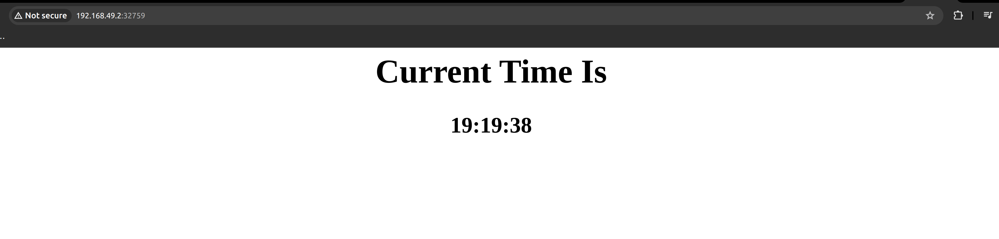
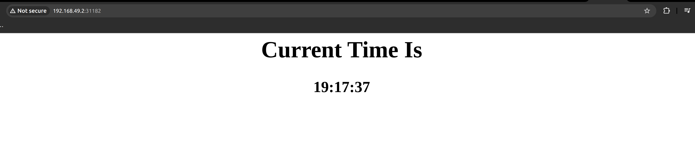

```
root@ramprin-strix:/home/ramprin/Study/DevOps-S24/k8s# sudo minikube service --all
|-----------|--------|-------------|---------------------------|
| NAMESPACE |  NAME  | TARGET PORT |            URL            |
|-----------|--------|-------------|---------------------------|
| default   | app-go |        8080 | http://192.168.49.2:32759 |
|-----------|--------|-------------|---------------------------|
|-----------|------------|-------------|---------------------------|
| NAMESPACE |    NAME    | TARGET PORT |            URL            |
|-----------|------------|-------------|---------------------------|
| default   | app-python |        8080 | http://192.168.49.2:31182 |
|-----------|------------|-------------|---------------------------|
|-----------|------------|-------------|--------------|
| NAMESPACE |    NAME    | TARGET PORT |     URL      |
|-----------|------------|-------------|--------------|
| default   | kubernetes |             | No node port |
|-----------|------------|-------------|--------------|

```

```
root@ramprin-strix:/home/ramprin/Study/DevOps-S24/k8s# kubectl get po,svc
NAME                                         READY   STATUS    RESTARTS   AGE
pod/app-go-5b77f855df-phkg8                  1/1     Running   0          3m34s
pod/app-python-7b84b49797-89455              1/1     Running   0          6m53s
pod/python-app-deployment-559ddd954d-7wspf   1/1     Running   0          34s
pod/python-app-deployment-559ddd954d-mx49h   1/1     Running   0          34s
pod/python-app-deployment-559ddd954d-tkdpq   1/1     Running   0          34s

NAME                         TYPE           CLUSTER-IP       EXTERNAL-IP   PORT(S)          AGE
service/app-go               LoadBalancer   10.109.114.144   <pending>     8080:32759/TCP   3m27s
service/app-python           LoadBalancer   10.109.92.38     <pending>     8080:31182/TCP   5m12s
service/kubernetes           ClusterIP      10.96.0.1        <none>        443/TCP          7m32s
service/python-app-service   ClusterIP      10.98.19.156     <none>        8080/TCP         24s
```


```
root@ramprin-strix:~/DevOps-S24/k8s/python# minikube addons enable ingress
💡  Restarting the docker service may improve performance.
💡  ingress is an addon maintained by Kubernetes. For any concerns contact minikube on GitHub.
You can view the list of minikube maintainers at: https://github.com/kubernetes/minikube/blob/master/OWNERS
    ▪ Using image registry.k8s.io/ingress-nginx/kube-webhook-certgen:v20231011-8b53cabe0
    ▪ Using image registry.k8s.io/ingress-nginx/kube-webhook-certgen:v20231011-8b53cabe0
    ▪ Using image registry.k8s.io/ingress-nginx/controller:v1.9.4
🔎  Verifying ingress addon...
🌟  The 'ingress' addon is enabled
```
### Go:


### Python:
