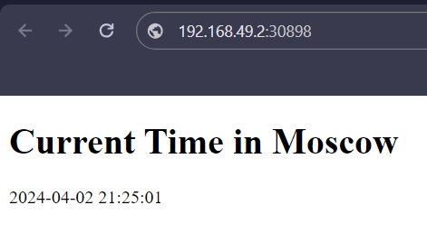

# Kubernetes Outputs
### Output of the command `kubectl get pods,svc`

```shell
NAME                      READY   STATUS    RESTARTS   AGE
pod/app-dd56d5688-lkcw9   1/1     Running   0          7m2s

NAME                 TYPE           CLUSTER-IP       EXTERNAL-IP   PORT(S)          AGE
service/app          LoadBalancer   10.109.130.162   <pending>     5000:30898/TCP   3m56s
service/kubernetes   ClusterIP      10.96.0.1        <none>        443/TCP          22m

```

### Output of the command `kubectl get pods,svc` for the 2 task
```shell
NAME                             READY   STATUS    RESTARTS   AGE
pod/app-3c7d12g6v-1fk2a   1/1     Running   0          2m4s
pod/app-3c7d12g6v-h5esq   1/1     Running   0          2m4s
pod/app-3c7d12g6v-eq34l   1/1     Running   0          2m4s
pod/app-3c7d12g6v-bd9f0   1/1     Running   0          2m4s

NAME                         TYPE        CLUSTER-IP       EXTERNAL-IP   PORT(S)          AGE
service/app-python-service   NodePort    10.109.130.162   <none>        5000:30898/TCP   2m4s
service/kubernetes           ClusterIP   10.96.0.1        <none>        443/TCP          3m45s
```

### Output of the command `minikube service --all`
```shell
|-----------|-------------|-------------|---------------------------|
| NAMESPACE |     NAME    | TARGET PORT |            URL            |
|-----------|-------------|-------------|---------------------------|
| default   | app-service |        5000 | http://192.168.49.2:30898 |
|-----------|-------------|-------------|---------------------------|
|-----------|------------|-------------|--------------|
| NAMESPACE |    NAME    | TARGET PORT |     URL      |
|-----------|------------|-------------|--------------|
| default   | kubernetes |             | No node port |
|-----------|------------|-------------|--------------|
* service default/kubernetes has no node port
* Opening service default/app-service in default browser...
  http://192.168.49.2:30898
```

### Application in Browser
