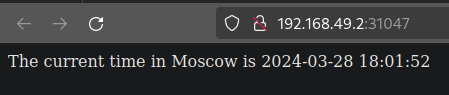

# Lab 9: Introduction to Kubernetes

## Task 1

### My steps

```bash
kubectl create deployment app-python --image=pgrammer/app_python:latest --port=5000
```

```bash
kubectl expose deployment app-python --type=LoadBalancer --port=5000
```

### Result of `kubectl get pods,svc`

```text
NAME                              READY   STATUS    RESTARTS   AGE
pod/app-python-6b989c87b6-mhxs8   1/1     Running   0          5m57s

NAME                 TYPE           CLUSTER-IP      EXTERNAL-IP   PORT(S)          AGE
service/app-python   LoadBalancer   10.107.96.181   <pending>     5000:30835/TCP   5m49s
service/kubernetes   ClusterIP      10.96.0.1       <none>        443/TCP          20m
```

### Cleanup

```bash
kubectl delete deployments app-python
kubectl delete services app-python
```

## Task 2

### Commands to up service and deployment

```bash
kubectl apply -f app_python/deployment.yml
kubectl apply -f app_python/service.yml
```

### Result of `kubectl get pods, svc`

```text
NAME                                         READY   STATUS    RESTARTS   AGE
pod/app-python-deployment-68c7d9dbb6-6blkj   1/1     Running   0          130m
pod/app-python-deployment-68c7d9dbb6-c5snp   1/1     Running   0          130m
pod/app-python-deployment-68c7d9dbb6-rl6cw   1/1     Running   0          130m

NAME                         TYPE           CLUSTER-IP       EXTERNAL-IP   PORT(S)          AGE
service/app-python-service   LoadBalancer   10.101.213.101   <pending>     5000:31047/TCP   20s
service/kubernetes           ClusterIP      10.96.0.1        <none>        443/TCP          160m
```

### Result of `minikube service --all`

```text
|-----------|--------------------|-------------|---------------------------|
| NAMESPACE |        NAME        | TARGET PORT |            URL            |
|-----------|--------------------|-------------|---------------------------|
| default   | app-python-service |        5000 | http://192.168.49.2:31047 |
|-----------|--------------------|-------------|---------------------------|
|-----------|------------|-------------|--------------|
| NAMESPACE |    NAME    | TARGET PORT |     URL      |
|-----------|------------|-------------|--------------|
| default   | kubernetes |             | No node port |
|-----------|------------|-------------|--------------|
😿  service default/kubernetes has no node port
🎉  Opening service default/app-python-service in default browser...
```



## Bonus task

### Result of curl

```text
~/D/S/k8s (lab9)> curl --resolve "localhost:80:$( minikube ip )" -i http://localhost/py
HTTP/1.1 200 OK
Date: Thu, 28 Mar 2024 15:42:12 GMT
Content-Type: text/html; charset=utf-8
Content-Length: 49
Connection: keep-alive

The current time in Moscow is 2024-03-28 18:42:12
~/D/S/k8s (lab9)> curl --resolve "localhost:80:$( minikube ip )" -i http://localhost/kt
HTTP/1.1 200 
Date: Thu, 28 Mar 2024 15:42:14 GMT
Content-Type: text/plain;charset=UTF-8
Content-Length: 31
Connection: keep-alive

Current time in Moscow 18:42:28
```

