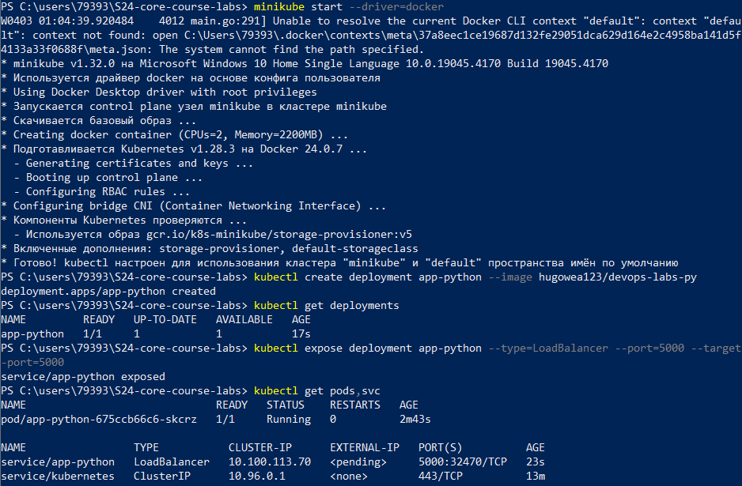
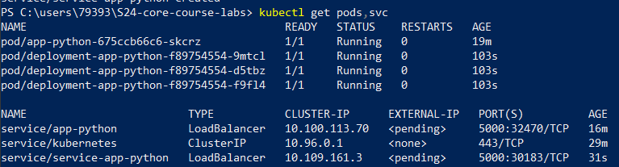
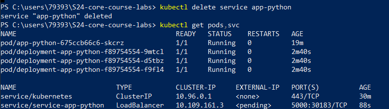
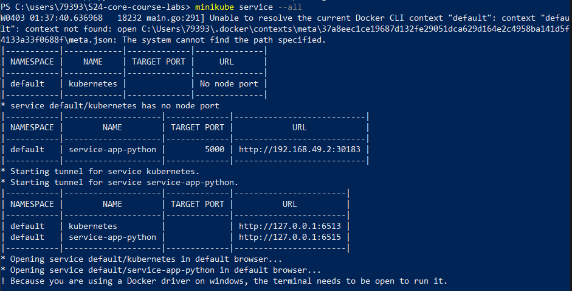
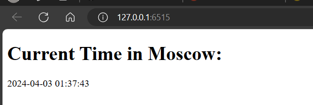

# k8s

The deployment itself, example. Also, there is ```kubectl get pods,svc``` output:



The output of ```kubectl get pods,svc``` after applying the development.yml and service.yml:



The output of ```kubectl get pods,svc``` after deleting the service:



The output of ```kubectl get pods,svc``` after deleting the pod:


`minikube service --all` output



Verification of IP addresses 

