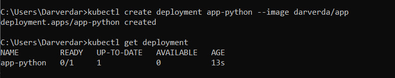

# Task 1: Manual deployment
```console
$ kubectl get pods,svc
NAME                                     READY   STATUS             RESTARTS        AGE
pod/moscowtime-web-app-966ddb7b8-wkfxb   0/1     CrashLoopBackOff   5 (2m45s ago)   5m57s

NAME                         TYPE           CLUSTER-IP     EXTERNAL-IP   PORT(S)          AGE
service/kubernetes           ClusterIP      10.96.0.1      <none>        443/TCP          103m
service/moscowtime-web-app   LoadBalancer   10.106.24.79   <pending>     8080:32045/TCP   15s
```

# Task 2: Deployment from configuration
```console
$ kubectl get pods,svc
NAME                                                 READY   STATUS    RESTARTS   AGE
pod/moscowtime-web-app-deployment-84c6899587-dk7fr   1/1     Running   0          2m47s
pod/moscowtime-web-app-deployment-84c6899587-m4bz6   1/1     Running   0          2m47s
pod/moscowtime-web-app-deployment-84c6899587-nn8qq   1/1     Running   0          2m47s

NAME                             TYPE           CLUSTER-IP    EXTERNAL-IP   PORT(S)          AGE
service/kubernetes               ClusterIP      10.96.0.1     <none>        443/TCP          116m
service/moscowtime-web-service   LoadBalancer   10.96.52.89   <pending>     8080:30561/TCP   98s
```

```console
$ minikube service --all
|-----------|------------|-------------|--------------|
| NAMESPACE |    NAME    | TARGET PORT |     URL      |
|-----------|------------|-------------|--------------|
| default   | kubernetes |             | No node port |
|-----------|------------|-------------|--------------|
😿  service default/kubernetes has no node port
|-----------|------------------------|-------------|---------------------------|
| NAMESPACE |          NAME          | TARGET PORT |            URL            |
|-----------|------------------------|-------------|---------------------------|
| default   | moscowtime-web-service |        8080 | http://192.168.49.2:30561 |
|-----------|------------------------|-------------|---------------------------|
🏃  Starting tunnel for service kubernetes.
🏃  Starting tunnel for service moscowtime-web-service.
|-----------|------------------------|-------------|------------------------|
| NAMESPACE |          NAME          | TARGET PORT |          URL           |
|-----------|------------------------|-------------|------------------------|
| default   | kubernetes             |             | http://127.0.0.1:41615 |
| default   | moscowtime-web-service |             | http://127.0.0.1:35501 |
|-----------|------------------------|-------------|------------------------|
🎉  Opening service default/kubernetes in default browser...
👉  http://127.0.0.1:41615
🎉  Opening service default/moscowtime-web-service in default browser...
👉  http://127.0.0.1:35501
❗  Because you are using a Docker driver on linux, the terminal needs to be open to run it.
```

