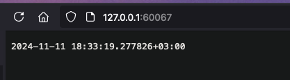

# Introduction to Kubernetes

## Task 1

- Output of `kubectl get pds,svc`:
```
NAME                                   READY   STATUS    RESTARTS   AGE
pod/moscow-time-app-7dddcbf65f-x8fxk   1/1     Running   0          3m36s

NAME                      TYPE           CLUSTER-IP      EXTERNAL-IP   PORT(S)          AGE
service/kubernetes        ClusterIP      10.96.0.1       <none>        443/TCP          9m58s
service/moscow-time-app   LoadBalancer   10.101.149.75   <pending>     8080:31851/TCP   108s
```

## Task 2
- After `kubectl apply -f k8s`:

- `kubectl get pds,svc`
NAME                            READY   STATUS    RESTARTS   AGE
pod/time-app-54d9d95c99-h9dkp   1/1     Running   0          16s
pod/time-app-54d9d95c99-nr95x   1/1     Running   0          16s
pod/time-app-54d9d95c99-r8q4z   1/1     Running   0          16s

NAME                 TYPE           CLUSTER-IP     EXTERNAL-IP   PORT(S)          AGE
service/kubernetes   ClusterIP      10.96.0.1      <none>        443/TCP          4m39s
service/time-app     LoadBalancer   10.100.39.73   <pending>     8080:31131/TCP   16

- `minikube service --all`

|-----------|------------|-------------|--------------|
| NAMESPACE |    NAME    | TARGET PORT |     URL      |
|-----------|------------|-------------|--------------|
| default   | kubernetes |             | No node port |
|-----------|------------|-------------|--------------|
😿  service default/kubernetes has no node port
|-----------|----------|-------------|---------------------------|
| NAMESPACE |   NAME   | TARGET PORT |            URL            |
|-----------|----------|-------------|---------------------------|
| default   | time-app |        8080 | http://192.168.49.2:31131 |
|-----------|----------|-------------|---------------------------|
❗  Services [default/kubernetes] have type "ClusterIP" not meant to be exposed, however for local development minikube allows you to access this !
🏃  Starting tunnel for service kubernetes.
🏃  Starting tunnel for service time-app.
|-----------|------------|-------------|------------------------|
| NAMESPACE |    NAME    | TARGET PORT |          URL           |
|-----------|------------|-------------|------------------------|
| default   | kubernetes |             | http://127.0.0.1:60066 |
| default   | time-app   |             | http://127.0.0.1:60067 |
|-----------|------------|-------------|------------------------|
🎉  Opening service default/kubernetes in default browser...
🎉  Opening service default/time-app in default browser...
❗  Because you are using a Docker driver on darwin, the terminal needs to be open to run it.

- Browser screenshot:

