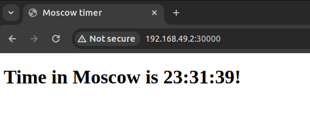
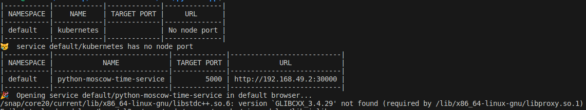

# Kubernetes

## Introduction
Kubernetes is a powerful system, developed by Google, for managing containerized applications across a cluster of machines. It provides tools for deploying applications, scaling them as necessary, managing changes to existing containerized applications, and helps optimize the use of underlying hardware beneath your containers.

## Deployment
A Kubernetes Deployment checks on the health of your Pod and restarts the Pod’s Container if it terminates. Deployments are the recommended way to manage the creation and scaling of Pods. A Deployment allows you to describe an application’s life cycle, such as which images to use for the app, the number of pod replicas, and the way to update them, among other aspects.

## Service
A Kubernetes Service is an abstraction which defines a logical set of Pods and a policy by which to access them - sometimes called a micro-service. The set of Pods targeted by a Service is usually determined by a selector. Services allow for exposing applications, running on a set of Pods, to the external world or for consuming external services.

## Ingress
An Ingress is an API object that manages external access to the services in a cluster, typically HTTP. Ingress can provide load balancing, SSL termination, and name-based virtual hosting.

## Pods
A Pod is the smallest deployable unit of computing that can be created and managed in Kubernetes. A Pod is a group of one or more containers (such as Docker containers), with shared storage/network, and a specification for how to run the containers.

## Outputs

### Deployments <kubectl get deployments>	

```plaintext
NAME                 READY   UP-TO-DATE   AVAILABLE   AGE
python-moscow-time   3/3     3            3           12m
```

### Pods <kubectl get pods>

```tex
NAME                                  READY   STATUS    RESTARTS   AGE
python-moscow-time-558f549b6d-cktwq   1/1     Running   0          12m
python-moscow-time-558f549b6d-jksrm   1/1     Running   0          12m
python-moscow-time-558f549b6d-lmm7k   1/1     Running   0          12m
```

### Services <kubectl get services>

```tex
NAME                         TYPE        CLUSTER-IP      EXTERNAL-IP   PORT(S)          AGE
kubernetes                   ClusterIP   10.96.0.1       <none>        443/TCP          12m
python-moscow-time-service   NodePort    10.100.96.147   <none>        5000:30000/TCP   12m
```

### Curl Output

```html
<!DOCTYPE html>
<html lang="en">

<head>
    <meta charset="UTF-8">
    <meta name="viewport" content="width=device-width, initial-scale=1.0">
    <title>Moscow timer</title>
</head>

<body>
    
    <h1>Time in Moscow is 22:39:47!</h1>
    
</body>

</html>
```


### Minikub output

```bash
minikube service --all
```






​	