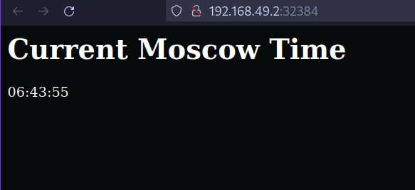

# kubernetes

## kubectl get pods,svc

```
NAME                        READY   STATUS    RESTARTS   AGE
pod/lab9-5c45cf5b49-zvxl9   1/1     Running   0          5m16s

NAME                 TYPE        CLUSTER-IP       EXTERNAL-IP   PORT(S)          AGE
service/kubernetes   ClusterIP   10.96.0.1        <none>        443/TCP          11m
service/lab9         NodePort    10.104.163.210   <none>        8000:30589/TCP   4m52s
```

After using kubectl apply -f {configuration files}

```
NAME                                         READY   STATUS    RESTARTS   AGE
pod/app-python-deployment-86698fcc68-fsq26   1/1     Running   0          7m41s
pod/app-python-deployment-86698fcc68-hc9k8   1/1     Running   0          7m41s
pod/app-python-deployment-86698fcc68-z4w2x   1/1     Running   0          7m41s

NAME                 TYPE        CLUSTER-IP       EXTERNAL-IP   PORT(S)    AGE
service/app-python   ClusterIP   10.111.198.100   <none>        8000/TCP   76s
service/kubernetes   ClusterIP   10.96.0.1        <none>        443/TCP    27m
```

## minikube service --all

```
|-----------|--------------------|----------------------|---------------------------|
| NAMESPACE |        NAME        |     TARGET PORT      |            URL            |
|-----------|--------------------|----------------------|---------------------------|
| default   | app-python-service | app-python-port/8000 | http://192.168.49.2:32384 |
|-----------|--------------------|----------------------|---------------------------|
|-----------|------------|-------------|--------------|
| NAMESPACE |    NAME    | TARGET PORT |     URL      |
|-----------|------------|-------------|--------------|
| default   | kubernetes |             | No node port |
|-----------|------------|-------------|--------------|
* service default/kubernetes has no node port
* Opening service default/app-python-service in default browser...
```


