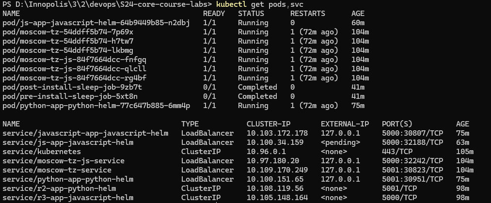
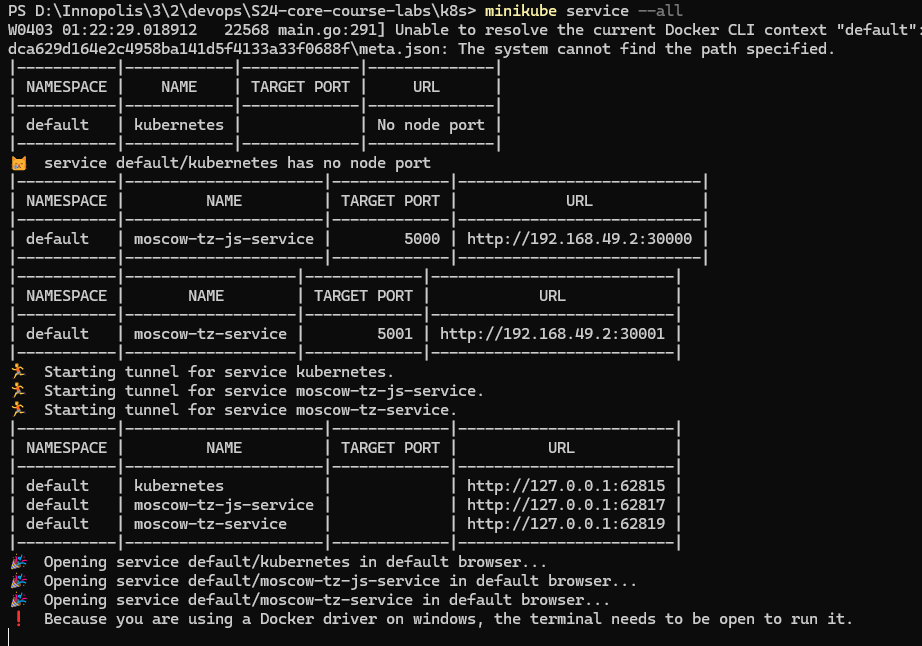
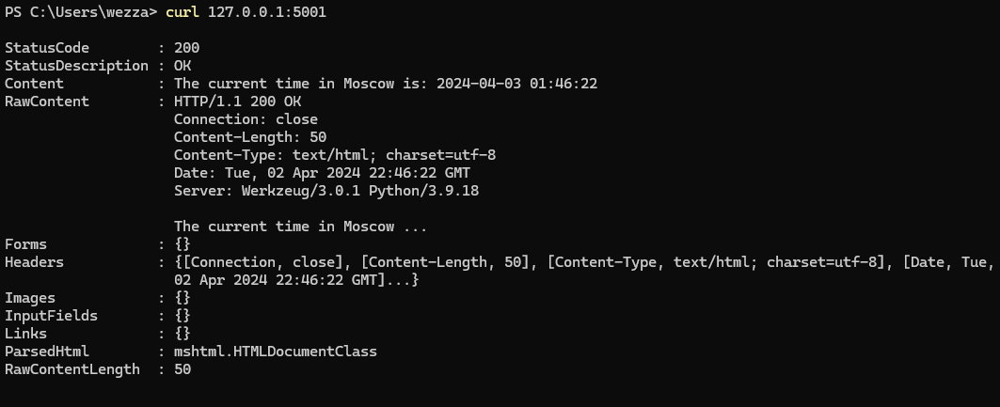
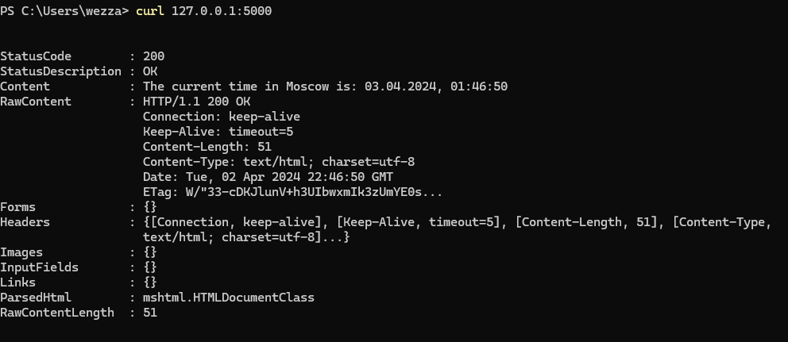
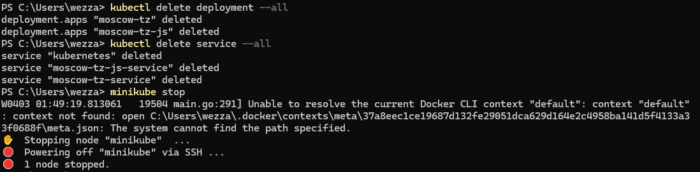

# Lab 9: Introduction to Kubernetes

## Task 1: Kubernetes Setup and Basic Deployment

### Learn About Kubernetes

Kubernetes is an open-source container orchestration platform that automates the deployment, scaling, and management of containerized applications.

#### Kubernetes Components

- Master Components:
  - kube-apiserver
  - kube-controller-manager
  - kube-scheduler
  - etcd
- Node Components:
  - kubelet
  - kube-proxy
  - Container runtime (e.g., Docker)

### Install Kubernetes Tools

To manage Kubernetes clusters, we need to install `kubectl` and `minikube`.

- **kubectl**: Command-line tool for interacting with Kubernetes clusters.
- **minikube**: Tool to run a single-node Kubernetes cluster locally for development and testing.

Installation guides:

- [Install kubectl](https://kubernetes.io/docs/tasks/tools/install-kubectl/)
- [Install minikube](https://minikube.sigs.k8s.io/docs/start/)

### Deploy Your Application

Deploy your application within the Minikube cluster using the following steps:

1. Create a Deployment resource for your app using the `kubectl create deployment` command.

```bash
kubectl apply -f k8s/app_javascript/deployment.yml
kubectl apply -f k8s/app_javascript/services.yml
kubectl apply -f k8s/app_javascript/ingress.yml
kubectl apply -f k8s/app_python/deployment.yml
kubectl apply -f k8s/app_python/services.yml
kubectl apply -f k8s/app_python/ingress.yml
```

2. Use Tunneling to access the application from your local machine.

```bash
minikube tunnel
```

### Access Your Application

Make your application accessible from outside the Kubernetes virtual network by creating a Service resource. I used LoadBalancer type Services.

- **LoadBalancer**: Provisions a load balancer in the cloud environment (if supported) and exposes your app with a public IP address.

Example of creating a Service:

```yaml
apiVersion: v1
kind: Service
metadata:
  name: my-app-service
spec:
  selector:
    app: my-app
  ports:
    - protocol: TCP
      port: 80
      targetPort: 8080
  type: LoadBalancer
```

### Create a Kubernetes Folder

Establish a `k8s` folder within your repository and create a `README.md` report inside it.

Include the output of the following commands in the `README.md`:

- `kubectl get pods,svc`
- `minikube service --all`
- `curl http://<EXTERNAL-IP>`

#### Screenshots






### Cleanup

```bash
kubectl delete deployment --all
kubectl delete service --all
minikube stop
```


