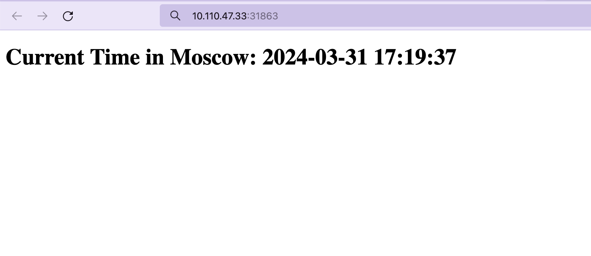

# Kubernetes

### Output of the kubectl get pods,svc

```bash
NAME                                   READY   STATUS    RESTARTS   AGE
pod/moscow-time-app-6484b7dd4f-rz6jc   1/1     Running   0          12m

NAME                      TYPE           CLUSTER-IP   EXTERNAL-IP   PORT(S)          AGE
service/kubernetes        ClusterIP      10.96.0.1    <none>        443/TCP          28m
service/moscow-time-app   LoadBalancer   10.99.90.8   <pending>     8000:30238/TCP   87s
```

### Output of the kubectl get pods,svc after addind manifests

```bash
NAME                                   READY   STATUS    RESTARTS   AGE
pod/moscow-time-app-778648f9c8-9jhbp   1/1     Running   0          65s
pod/moscow-time-app-778648f9c8-kplfp   1/1     Running   0          65s
pod/moscow-time-app-778648f9c8-pzh62   1/1     Running   0          65s

NAME                              TYPE           CLUSTER-IP      EXTERNAL-IP   PORT(S)        AGE
service/kubernetes                ClusterIP      10.96.0.1       <none>        443/TCP        131m
service/moscow-time-app-service   LoadBalancer   10.102.98.141   <pending>     80:30419/TCP   29s
```

### minikube service --all

```bash
|-----------|------------|-------------|--------------|
| NAMESPACE |    NAME    | TARGET PORT |     URL      |
|-----------|------------|-------------|--------------|
| default   | kubernetes |             | No node port |
|-----------|------------|-------------|--------------|
* service default/kubernetes has no node port
|-----------|-------------------------|-------------|---------------------------|
| NAMESPACE |          NAME           | TARGET PORT |            URL            |
|-----------|-------------------------|-------------|---------------------------|
| default   | moscow-time-app-service |          80 | http://192.168.49.2:30419 |
|-----------|-------------------------|-------------|---------------------------|
* Starting tunnel for service kubernetes.
* Starting tunnel for service moscow-time-app-service.
|-----------|-------------------------|-------------|------------------------|
| NAMESPACE |          NAME           | TARGET PORT |          URL           |
|-----------|-------------------------|-------------|------------------------|
| default   | kubernetes              |             | http://127.0.0.1:51143 |
| default   | moscow-time-app-service |             | http://127.0.0.1:51147 |
|-----------|-------------------------|-------------|------------------------|
* Opening service default/kubernetes in default browser...
* Opening service default/moscow-time-app-service in default browser...
```


