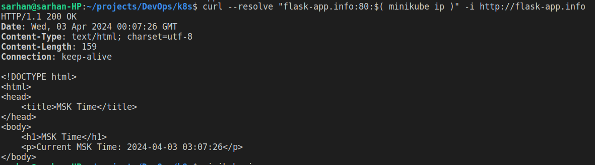

# Output of `kubectl get pods,svc`

```
NAME                             READY   STATUS    RESTARTS   AGE
pod/app-python-55b4cc44d-z6b5w   1/1     Running   0          37m

NAME                 TYPE           CLUSTER-IP     EXTERNAL-IP   PORT(S)          AGE
service/app-python   LoadBalancer   10.103.12.91   <pending>     8000:31823/TCP   5m
service/kubernetes   ClusterIP      10.96.0.1      <none>        443/TCP          6h13m
```

# Output of `kubectl get pods,svc` after the creation of `deployment.yml` and `service.yml`

```
NAME                              READY   STATUS    RESTARTS   AGE
pod/app-python-5885955fbf-c6r2v   1/1     Running   0          5m55s
pod/app-python-5885955fbf-lscdl   1/1     Running   0          5m55s
pod/app-python-5885955fbf-zm896   1/1     Running   0          5m55s

NAME                         TYPE           CLUSTER-IP    EXTERNAL-IP   PORT(S)          AGE
service/app-python-service   LoadBalancer   10.99.57.92   <pending>     8000:30734/TCP   4m44s
service/kubernetes           ClusterIP      10.96.0.1     <none>        443/TCP          2d2h
```

# Output of `minikube service --all`

```
|-----------|--------------------|-------------|---------------------------|
| NAMESPACE |        NAME        | TARGET PORT |            URL            |
|-----------|--------------------|-------------|---------------------------|
| default   | app-python-service |        8000 | http://192.168.49.2:30734 |
|-----------|--------------------|-------------|---------------------------|
|-----------|------------|-------------|--------------|
| NAMESPACE |    NAME    | TARGET PORT |     URL      |
|-----------|------------|-------------|--------------|
| default   | kubernetes |             | No node port |
|-----------|------------|-------------|--------------|
😿  service default/kubernetes has no node port
🏃  Starting tunnel for service app-python-service.
🏃  Starting tunnel for service kubernetes.
|-----------|--------------------|-------------|------------------------|
| NAMESPACE |        NAME        | TARGET PORT |          URL           |
|-----------|--------------------|-------------|------------------------|
| default   | app-python-service |             | http://127.0.0.1:51633 |
| default   | kubernetes         |             | http://127.0.0.1:51635 |
|-----------|--------------------|-------------|------------------------|
🎉  Opening service default/app-python-service in default browser...
🎉  Opening service default/kubernetes in default browser...
❗  Because you are using a Docker driver on darwin, the terminal needs to be open to run it.
```

# Result in browser after running `minikube service --all`


# Ingress

Enable it: `minikube addons enable ingress`
Apply it: `kubectl apply -f ingress.yml`



(There are some issues on Apple Silicon, therefore I have used 127.0.0.1)
https://github.com/kubernetes/minikube/issues/13510
