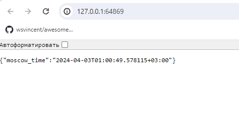
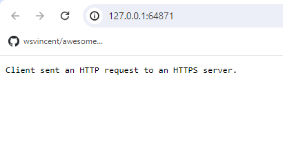

# Lab 9: Introduction to Kubernetes

## Report

### Task 1

#### 1. Install Kubernetes Tools
I installed the `kubectl` and `minikube` on my machine and prepared for usage.
#### 2. Deploy Your Application
I deployed my application using following command, which creates `Deployment`:
```bash
kubectl create deployment app-node --image=zaqbez39me/moscow-time-app
```
#### 3. Access Your Application
To access my application we should create `Service` using command:
```bash
kubectl expose deployment app-node --type=LoadBalancer --port=80
```
#### 4. Output of the `kubectl get pods,svc`
```bash
C:\Users\korol>kubectl get pods,svc
NAME                            READY   STATUS    RESTARTS   AGE
pod/app-node-75797959bc-46gjx   1/1     Running   0          20m

NAME                 TYPE           CLUSTER-IP       EXTERNAL-IP   PORT(S)          AGE
service/app-http     ClusterIP      10.104.202.248   <none>        80/TCP           43m
service/app-node     LoadBalancer   10.110.94.76     <pending>     80:31103/TCP     19m
service/hello-node   LoadBalancer   10.98.147.102    <pending>     8000:31108/TCP   56m
service/kubernetes   ClusterIP      10.96.0.1        <none>        443/TCP          60m
```
#### 5. Cleanup
```bash
C:\Users\korol>kubectl delete service app-node
service "app-node" deleted

C:\Users\korol>kubectl delete deployment app-node
deployment.apps "app-node" deleted

C:\Users\korol>minikube stop
W0403 00:40:02.445153   16908 main.go:291] Unable to resolve the current Docker CLI context "default": context "default": context not found: open C:\Users\korol\.docker\contexts\meta\37a8eec1ce19687d132fe29051dca629d164e2c4958ba141d5f4133a33f0688f\meta.json: The system cannot find the path specified.
* Узел "minikube" останавливается ...
* Выключается "minikube" через SSH ...
* Остановлено узлов: 1.
```

### Task 2

#### 1. Output of `minikube service --all` and browser result
```bash
$ minikube service --all                                              
|-----------|----------|-------------|--------------|
| NAMESPACE |   NAME   | TARGET PORT |     URL      |
|-----------|----------|-------------|--------------|
| default   | app-http |             | No node port |
|-----------|----------|-------------|--------------|
😿  service default/app-http has no node port        
|-----------|-------------|-------------|--------------|
| NAMESPACE |    NAME     | TARGET PORT |     URL      |
|-----------|-------------|-------------|--------------|
| default   | app-service |             | No node port |
|-----------|-------------|-------------|--------------|
😿  service default/app-service has no node port        
|-----------|------------|-------------|--------------|
| NAMESPACE |    NAME    | TARGET PORT |     URL      |
|-----------|------------|-------------|--------------|
| default   | kubernetes |             | No node port |
|-----------|------------|-------------|--------------|
😿  service default/kubernetes has no node port        
🏃  Starting tunnel for service app-http.
🏃  Starting tunnel for service app-service.
🏃  Starting tunnel for service kubernetes.
|-----------|-------------|-------------|------------------------|
| NAMESPACE |    NAME     | TARGET PORT |          URL           |
|-----------|-------------|-------------|------------------------|
| default   | app-http    |             | http://127.0.0.1:64867 |
| default   | app-service |             | http://127.0.0.1:64869 |
| default   | kubernetes  |             | http://127.0.0.1:64871 |
|-----------|-------------|-------------|------------------------|
🎉  Opening service default/app-http in default browser...
🎉  Opening service default/app-service in default browser...
🎉  Opening service default/kubernetes in default browser...
❗  Because you are using a Docker driver on windows, the terminal needs to be open to run it.
```


#### 2. Output of the `kubectl get pods,svc`
```bash
C:\Users\korol>minikube stop
W0403 00:40:02.445153   16908 main.go:291] Unable to resolve the current Docker CLI context "default": context "default": context not found: open C:\Users\korol\.docker\contexts\meta\37a8eec1ce19687d132fe29051dca629d164e2c4958ba141d5f4133a33f0688f\meta.json: The system cannot find the path specified.
* Узел "minikube" останавливается ...
* Выключается "minikube" через SSH ...
* Остановлено узлов: 1.

C:\Users\korol>kubectl get pods,svc
NAME                                  READY   STATUS    RESTARTS   AGE
pod/app-deployment-7fd557d64b-ph6pk   1/1     Running   0          11m
pod/app-deployment-7fd557d64b-plgfw   1/1     Running   0          11m
pod/app-deployment-7fd557d64b-xrwbg   1/1     Running   0          11m

NAME                  TYPE        CLUSTER-IP       EXTERNAL-IP   PORT(S)   AGE
service/app-http      ClusterIP   10.104.202.248   <none>        80/TCP    69m
service/app-service   ClusterIP   10.103.188.125   <none>        80/TCP    11m
service/kubernetes    ClusterIP   10.96.0.1        <none>        443/TCP   86m
```
