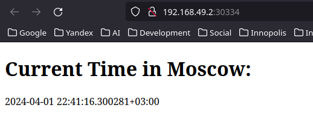
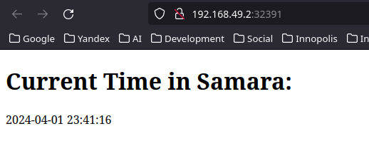

# Kubernetes

## Setup and basics

Firstly I tried default `minikube start` which uses `kvm2`, but on my ArChLiNuX
machine each pod decided to stuck at `CrashLoopBackOff` state. I switched to
`docker` driver.

```bash
$ minikube start --driver=docker
🔥  Deleting "minikube" in kvm2 ...
💀  Removed all traces of the "minikube" cluster.
 dmfrpro@dmfrpro-pc  ~  minikube start --driver=docker
😄  minikube v1.32.0 on Arch rolling
✨  Using the docker driver based on user configuration
📌  Using Docker driver with root privileges
👍  Starting control plane node minikube in cluster minikube
🚜  Pulling base image ...
    > gcr.io/k8s-minikube/kicbase...:  453.90 MiB / 453.90 MiB  100.00% 32.63 M
🔥  Creating docker container (CPUs=2, Memory=3900MB) ...
🐳  Preparing Kubernetes v1.28.3 on Docker 24.0.7 ...
    ▪ Generating certificates and keys ...
    ▪ Booting up control plane ...
    ▪ Configuring RBAC rules ...
🔗  Configuring bridge CNI (Container Networking Interface) ...
🔎  Verifying Kubernetes components...
    ▪ Using image gcr.io/k8s-minikube/storage-provisioner:v5
🌟  Enabled addons: storage-provisioner, default-storageclass
🏄  Done! kubectl is now configured to use "minikube" cluster and "default" namespace by default
```

Create a deployment and expose:

```bash
$ kubectl create deployment app-python --image=dmfrpro/app_python
deployment.apps/app-python created

$ kubectl expose deployment app-python --type=LoadBalancer --port=8080
service/app-python exposed

$ kubectl get pods,svc
NAME                 TYPE           CLUSTER-IP      EXTERNAL-IP     PORT(S)          AGE
service/app-python   LoadBalancer   10.103.210.16   10.103.210.16   8080:30752/TCP   30s
service/kubernetes   ClusterIP      10.96.0.1       <none>          443/TCP          6m5s

NAME                              READY   STATUS    RESTARTS   AGE
pod/app-python-6d7d4dc689-hbjbh   1/1     Running   0          38s
```

Verify availability:

```bash
$ curl 10.103.210.16:8080
<!DOCTYPE html>
<html>
<head>
    <title>Current Time in Moscow</title>
</head>
<body>
    <h1>Current Time in Moscow:</h1>
    <p>2024-04-01 22:33:22.065365+03:00</p>
</body>
```

Cleanup:

```bash
$ kubectl delete deployment app-python
deployment.apps "app-python" deleted

$ kubectl delete service app-python
service "app-python" deleted

$ kubectl get svc,pods
NAME                 TYPE        CLUSTER-IP   EXTERNAL-IP   PORT(S)   AGE
service/kubernetes   ClusterIP   10.96.0.1    <none>        443/TCP   7m21s
```

## Use deployment and service manifests

```bash
$ cd k8s
/home/dmfrpro/Projects/S24-core-course-labs/k8s

$ kubectl apply -f app-python
deployment.apps/app-python created
service/app-python created

$ kubectl apply -f app-java
deployment.apps/app-java created
service/app-java created

$ kubectl get svc,pods
NAME                 TYPE           CLUSTER-IP      EXTERNAL-IP     PORT(S)          AGE
service/app-java     LoadBalancer   10.110.139.80   10.110.139.80   8080:32391/TCP   64s
service/app-python   LoadBalancer   10.108.0.193    10.108.0.193    8080:30334/TCP   74s
service/kubernetes   ClusterIP      10.96.0.1       <none>          443/TCP          13m

NAME                              READY   STATUS    RESTARTS   AGE
pod/app-java-678b9984d8-86nc7     1/1     Running   0          64s
pod/app-java-678b9984d8-j9p67     1/1     Running   0          64s
pod/app-java-678b9984d8-npcnz     1/1     Running   0          5s
pod/app-python-69fffb44c4-5pgmv   1/1     Running   0          74s
pod/app-python-69fffb44c4-bfwkl   1/1     Running   0          74s
pod/app-python-69fffb44c4-xmx6j   1/1     Running   0          9s
```

Output of `minikube tunnel` in a separate tab:

```bash
Status:
        machine: minikube
        pid: 63320
        route: 10.96.0.0/12 -> 192.168.49.2
        minikube: Running
        services: [app-java, app-python]
    errors: 
                minikube: no errors
                router: no errors
                loadbalancer emulator: no errors
```

```bash
$ minikube service --all
|-----------|----------|-------------|---------------------------|
| NAMESPACE |   NAME   | TARGET PORT |            URL            |
|-----------|----------|-------------|---------------------------|
| default   | app-java |        8080 | http://192.168.49.2:32391 |
|-----------|----------|-------------|---------------------------|
|-----------|------------|-------------|---------------------------|
| NAMESPACE |    NAME    | TARGET PORT |            URL            |
|-----------|------------|-------------|---------------------------|
| default   | app-python |        8080 | http://192.168.49.2:30334 |
|-----------|------------|-------------|---------------------------|
|-----------|------------|-------------|--------------|
| NAMESPACE |    NAME    | TARGET PORT |     URL      |
|-----------|------------|-------------|--------------|
| default   | kubernetes |             | No node port |
|-----------|------------|-------------|--------------|
😿  service default/kubernetes has no node port
🎉  Opening service default/app-java in default browser...
🎉  Opening service default/app-python in default browser...
```

Python app:



```bash
$ curl http://192.168.49.2:30334
<!DOCTYPE html>
<html>
<head>
    <title>Current Time in Moscow</title>
</head>
<body>
    <h1>Current Time in Moscow:</h1>
    <p>2024-04-01 22:44:23.102236+03:00</p>
</body>
```

Java app:



```bash
$ curl http://192.168.49.2:32391
<!DOCTYPE html>
<html>
<head>
    <title>Current Time in Samara</title>
</head>
<body>
<h1>Current Time in Samara:</h1>
<p>2024-04-01 23:44:16</p>
</body>
</html>
```

## Ingress

Enable ingress addon:

```bash
$ minikude addons enable ingress
💡  ingress is an addon maintained by Kubernetes. For any concerns contact minikube on GitHub.
You can view the list of minikube maintainers at: https://github.com/kubernetes/minikube/blob/master/OWNERS
    ▪ Using image registry.k8s.io/ingress-nginx/controller:v1.9.4
    ▪ Using image registry.k8s.io/ingress-nginx/kube-webhook-certgen:v20231011-8b53cabe0
    ▪ Using image registry.k8s.io/ingress-nginx/kube-webhook-certgen:v20231011-8b53cabe0
🔎  Verifying ingress addon...
🌟  The 'ingress' addon is enabled
```

Apply ingress:

```bash
$ kubectl apply -f ingress.yml
ingress.networking.k8s.io/example-ingress created

$ kubectl get all -n ingress-nginx
NAME                                            READY   STATUS      RESTARTS   AGE
pod/ingress-nginx-admission-create-8mfgz        0/1     Completed   0          95m
pod/ingress-nginx-admission-patch-4thks         0/1     Completed   0          95m
pod/ingress-nginx-controller-7c6974c4d8-5qmrp   1/1     Running     0          95m

NAME                                         TYPE        CLUSTER-IP     EXTERNAL-IP   PORT(S)                      AGE
service/ingress-nginx-controller             NodePort    10.110.203.1   <none>        80:32744/TCP,443:30263/TCP   95m
service/ingress-nginx-controller-admission   ClusterIP   10.109.41.64   <none>        443/TCP                      95m

NAME                                       READY   UP-TO-DATE   AVAILABLE   AGE
deployment.apps/ingress-nginx-controller   1/1     1            1           95m

NAME                                                  DESIRED   CURRENT   READY   AGE
replicaset.apps/ingress-nginx-controller-7c6974c4d8   1         1         1       95m

NAME                                       COMPLETIONS   DURATION   AGE
job.batch/ingress-nginx-admission-create   1/1           14s        95m
job.batch/ingress-nginx-admission-patch    1/1           14s        95m

$ minikube service --all -n ingress-nginx
|---------------|--------------------------|-------------|---------------------------|
|   NAMESPACE   |           NAME           | TARGET PORT |            URL            |
|---------------|--------------------------|-------------|---------------------------|
| ingress-nginx | ingress-nginx-controller | http/80     | http://192.168.49.2:32744 |
|               |                          | https/443   | http://192.168.49.2:30263 |
|---------------|--------------------------|-------------|---------------------------|
|---------------|------------------------------------|-------------|--------------|
|   NAMESPACE   |                NAME                | TARGET PORT |     URL      |
|---------------|------------------------------------|-------------|--------------|
| ingress-nginx | ingress-nginx-controller-admission |             | No node port |
|---------------|------------------------------------|-------------|--------------|
😿  service ingress-nginx/ingress-nginx-controller-admission has no node port
[ingress-nginx ingress-nginx-controller http/80
https/443 http://192.168.49.2:32744
http://192.168.49.2:30263]
```

Check availability for Python app:

```bash
$ curl --resolve "python.dmfrpro.app:80:$(minikube ip)" -i python.dmfrpro.app
HTTP/1.1 200 OK
Date: Mon, 01 Apr 2024 19:48:12 GMT
Content-Type: text/html; charset=utf-8
Content-Length: 183
Connection: keep-alive

<!DOCTYPE html>
<html>
<head>
    <title>Current Time in Moscow</title>
</head>
<body>
    <h1>Current Time in Moscow:</h1>
    <p>2024-04-01 22:48:12.178496+03:00</p>
</body>
```

Check availability for Java app:

```bash
$ curl --resolve "java.dmfrpro.app:80:$(minikube ip)" -i java.dmfrpro.app
HTTP/1.1 200 
Date: Mon, 01 Apr 2024 19:48:22 GMT
Content-Type: text/html;charset=UTF-8
Transfer-Encoding: chunked
Connection: keep-alive
Content-Language: en-US

<!DOCTYPE html>
<html>
<head>
    <title>Current Time in Samara</title>
</head>
<body>
<h1>Current Time in Samara:</h1>
<p>2024-04-01 23:48:22</p>
</body>
</html>
```
