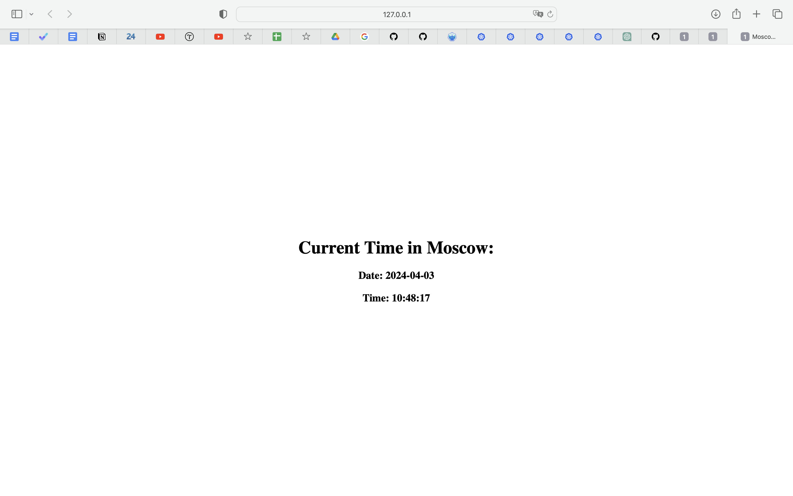

# Task 1

```
(base) yanapavlova@MacBook-Air-Ana k8s % kubectl delete deployment web-app-deployment
deployment.apps "web-app-deployment" deleted
(base) yanapavlova@MacBook-Air-Ana k8s % kubectl create deployment web-app --image nytakoe115/flask-moscow-app 
deployment.apps/web-app created
(base) yanapavlova@MacBook-Air-Ana k8s % kubectl get deployments                                
NAME      READY   UP-TO-DATE   AVAILABLE   AGE
web-app   1/1     1            1           15s
(base) yanapavlova@MacBook-Air-Ana k8s % kubectl expose deployment web-app --type=LoadBalancer --port=4000 --target-port=80
service/web-app exposed
(base) yanapavlova@MacBook-Air-Ana k8s % kubectl get pods,svc
NAME                           READY   STATUS    RESTARTS   AGE
pod/web-app-867d77db48-9ggzz   1/1     Running   0          5m48s

NAME                 TYPE           CLUSTER-IP      EXTERNAL-IP   PORT(S)          AGE
service/kubernetes   ClusterIP      10.96.0.1       <none>        443/TCP          26m
service/web-app      LoadBalancer   10.99.115.251   <pending>     4000:30849/TCP   35s
```

# Task 2

```
(base) yanapavlova@MacBook-Air-Ana k8s % kubectl get svc
NAME              TYPE        CLUSTER-IP       EXTERNAL-IP   PORT(S)          AGE
kubernetes        ClusterIP   10.96.0.1        <none>        443/TCP          34m
web-app-service   NodePort    10.103.115.161   <none>        4000:30249/TCP   3m8s
(base) yanapavlova@MacBook-Air-Ana k8s % minikube service --all
|-----------|------------|-------------|--------------|
| NAMESPACE |    NAME    | TARGET PORT |     URL      |
|-----------|------------|-------------|--------------|
| default   | kubernetes |             | No node port |
|-----------|------------|-------------|--------------|
😿  service default/kubernetes has no node port
|-----------|-----------------|-------------|---------------------------|
| NAMESPACE |      NAME       | TARGET PORT |            URL            |
|-----------|-----------------|-------------|---------------------------|
| default   | web-app-service |        4000 | http://192.168.49.2:30249 |
|-----------|-----------------|-------------|---------------------------|
🏃  Starting tunnel for service kubernetes.
🏃  Starting tunnel for service web-app-service.
|-----------|-----------------|-------------|------------------------|
| NAMESPACE |      NAME       | TARGET PORT |          URL           |
|-----------|-----------------|-------------|------------------------|
| default   | kubernetes      |             | http://127.0.0.1:52364 |
| default   | web-app-service |             | http://127.0.0.1:52366 |
|-----------|-----------------|-------------|------------------------|
🎉  Opening service default/kubernetes in default browser...
🎉  Opening service default/web-app-service in default browser...
❗  Because you are using a Docker driver on darwin, the terminal needs to be open to run it.

```

