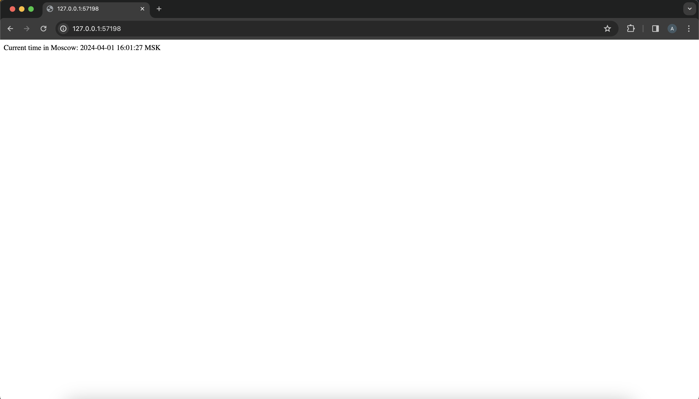

# Kubernetes with `minikube`

## Manual setup

```bash
$ kubectl get pods,svc
NAME                              READY   STATUS    RESTARTS   AGE
pod/app-python-68b587897b-vb5fv   1/1     Running   0          23m

NAME                 TYPE           CLUSTER-IP      EXTERNAL-IP   PORT(S)          AGE
service/app-python   LoadBalancer   10.111.181.12   <pending>     5000:32436/TCP   19m
service/kubernetes   ClusterIP      10.96.0.1       <none>        443/TCP          106m
```

## Manifest setup

```bash
$ kubectl get pods,svc
NAME                              READY   STATUS    RESTARTS   AGE
pod/app-python-54db76644f-8pj55   1/1     Running   0          52s
pod/app-python-54db76644f-jc2fq   1/1     Running   0          52s
pod/app-python-54db76644f-pk9rx   1/1     Running   0          52s

NAME                         TYPE        CLUSTER-IP       EXTERNAL-IP   PORT(S)    AGE
service/app-python-service   ClusterIP   10.108.246.124   <none>        5000/TCP   44s
service/kubernetes           ClusterIP   10.96.0.1        <none>        443/TCP    142m
```

```bash
$ minikube service --all
W0408 20:41:50.719529   37488 main.go:291] Unable to resolve the current Docker CLI context "default": context "default": context not found: open C:\Users\Sergey Milgram\.docker\contexts\meta\37a8eec1ce19687d132fe29051dca629d164e2c4958ba141d5f4133a33f0688f\meta.json: The system cannot find the path specifie
d.
|-----------|--------------------|-------------|--------------|
| NAMESPACE |        NAME        | TARGET PORT |     URL      |
|-----------|--------------------|-------------|--------------|
| default   | app-python-service |             | No node port |
|-----------|--------------------|-------------|--------------|
* service default/app-python-service has no node port
|-----------|------------|-------------|--------------|
| NAMESPACE |    NAME    | TARGET PORT |     URL      |
|-----------|------------|-------------|--------------|
| default   | kubernetes |             | No node port |
|-----------|------------|-------------|--------------|
* service default/kubernetes has no node port
* Starting tunnel for service app-python-service.
* Starting tunnel for service kubernetes.
|-----------|--------------------|-------------|------------------------|
| NAMESPACE |        NAME        | TARGET PORT |          URL           |
|-----------|--------------------|-------------|------------------------|
| default   | app-python-service |             | http://127.0.0.1:52272 |
| default   | kubernetes         |             | http://127.0.0.1:52274 |
|-----------|--------------------|-------------|------------------------|
* Opening service default/app-python-service in default browser...
* Opening service default/kubernetes in default browser...
! Because you are using a Docker driver on windows, the terminal needs to be open to run it.
```



The IP `127.0.0.1:52272` from the browser matches the console output.
