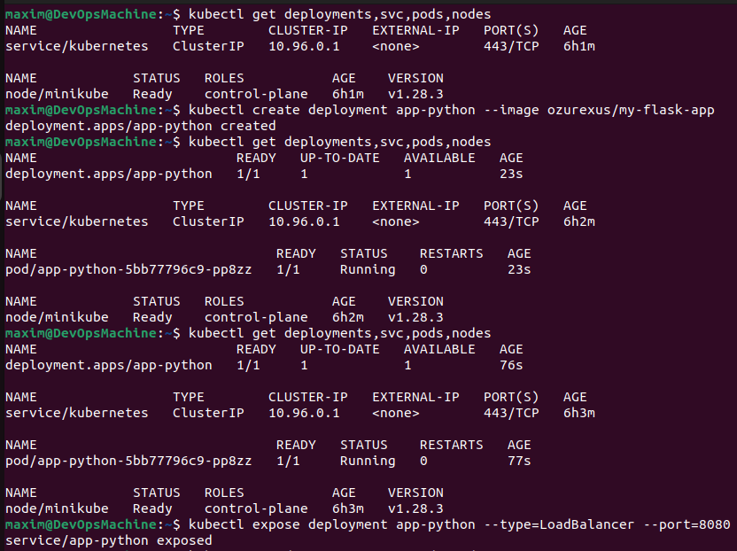
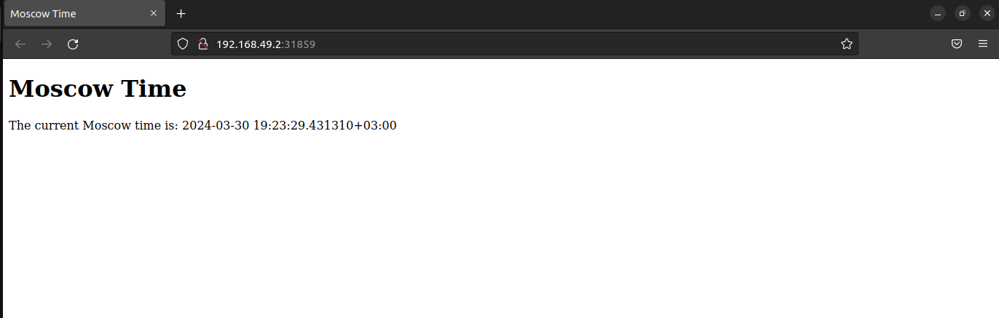
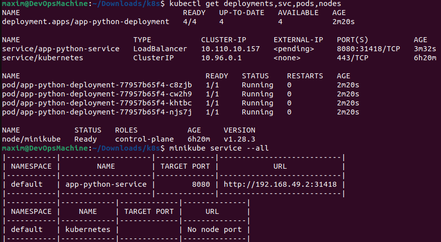
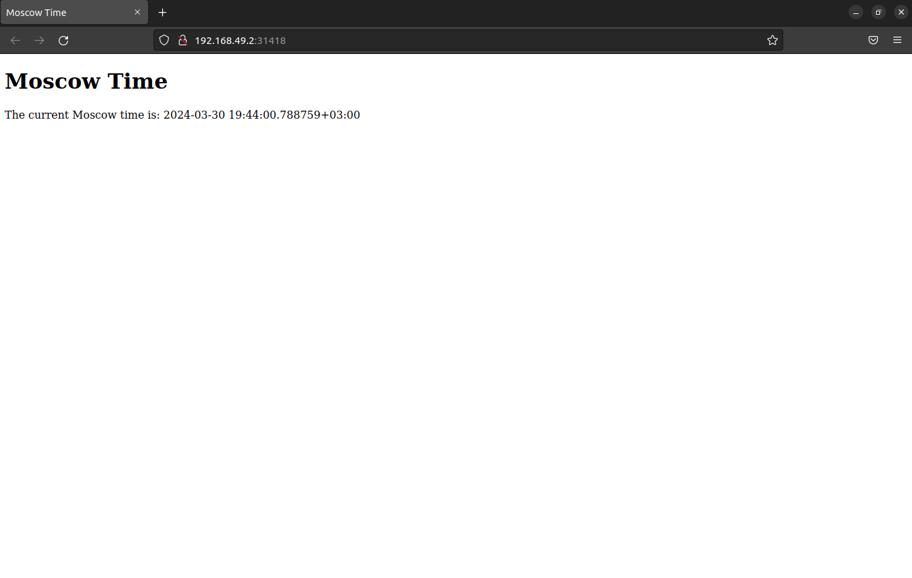

# Introduction to Kubernetes

## Task 1

1. I deployed my application usig commands

   ```bash
   kubectl create deployment app-python --image ozurexus/my-flask-app
   kubectl expose deployment app-python --type=LoadBalancer --port=8080
   ```

   

2. I used the following command to get accesible url to check deployment:

   ```bash
   minikube service app-python --url
   ```

   

## Task 2

1. I wrote deployment.yml and service.yml and applied them. Screenshot from terminal:

   

2. Checking deploy in browser:

   
