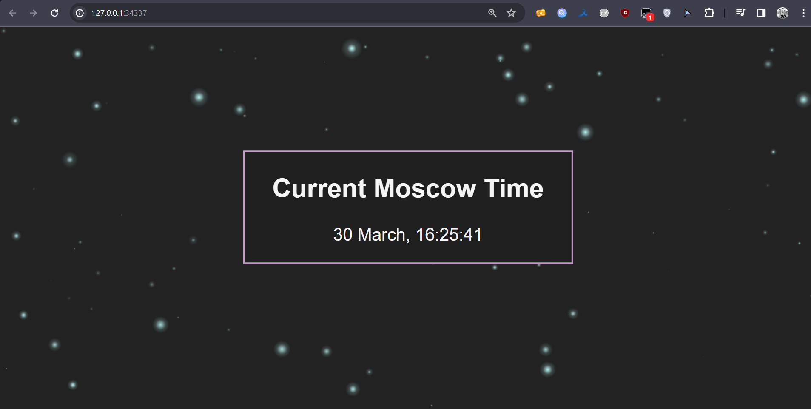

## Task 1

### Steps

```sh
$ kubectl create deployment app-python --image=soralin/moscow-time-webapp:latest --port=5000
```

```sh
$ kubectl expose deployment app-python --type=LoadBalancer --port=5000
```

### Output of `kubectl get pods,svc`
```sh
NAME                            READY   STATUS    RESTARTS   AGE
pod/app-python-686d9b45-t5k58   1/1     Running   0          12m

NAME                 TYPE           CLUSTER-IP     EXTERNAL-IP   PORT(S)          AGE
service/app-python   LoadBalancer   10.96.184.66   <pending>     5000:30332/TCP   12m
service/kubernetes   ClusterIP      10.96.0.1      <none>        443/TCP          16m
```

### Cleanup:

```sh
$ kubectl delete deployments app-python
```
```sh
$ kubectl delete services app-python
```

## Task 2

### Applying manifest files

```sh
$ kubectl apply -f deployment.yml
```
```sh
$ kubectl apply -f service.yml
```

### Output of `kubectl get pods,svc`
```sh
NAME                            READY   STATUS    RESTARTS   AGE
pod/app-python-686d9b45-4qdbm   1/1     Running   0          105s
pod/app-python-686d9b45-hwjnq   1/1     Running   0          105s
pod/app-python-686d9b45-tvgsx   1/1     Running   0          105s

NAME                         TYPE           CLUSTER-IP     EXTERNAL-IP   PORT(S)          AGE
service/app-python-service   LoadBalancer   10.103.27.41   <pending>     5000:32305/TCP   97s
service/kubernetes           ClusterIP      10.96.0.1      <none>        443/TCP          31m
```

### Output of ```minikube service --all```
```sh
|-----------|--------------------|-------------|---------------------------|
| NAMESPACE |        NAME        | TARGET PORT |            URL            |
|-----------|--------------------|-------------|---------------------------|
| default   | app-python-service |        5000 | http://192.168.49.2:32305 |
|-----------|--------------------|-------------|---------------------------|
|-----------|------------|-------------|--------------|
| NAMESPACE |    NAME    | TARGET PORT |     URL      |
|-----------|------------|-------------|--------------|
| default   | kubernetes |             | No node port |
|-----------|------------|-------------|--------------|
😿  service default/kubernetes has no node port
🏃  Starting tunnel for service app-python-service.
🏃  Starting tunnel for service kubernetes.
|-----------|--------------------|-------------|------------------------|
| NAMESPACE |        NAME        | TARGET PORT |          URL           |
|-----------|--------------------|-------------|------------------------|
| default   | app-python-service |             | http://127.0.0.1:34337 |
| default   | kubernetes         |             | http://127.0.0.1:41595 |
|-----------|--------------------|-------------|------------------------|
🎉  Opening service default/app-python-service in default browser...
👉  http://127.0.0.1:34337
🎉  Opening service default/kubernetes in default browser...
👉  http://127.0.0.1:41595
```
### Browser screenshot
