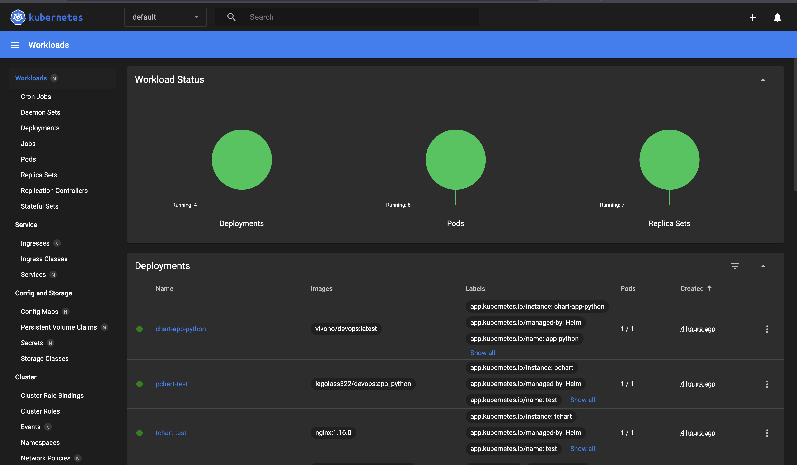

# Kubernetes

## Results

```
NAME                                    READY   STATUS    RESTARTS        AGE
pod/app-python-deploy-f857b665d-7fqv6   1/1     Running   1 (4h39m ago)   6h29m
pod/app-python-deploy-f857b665d-w6sfw   1/1     Running   1 (4h39m ago)   6h29m
pod/app-python-deploy-f857b665d-xt7r9   1/1     Running   1 (4h39m ago)   6h29m
pod/chart-app-python-9d546b454-k8hrk    1/1     Running   1 (3m17s ago)   4h18m
pod/pchart-test-6564dcd77f-rzp8k        1/1     Running   3 (3m18s ago)   4h40m
pod/tchart-test-54d8577598-d6xm2        1/1     Running   1 (4h39m ago)   4h57m

NAME                         TYPE        CLUSTER-IP       EXTERNAL-IP   PORT(S)    AGE
service/app-python-service   ClusterIP   10.96.87.170     <none>        8090/TCP   6h29m
service/chart-app-python     ClusterIP   10.97.180.177    <none>        8000/TCP   4h18m
service/kubernetes           ClusterIP   10.96.0.1        <none>        443/TCP    6h58m
service/pchart-test          ClusterIP   10.108.88.18     <none>        8080/TCP   4h40m
service/tchart-test          ClusterIP   10.110.102.255   <none>        80/TCP     4h57m
```

```
|-----------|--------------------|-------------|--------------|
| NAMESPACE |        NAME        | TARGET PORT |     URL      |
|-----------|--------------------|-------------|--------------|
| default   | app-python-service |             | No node port |
|-----------|--------------------|-------------|--------------|
😿  service default/app-python-service has no node port
|-----------|------------------|-------------|--------------|
| NAMESPACE |       NAME       | TARGET PORT |     URL      |
|-----------|------------------|-------------|--------------|
| default   | chart-app-python |             | No node port |
|-----------|------------------|-------------|--------------|
😿  service default/chart-app-python has no node port
|-----------|------------|-------------|--------------|
| NAMESPACE |    NAME    | TARGET PORT |     URL      |
|-----------|------------|-------------|--------------|
| default   | kubernetes |             | No node port |
|-----------|------------|-------------|--------------|
😿  service default/kubernetes has no node port
|-----------|-------------|-------------|--------------|
| NAMESPACE |    NAME     | TARGET PORT |     URL      |
|-----------|-------------|-------------|--------------|
| default   | pchart-test |             | No node port |
|-----------|-------------|-------------|--------------|
😿  service default/pchart-test has no node port
|-----------|-------------|-------------|--------------|
| NAMESPACE |    NAME     | TARGET PORT |     URL      |
|-----------|-------------|-------------|--------------|
| default   | tchart-test |             | No node port |
|-----------|-------------|-------------|--------------|
😿  service default/tchart-test has no node port
🏃  Starting tunnel for service app-python-service.
🏃  Starting tunnel for service chart-app-python.
🏃  Starting tunnel for service kubernetes.
🏃  Starting tunnel for service pchart-test.
🏃  Starting tunnel for service tchart-test.
|-----------|--------------------|-------------|------------------------|
| NAMESPACE |        NAME        | TARGET PORT |          URL           |
|-----------|--------------------|-------------|------------------------|
| default   | app-python-service |             | http://127.0.0.1:49842 |
| default   | chart-app-python   |             | http://127.0.0.1:49843 |
| default   | kubernetes         |             | http://127.0.0.1:49846 |
| default   | pchart-test        |             | http://127.0.0.1:49848 |
| default   | tchart-test        |             | http://127.0.0.1:49849 |
|-----------|--------------------|-------------|------------------------|
🎉  Opening service default/app-python-service in default browser...
🎉  Opening service default/chart-app-python in default browser...
🎉  Opening service default/kubernetes in default browser...
🎉  Opening service default/pchart-test in default browser...
🎉  Opening service default/tchart-test in default browser...
❗  Because you are using a Docker driver on darwin, the terminal needs to be open to run it.
```


