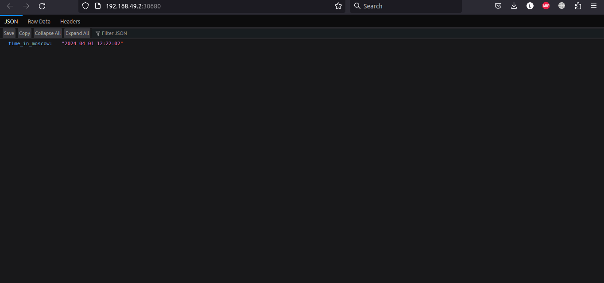

# Task 1
## Steps to deploy:
- ```minikube start```
- ```kubectl create deployment app-python --image=levgo/app_python:latest --port=5000```
- ```kubectl expose deployment app-python --type=LoadBalancer --port=5000```

```kubectl get pods,svc```:
```
NAME                          READY   STATUS    RESTARTS   AGE
app-python-7477997898-zxqp7   1/1     Running   0          15m43s

NAME                 TYPE           CLUSTER-IP      EXTERNAL-IP   PORT(S)          AGE
service/app-python   LoadBalancer   10.102.147.14   <pending>     5000:31686/TCP   15m43s
service/kubernetes   ClusterIP      10.96.0.1       <none>        443/TCP          30m
```

### Cleanup

```
kubectl delete deployments app-python
kubectl delete services app-python
```

# Task 2
Steps:
```
kubectl apply -f deployment.yml
kubectl apply -f service.yml
```

`kubectl get pods, svc`:
```
NAME                                         READY   STATUS    RESTARTS   AGE
pod/app-python-deployment-69cb99bdd6-bkzbm   1/1     Running   0          2m3s
pod/app-python-deployment-69cb99bdd6-dffr2   1/1     Running   0          2m3s
pod/app-python-deployment-69cb99bdd6-xvb9r   1/1     Running   0          2m3s

NAME                         TYPE           CLUSTER-IP      EXTERNAL-IP   PORT(S)          AGE
service/app-python-service   LoadBalancer   10.96.108.149   <pending>     5000:30680/TCP   1m2s
service/kubernetes           ClusterIP      10.96.0.1       <none>        443/TCP          55m
```

`minikube service --all`:
```
|-----------|--------------------|-------------|---------------------------|
| NAMESPACE |        NAME        | TARGET PORT |            URL            |
|-----------|--------------------|-------------|---------------------------|
| default   | app-python-service |        5000 | http://192.168.49.2:30680 |
|-----------|--------------------|-------------|---------------------------|
|-----------|------------|-------------|--------------|
| NAMESPACE |    NAME    | TARGET PORT |     URL      |
|-----------|------------|-------------|--------------|
| default   | kubernetes |             | No node port |
|-----------|------------|-------------|--------------|
😿  service default/kubernetes has no node port
🎉  Opening service default/app-python-service in default browser...
```

