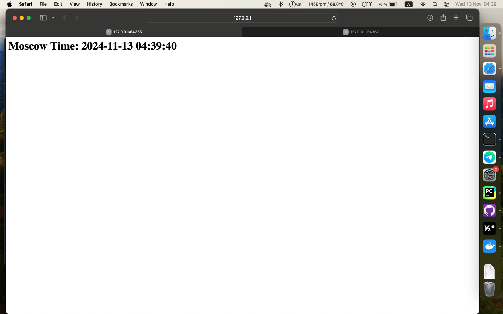

# Kubernetes Resources

This folder contains Kubernetes manifests for deploying our application.

## Pods

```bash
kubectl get pods
```

```bash
NAME                             READY   STATUS             RESTARTS   AGE
my-app-devops-6f759f666f-7wf6s   1/1     Running            0          37m
```


## Services

```bash
kubectl get svc
```

```bash
NAME            TYPE        CLUSTER-IP     EXTERNAL-IP   PORT(S)          AGE
kubernetes      ClusterIP   10.96.0.1      <none>        443/TCP          50m
my-app-devops   NodePort    10.98.62.223   <none>        5000:31230/TCP   7m33s
```


##Declarative Kubernetes Manifests
### Pods and services
```bash
(venv) (base) dilaraf@MacBook-Air S24-core-course-labs % kubectl get pod,svc -n kube-system
NAME                                   READY   STATUS    RESTARTS      AGE
pod/coredns-5dd5756b68-6g97k           1/1     Running   0             79m
pod/etcd-minikube                      1/1     Running   0             79m
pod/kube-apiserver-minikube            1/1     Running   0             79m
pod/kube-controller-manager-minikube   1/1     Running   0             79m
pod/kube-proxy-h5pb7                   1/1     Running   0             79m
pod/kube-scheduler-minikube            1/1     Running   0             79m
pod/storage-provisioner                1/1     Running   1 (79m ago)   79m

NAME               TYPE        CLUSTER-IP   EXTERNAL-IP   PORT(S)                  AGE
service/kube-dns   ClusterIP   10.96.0.10   <none>        53/UDP,53/TCP,9153/TCP   79m
(venv) (base) dilaraf@MacBook-Air S24-core-course-labs % 

```
### Checking all
(and checking the web page)
```bash
(venv) (base) dilaraf@MacBook-Air app_python % minikube service --all
|-----------|------------|-------------|--------------|
| NAMESPACE |    NAME    | TARGET PORT |     URL      |
|-----------|------------|-------------|--------------|
| default   | kubernetes |             | No node port |
|-----------|------------|-------------|--------------|
😿  service default/kubernetes has no node port
🏃  Starting tunnel for service kubernetes.
|-----------|------------|-------------|------------------------|
| NAMESPACE |    NAME    | TARGET PORT |          URL           |
|-----------|------------|-------------|------------------------|
| default   | kubernetes |             | http://127.0.0.1:57359 |
|-----------|------------|-------------|------------------------|
🎉  Opening service default/kubernetes in default browser...
❗  Because you are using a Docker driver on darwin, the terminal needs to be open to run it.


```


