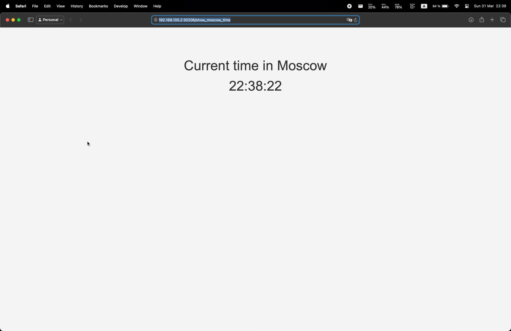

# Answers to Lab 9

## Basic Deployment

```bash
$ kubectl get pods,svc

NAME                              READY   STATUS    RESTARTS   AGE
pod/app-python-4c45bbd9f8-5s9fh   1/1     Running   0          80m

NAME                 TYPE           CLUSTER-IP      EXTERNAL-IP   PORT(S)          AGE
service/app-python   LoadBalancer   10.102.24.230   <pending>     8080:30942/TCP   78m
service/kubernetes   ClusterIP      10.86.0.1       <none>        443/TCP          82m
```

## Deployment with Manifests

```bash
$ kubectl get pods,svc

NAME                             READY   STATUS    RESTARTS   AGE
pod/app-python-bb4dc4fb7-8x7zs   1/1     Running   0          21s
pod/app-python-bb4dc4fb7-h96rb   1/1     Running   0          21s
pod/app-python-bb4dc4fb7-hdqr8   1/1     Running   0          21s

NAME                 TYPE           CLUSTER-IP    EXTERNAL-IP   PORT(S)          AGE
service/app-python   LoadBalancer   10.99.2.226   <pending>     8080:30206/TCP   17s
service/kubernetes   ClusterIP      10.86.0.1     <none>        443/TCP          89m
```

```bash
$ minikube service --all

|-----------|------------|-------------|----------------------------|
| NAMESPACE |    NAME    | TARGET PORT |            URL             |
|-----------|------------|-------------|----------------------------|
| default   | app-python |        8080 | http://192.168.105.2:30206 |
|-----------|------------|-------------|----------------------------|
|-----------|------------|-------------|--------------|
| NAMESPACE |    NAME    | TARGET PORT |     URL      |
|-----------|------------|-------------|--------------|
| default   | kubernetes |             | No node port |
|-----------|------------|-------------|--------------|
😿  service default/kubernetes has no node port
🎉  Opening service default/app-python in default browser...
```

