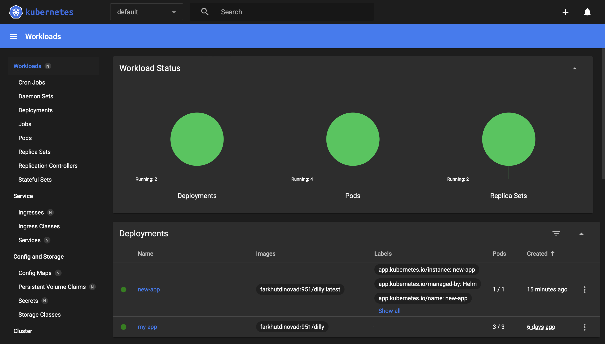

# HELM Deployment Documentation

## Helm Chart Installation

To install the Helm chart for our application, use the following command:

```bash
helm install my-app ./new-app
```

##Accessing the Application

To access the application, use the following command:

```bash
minikube service new-app
```
###Output:
```bash

|-----------|---------|-------------|--------------|
| NAMESPACE |  NAME   | TARGET PORT |     URL      |
|-----------|---------|-------------|--------------|
| default   | new-app |             | No node port |
|-----------|---------|-------------|--------------|
😿  service default/new-app has no node port
🏃  Starting tunnel for service new-app.
|-----------|---------|-------------|------------------------|
| NAMESPACE |  NAME   | TARGET PORT |          URL           |
|-----------|---------|-------------|------------------------|
| default   | new-app |             | http://127.0.0.1:64718 |
|-----------|---------|-------------|------------------------|
🎉  Opening service default/new-app in default browser...
❗  Because you are using a Docker driver on darwin, the terminal needs to be open to run it.
```

##Pods and Services Status

To check the status of pods, use the following command:

```bash
kubectl get pods,svc
```

###Output:
```bash
NAME                           READY   STATUS    RESTARTS      AGE
pod/my-app-59cc786cc-5wtxv     1/1     Running   1 (17m ago)   6d22h
pod/my-app-59cc786cc-958cz     1/1     Running   1 (17m ago)   6d22h
pod/my-app-59cc786cc-jddk8     1/1     Running   1 (17m ago)   6d22h
pod/new-app-684f958d54-4tjhh   1/1     Running   0             9m1s

NAME                 TYPE        CLUSTER-IP      EXTERNAL-IP   PORT(S)   AGE
service/kubernetes   ClusterIP   10.96.0.1       <none>        443/TCP   6d22h
service/new-app      ClusterIP   10.109.11.167   <none>        80/TCP    9m1s
```

###Screenshot from dashboard:


##After pre/post-install, linting and installing

```bash
kubectl get pods                         
NAME                       READY   STATUS    RESTARTS      AGE
my-app-59cc786cc-5wtxv     1/1     Running   1 (75m ago)   6d23h
my-app-59cc786cc-958cz     1/1     Running   1 (75m ago)   6d23h
my-app-59cc786cc-jddk8     1/1     Running   1 (75m ago)   6d23h
new-app-684f958d54-4tjhh   1/1     Running   0             67m
(venv) (base) dilaraf@MacBook-Air k8s % ```
