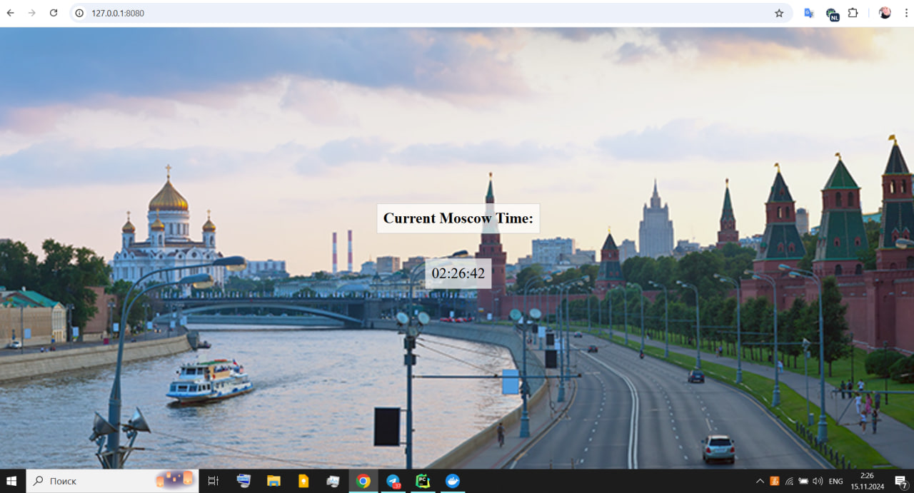

# HELM Chart Installation

## Running the application

```bash
(venv) PS C:\Users\Ernest\Desktop\Matskevich\k8s\python-app> $POD_NAME = $(kubectl get pods --namespace default -l "app.kubernetes.io/name=python-app,app.kubernetes.io/instance=moscow-
time" -o jsonpath="{.items[0].metadata.name}")
(venv) PS C:\Users\Ernest\Desktop\Matskevich\k8s\python-app> $CONTAINER_PORT = $(kubectl get pod --namespace default $POD_NAME -o jsonpath="{.spec.containers[0].ports[0].containerPort}
")
(venv) PS C:\Users\Ernest\Desktop\Matskevich\k8s\python-app> kubectl --namespace default port-forward $POD_NAME 8080:$CONTAINER_PORT
Forwarding from 127.0.0.1:8080 -> 5000
Forwarding from [::1]:8080 -> 5000
Handling connection for 8080
Handling connection for 8080
Handling connection for 8080
```



## Output of `kubectl get pods,svc`

```bash
(venv) PS C:\Users\Ernest\Desktop\Matskevich\k8s\python-app> kubectl get pods,svc
NAME                                         READY   STATUS    RESTARTS   AGE
pod/moscow-time-python-app-bb6486cc8-572pl   1/1     Running   0          5m27s

NAME                             TYPE        CLUSTER-IP      EXTERNAL-IP   PORT(S)    AGE
service/kubernetes               ClusterIP   10.96.0.1       <none>        443/TCP    24h
service/moscow-time-python-app   ClusterIP   10.101.18.151   <none>        5000/TCP   19m
```