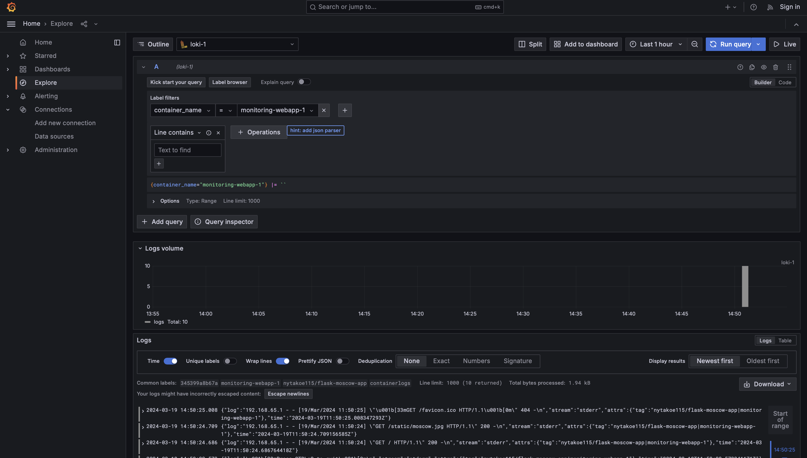
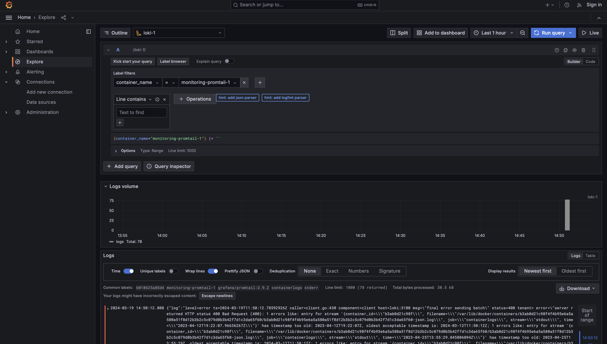
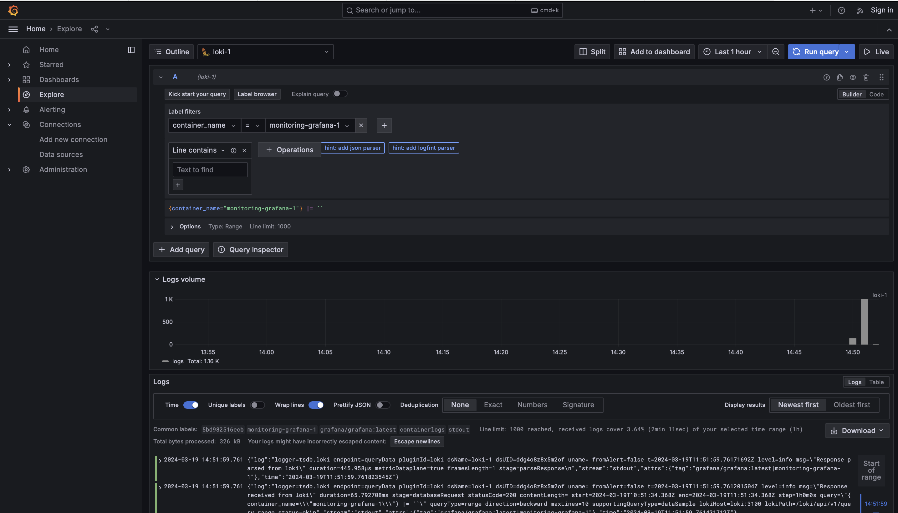
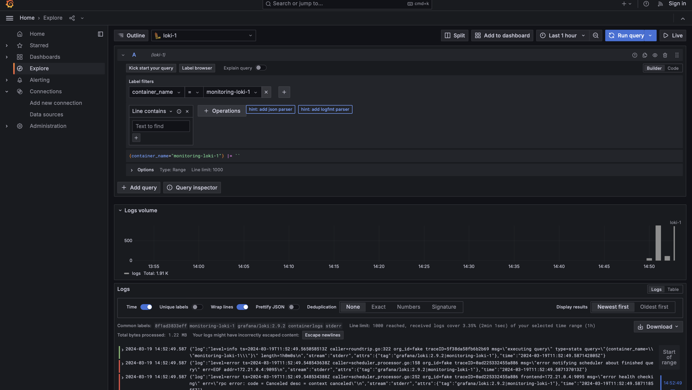

#Logging Stack Report

In this report, we'll explore the logging stack that has been set up and discuss the functionality of each component within the stack.

##Components of the Logging Stack

**Loki:** Loki is a horizontally-scalable, highly-available log aggregation system inspired by Prometheus. It is designed to be cost-effective and easy to operate.

**Promtail:** Promtail is an agent responsible for gathering logs and sending them to Loki. It can tail logs, extract labels from log lines, and ship them to Loki.

**Grafana:** Grafana is an open-source analytics and monitoring platform. It provides a powerful interface for querying, visualizing, and alerting on logs and metrics.

##Functionality

**Loki:** Loki stores logs in a highly efficient manner by indexing and compressing them. It allows querying logs based on labels, making it fast and scalable even with large volumes of logs.

**Promtail:** Promtail collects logs from various sources, such as log files or streams, and sends them to Loki for storage and analysis. It enriches logs with metadata and labels before sending them, enabling efficient querying and filtering.

**Grafana:** Grafana provides a user-friendly interface for visualizing logs stored in Loki. It allows users to create dashboards, alerts, and explore logs interactively using powerful query capabilities.
Screenshots

##Screenshots

###WebApp Dashboard

### Promtail Dashboard:

### Grafana Dashboard:

### Loki Logs in Grafana:

##Conclusion
The logging stack comprising Loki, Promtail, and Grafana provides a robust solution for collecting, storing, and visualizing logs. With its scalable architecture and powerful querying capabilities, it enables effective monitoring and troubleshooting of applications.

