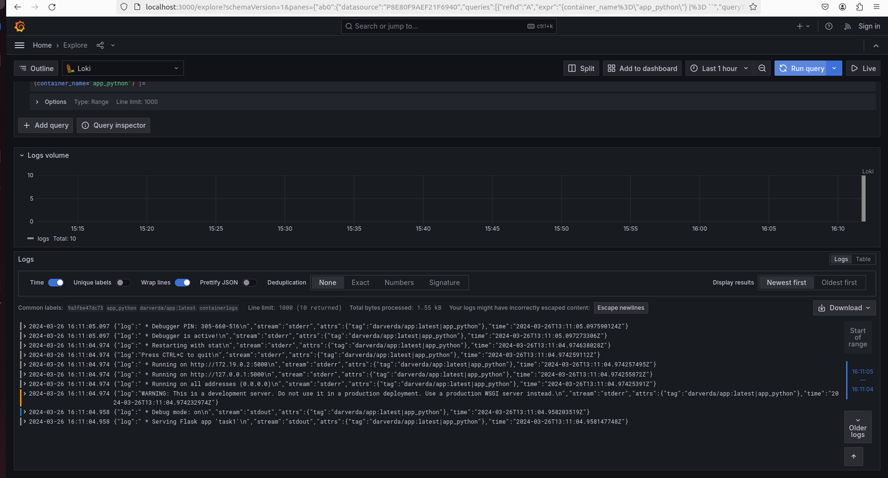
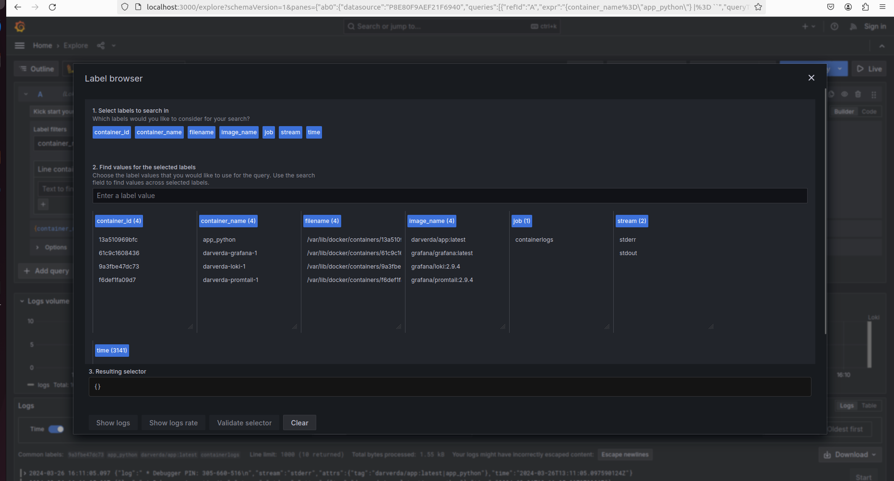
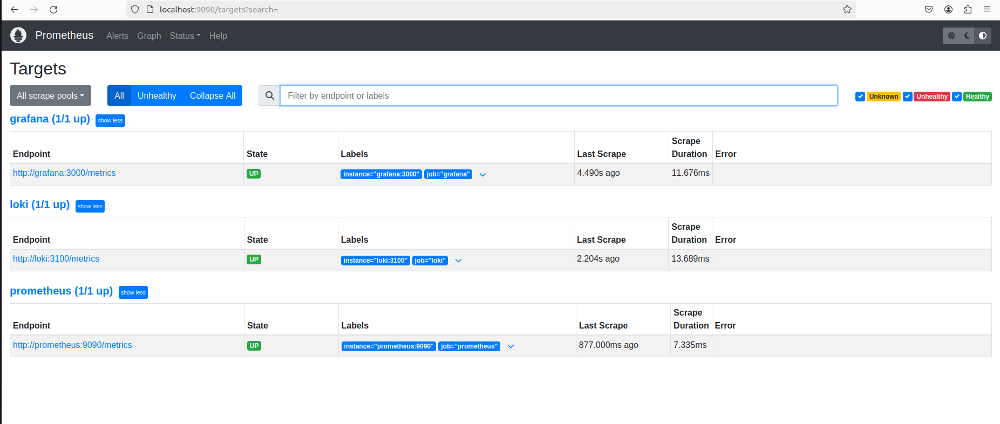
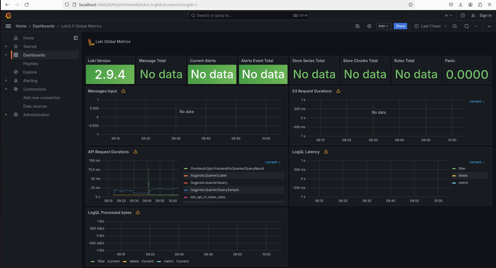
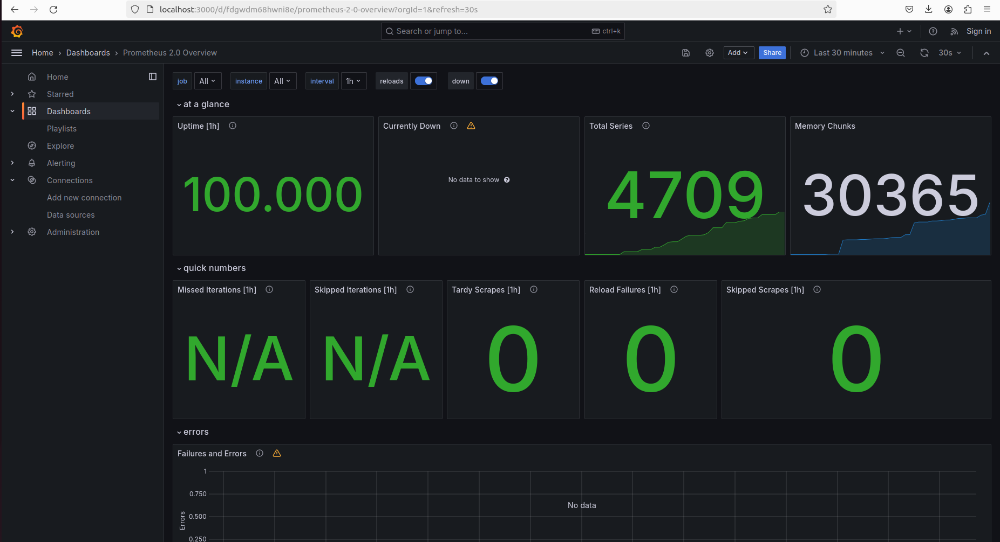

# Loki

### Role: 
Loki is the log aggregation system. It ingests logs from various sources, indexes them based on labels rather than full content, which makes it a cost-effective choice for logging infrastructure.
### Configuration:
In the docker-compose.yml, Loki is configured to listen on port 3100, and it uses local-config.yaml for settings. Key configurations in this file include:
- Retention policies
- Indexing rules based on labels
- Source and storage configurations.
 
# Promtail
### Role:
Promtail is the log collector agent. It scrapes logs from local sources, applies filters and relabeling, and forwards them to Loki for aggregation.
### Configuration:
Promtail uses promtail-config.yaml, which defines:
- Job Configurations: Specifies log paths (e.g., /var/log/*log), scraping intervals, and label configurations.
- Relabeling Rules: Transforms incoming logs, extracting metadata such as container names or application IDs.
Log Paths: Mounted directories include system logs and Docker logs for comprehensive monitoring.
# Grafana
### Role:
Grafana serves as the visualization tool. It allows querying Loki for logs and presenting them in dashboards, making it easier to filter, search, and analyze log data.
### Configuration:
- Datasource: Configured to connect to Loki at http://loki:3100, with proxy access enabled.
- Dashboards: Custom dashboards can be created to view logs based on application labels, error levels, or custom filters.

